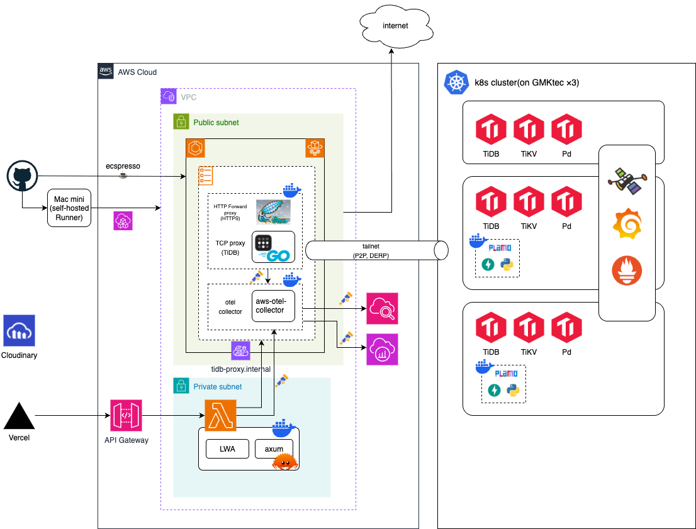

# 環境構築

## 構成



### VPC 内 Lambda の共通 egress ゲートウェイ

`tidb-proxy.internal` (ECS Fargate) は 1 ホスト名で複数サービスへの出口を担う[^tidb-proxy-name]。ホスト名は AWS Cloud Map の private DNS namespace `internal` + service `tidb-proxy` で解決され、ECS task の ENI 直 IP が A レコードとして登録される。Lambda 側はホスト名ではなくポート番号で行き先を選ぶ。

[^tidb-proxy-name]: 名前は TiDB 専用プロキシを連想させるが、実態は VPC 内の Lambda から Tailnet / インターネット / OTel 集約への出口を束ねる汎用 egress ゲートウェイ。初期は TiDB への tsnet 中継のみを担っていた名残でこの名前になっている。正確には `vpc-egress-gateway` に近い。

Lambda 側 (どの URL を叩くか)。

| Lambda が使う URL                   | ポート | 出口                                      |
| ----------------------------------- | -----: | ----------------------------------------- |
| `mysql://tidb-proxy.internal:13306` |  13306 | Tailnet の `tidb.<tailnet>:4000`          |
| `http://tidb-proxy.internal:3128`   |   3128 | インターネット全般 (CONNECT 443 のみ許可) |
| `http://tidb-proxy.internal:18080`  |  18080 | Tailnet の `plamo-embedding.<tailnet>:80` |
| `http://tidb-proxy.internal:4318`   |   4318 | メトリクス / トレース集約先               |

ECS task 側 (誰が受けるか)。1 task に 3 コンテナが同居し、`awsvpc` で network namespace を共有するので `localhost` で相互に届く。

| コンテナ         | listen ポート | 役割                                                                   |
| ---------------- | ------------- | ---------------------------------------------------------------------- |
| `tidb-proxy`     | 13306 / 18080 | Go forwarder。`tsnet.Server` 1 つで Tailnet に参加し L4 中継する       |
| （同上）         | 3128          | squid。インターネットへの HTTPS forward proxy (CONNECT 443 のみ)       |
| `otel-collector` | 4317 / 4318   | AWS Distro for OpenTelemetry。gRPC (4317) / HTTP (4318) を受ける       |
| `log-router`     | -             | FireLens (Fluent Bit)。他コンテナの stdout を CloudWatch / Firehose へ |

Lambda 側の 13306 / 18080 は `tidb-proxy` コンテナの forwarder が、3128 は同コンテナの squid が受ける (同一コンテナ内で forwarder と squid が併存)。4318 は別コンテナの `otel-collector` が受け、network namespace 共有によって同じ `tidb-proxy.internal` ホスト名から到達できる。

Tailnet に参加しているのは forwarder の `tsnet.Server` 1 つだけで、Tailscale ACL は `tag:proxy` 1 デバイスに集約される。Lambda の `HTTP_PROXY` 経由でループしないよう `NO_PROXY` に `tidb-proxy.internal` を含めており、`PLAMO_EMBED_ENDPOINT` (18080) も squid を経由せず forwarder に直接 TCP 接続する。

### 必要機材

自作MiniPCクラスタ (k8s + TiDB + Tailscale) を構成する機材。

#### 物理機材

| 区分           | 名称                                                       | 数量 | 用途                       | 備考                                                   |
| -------------- | ---------------------------------------------------------- | ---: | -------------------------- | ------------------------------------------------------ |
| Mini PC        | GMKtec M5 Ultra Ryzen 7 7730U / 32GB DDR4 / 1TB SSD        |  3台 | TiDBクラスタ用の物理ノード | `node1` / `node2` / `node3` として利用                 |
| Network Switch | TP-Link Omada SG3210X-M2 8ポート 2.5GbE L2+ Managed Switch |  1台 | クラスタ用ネットワーク     | 最初は管理機能を使わず、通常の2.5GbEスイッチとして利用 |

#### ソフトウェア

| 区分 | 名称                    |  数量 | 用途                        | 備考                                   |
| ---- | ----------------------- | ----: | --------------------------- | -------------------------------------- |
| OS   | Ubuntu Server 24.04 LTS | 3台分 | Mini PCにインストールするOS | まずはベアメタル構成でTiDBを動かす想定 |

## 初回構築

### Vercel

1. [Vercel](https://vercel.com)でGitHubリポジトリをインポート
2. Root Directory: `apps/web` を指定
3. Framework Preset: Next.js（自動検出）
4. Environment Variables に上記の環境変数を設定
   - Production: 本番用の値を設定
   - Preview: プレビュー用の値を設定
5. Deploy

| 設定項目          | 値                          |
| ----------------- | --------------------------- |
| Production Branch | `main`                      |
| Preview           | feature ブランチ（PR ごと） |
| Root Directory    | `apps/web`                  |
| Framework         | Next.js（自動検出）         |

main への push では本番デプロイされない（`apps/web/vercel.json` の `git.deploymentEnabled` で無効化）。本番反映は CalVer タグ経由で行う（[リリース](#リリース)を参照）。

| 変数名                              | 用途              | Production                 | Preview                     |
| ----------------------------------- | ----------------- | -------------------------- | --------------------------- |
| `NEXT_PUBLIC_API_URL`               | バックエンドAPI   | `https://api.shuntaka.dev` | `https://api.shuntaka.tech` |
| `NEXT_PUBLIC_SITE_URL`              | サイトURL         | `https://shuntaka.dev`     | `https://shuntaka.tech`     |
| `NEXT_PUBLIC_GOOGLE_TAG_MANAGER_ID` | GTM               | `GTM-XXXXXXX`              | （空）                      |
| `NEXT_PUBLIC_CLARITY_PROJECT_ID`    | Microsoft Clarity | `xxxxxxxxxx`               | （空）                      |

### リリース

リリースは [tagpr](https://github.com/Songmu/tagpr) のリリース PR マージで行う。main へのマージごとに tagpr（`.github/workflows/tagpr.yaml`）がリリース PR を自動作成・追従し、マージすると CalVer タグ（例: `2026.0711.0`、形式は `.tagpr` で定義）と GitHub Release が作られ、同一ワークフローの後続ジョブが prd CDK → Vercel 本番の順にデプロイする。main push の自動デプロイは dev CDK のみ。

tagpr が `GITHUB_TOKEN` で PR を作成できるよう、GitHub 設定の「Allow GitHub Actions to create and approve pull requests」を有効にしておく（`.github/infra.yaml` の `actions.can_approve_pull_requests: true` に対応。`gh infra apply` は ruleset の required status checks を消すため、この設定だけを gh api で変更する）。

```bash
gh api --method PUT repos/shuntaka9576/shuntaka-dev/actions/permissions/workflow \
  -f default_workflow_permissions=read \
  -F can_approve_pull_request_reviews=true
```

Vercel CLI デプロイ用のシークレットを登録する。トークンは <https://vercel.com/account/tokens> で発行し、orgId / projectId は `vercel link` が生成する `.vercel/project.json` から取得する。

```bash
cd apps/web
bunx vercel link

# トークンはシェル履歴に残さないよう対話プロンプトで貼り付ける
gh secret set VERCEL_TOKEN
gh secret set VERCEL_ORG_ID --body "$(jq -r .orgId .vercel/project.json)"
gh secret set VERCEL_PROJECT_ID --body "$(jq -r .projectId .vercel/project.json)"
```

導入時はベースラインの CalVer タグを手動で打つ。バージョンタグが1つも無いと tagpr は全履歴からリリース PR 本文を生成し、GitHub の 65536 文字上限を超えて 422 で失敗する。

```bash
git tag <YYYY.0M0D.0 形式の当日タグ> origin/main
git push origin <当日タグ>
```

### GitHub App (Webhook)

記事リポジトリへのpushで自動的に記事を更新するためのGitHub App設定。

1. GitHub Settings → Developer settings → GitHub Apps → New GitHub App
2. 設定値:
   - **GitHub App name**: `shuntaka-blog-api`（任意）
   - **Webhook URL**: `https://api-endpoint/webhooks/github`
   - **Webhook secret**: 任意の文字列を生成して設定（後でSSMに登録）
   - **Permissions**:
     - Repository permissions → Contents: Read-only
   - **Subscribe to events**: Push
3. 作成後、App IDを控える
4. Private keyを生成してダウンロード
5. Webhook secretを控える（SSM登録用）

### AWS

SSM Parameter Storeの登録

GitHub App秘密鍵を登録

```bash
export STAGE_NAME=""
aws ssm put-parameter \
  --name "/${STAGE_NAME}/shuntaka/github-app/private-key" \
  --type "SecureString" \
  --value "$(cat path/to/private-key.pem)"
```

GitHub Webhook Secretを登録（署名検証用）

```bash
export STAGE_NAME=""
export WEBHOOK_SECRET=$(openssl rand -hex 32)

aws ssm put-parameter \
  --name "/${STAGE_NAME}/shuntaka/github-webhook/secret" \
  --type "SecureString" \
  --value "${WEBHOOK_SECRET}"

# GitHub App設定画面で同じ値を設定
echo "GitHub Appに設定するSecret: ${WEBHOOK_SECRET}"
```

Cloudinaryの設定（OGP画像生成用）

1. [Cloudinary](https://cloudinary.com/)でアカウント作成
2. Dashboard から Cloud name, API Key, API Secret を取得
3. SSM Parameter Storeに登録

```bash
export STAGE_NAME=""
aws ssm put-parameter \
  --name "/${STAGE_NAME}/shuntaka/cloudinary/api-secret" \
  --type "SecureString" \
  --value "your-api-secret"
```

Tailscale proxy auth key と tailnet suffix を登録（tidb-proxy Fargate task が Tailnet に join + TiDB の Tailnet hostname を解決するため）。proxy auth key は reusable / non-ephemeral / `tag:proxy` 付きで発行する。dev / prd 共用なので `/shared/shuntaka/...` に 1 つだけ格納する。発行手順は [blog-api tidb-proxy 化](../98_tasks/2026-06-29-blog-api-tidb-proxy/index.md) の「事前準備」を参照。

```bash
export TS_PROXY_AUTHKEY=""  # tskey-auth-... を貼り付け
export TS_TAILNET_SUFFIX=$(tailscale status --json | jq -r '.MagicDNSSuffix')

aws ssm put-parameter \
  --name "/shared/shuntaka/tailscale/proxy-auth-key" \
  --type "SecureString" \
  --value "$TS_PROXY_AUTHKEY" \
  --overwrite

aws ssm put-parameter \
  --name "/shared/shuntaka/tailscale/tailnet-suffix" \
  --type "String" \
  --value "$TS_TAILNET_SUFFIX" \
  --overwrite

unset TS_PROXY_AUTHKEY TS_TAILNET_SUFFIX
```

OIDCプロバイダーの作成。アカウントに1つのみ作成（初回のみ）。

```bash
export STAGE_NAME=""
# stageNameはこのスタックでは使用しないが、getConfig()の実行に必要
bunx dotenv -- cdk deploy \
  -c stageName=${STAGE_NAME} \
  st-oidc-provider \
  --require-approval never
```

GitHub Actions用のデプロイロールの作成

```bash
export STAGE_NAME=""
bunx dotenv -- cdk deploy \
  -c stageName=${STAGE_NAME} \
  ${STAGE_NAME:0:1}-st-deploy-role \
  --require-approval never
```

ホストゾーンの作成

```bash
export STAGE_NAME=""
export CDK_DEFAULT_ACCOUNT=$(aws sts get-caller-identity --query "Account" --output text)
bunx dotenv -- cdk deploy \
  -c stageName=${STAGE_NAME} \
  ${STAGE_NAME:0:1}-st-global-dns \
  --require-approval never
```

Route53にNSレコードを登録

AWSのRoute53からホストゾーンのNSレコードを確認し、ムームードメインのコンソール画面のNSレコードを変更

証明書の作成

```bash
export STAGE_NAME=""
bunx dotenv -- cdk deploy \
  -c stageName=${STAGE_NAME} \
  ${STAGE_NAME:0:1}-st-tokyo-cert \
  --require-approval never

# デプロイ中にAWSコンソール ap-northeast-1 リージョンのACMで、*.shuntaka.techドメインのDNS検証レコードをRoute53に追加
```

GitHub ActionsにEnvironmentを登録

`gh`コマンドで環境変数を設定（実際のシークレットはSSM Parameter Storeに格納）:

> **Note**: Webフロントエンド（Next.js）の環境変数はVercelダッシュボードで設定します。[Vercelセクション](#vercel)を参照してください。

```bash
# 設定値（環境に応じて変更）
export STAGE_NAME=""
export AWS_ACCOUNT_ID=$(aws sts get-caller-identity --query "Account" --output text)
export GH_APP_ID=123456
export CLOUDINARY_CLOUD_NAME=your-cloud-name
export CLOUDINARY_API_KEY=123456789012345

# GitHub Environmentの作成（初回のみ）
gh api --method PUT repos/shuntaka9576/shuntaka-dev/environments/${STAGE_NAME}

# GitHub Actions 用（CDKデプロイで使用）
gh secret set AWS_ACCOUNT_ID --env ${STAGE_NAME} --body "${AWS_ACCOUNT_ID}"

# Lambda 環境変数用（CDK経由でLambdaに設定）
gh secret set GH_APP_ID --env ${STAGE_NAME} --body "${GH_APP_ID}"
gh variable set GH_APP_SECRET_PEM_KEY_NAME --env ${STAGE_NAME} --body "/${STAGE_NAME}/shuntaka/github-app/private-key"
gh variable set GH_WEBHOOK_SECRET_KEY_NAME --env ${STAGE_NAME} --body "/${STAGE_NAME}/shuntaka/github-webhook/secret"
gh secret set CLOUDINARY_CLOUD_NAME --env ${STAGE_NAME} --body "${CLOUDINARY_CLOUD_NAME}"
gh secret set CLOUDINARY_API_KEY --env ${STAGE_NAME} --body "${CLOUDINARY_API_KEY}"
gh variable set CLOUDINARY_API_SECRET_KEY_NAME --env ${STAGE_NAME} --body "/${STAGE_NAME}/shuntaka/cloudinary/api-secret"
```

usersテーブルにinstallation_idを登録。GitHub Appをリポジトリにインストール後、installation_idを確認して登録。

```sql
-- installation_idの確認方法:
-- GitHub App設定画面 → Install App → インストール済みリポジトリをクリック
-- URLの末尾の数字がinstallation_id (例: /installations/12345678)

UPDATE blog_prd.users
SET github_installation_id = 12345678
WHERE name = 'shuntaka';
```

tidb-proxy スタックのデプロイ（dev / prd 共用、初回のみ）。VPC / ECS Cluster / ECR / IAM / LogGroup / SG / Cloud Map / SSM パラメータを作成する。Task Definition と ECS Service は ecspresso 側で扱う。

```bash
export STAGE_NAME=""
# stageName はこのスタックでは使われないが getConfig() の評価に必要
bunx dotenv -- cdk deploy \
  -c stageName=${STAGE_NAME} \
  st-tidb-proxy \
  --require-approval never
```

ecspresso CLI のインストール（tidb-proxy の Task Definition / ECS Service を管理するため、初回のみ）。

```bash
brew install kayac/tap/ecspresso
ecspresso version
```

tidb-proxy コンテナ image の build & push と ecspresso deploy をまとめた `scripts/deploy-tidb-proxy.sh` を実行する。`IMAGE_TAG` は git short SHA が自動で使われる（環境変数で上書き可）。GitHub Actions の Deploy tidb-proxy ワークフロー（workflow_dispatch、`ref` 入力で commit SHA / タグ指定可）でも同じスクリプトを実行できる。

```bash
scripts/deploy-tidb-proxy.sh

# GitHub Actions から実行する場合
gh workflow run deploy-tidb-proxy.yaml --ref main
```

tidb-proxy task の動作確認。`runningCount: 1` かつ `events[0]` が `steady state` になり、ログに `Accepting HTTP Socket connections` と `pre-warm dial ok` が出れば成功。<https://login.tailscale.com/admin/machines> で `tidb-proxy` device が `tag:proxy` 付きで Connected (緑) になっているかも確認する。

```bash
aws ecs describe-services \
  --cluster tidb-proxy \
  --services tidb-proxy \
  --query "services[0].{Status:status, Running:runningCount, Desired:desiredCount, Events:events[0:3]}"

aws logs tail /ecs/tidb-proxy --follow --since 5m
```

tidb-proxy ログ分析スタックのデプロイ（dev / prd 共用、初回のみ）。S3 バケット / Glue Database・Iceberg テーブル / Firehose / Athena WorkGroup / SSM パラメータを作成し、FireLens (Fluent Bit) の設定ファイル (`apps/tidb-proxy/firelens/`) を S3 の `firelens-config/` に配置する。設計は `docs/source/98_tasks/2026-07-10-tidb-proxy-log-iceberg/index.md` を参照。ecspresso が本スタックの SSM 出力を参照するため、`scripts/deploy-tidb-proxy.sh` より先にデプロイする。

本スタックは Glue / Firehose / Athena を使うため、デプロイロールにこれらの権限が入る前の環境では、先に `${STAGE_NAME:0:1}-st-deploy-role` の再デプロイが必要（初回のみ）。

```bash
export STAGE_NAME=""
# stageName はこのスタックでは使われないが getConfig() の評価に必要
bunx dotenv -- cdk deploy \
  -c stageName=${STAGE_NAME} \
  st-tidb-proxy-logs \
  --require-approval never

# GitHub Actions から実行する場合 (Deploy ワークフローの stack 選択に含まれる)
gh workflow run deploy.yaml --ref main -f stageName=dev -f stack=st-tidb-proxy-logs
```

ログ振り分けの動作確認。INFO 系（squid アクセスログ・forwarder の INFO）は Firehose 経由で Iceberg テーブルに入り、WARN / ERROR と非 JSON 行（tsnet 内部ログ・squid cache_log）は CloudWatch Logs に残る。

```bash
# log-router の起動確認 (init プロセスの S3 取得失敗はここに出る)
aws logs tail /ecs/tidb-proxy --since 10m --format short | grep log-router

# WARN/ERROR (fluentbit-warnerr-*) とパース不能行 (fluentbit-fallback-*) の確認
aws logs tail /ecs/tidb-proxy --since 10m --format short | grep -E "fluentbit-(warnerr|fallback)-"

# Athena で INFO 系ログを検索 (WorkGroup: tidb-proxy-logs)
aws athena start-query-execution \
  --work-group tidb-proxy-logs \
  --query-execution-context Database=tidb_proxy_logs \
  --query-string "SELECT ts, log_type, level, method, url, status FROM logs ORDER BY ts DESC LIMIT 20"
aws athena get-query-results --query-execution-id <上の実行結果の QueryExecutionId>

# Firehose の配信失敗レコードが無いことを確認 (溜まる場合はスキーマ不一致)
aws s3 ls s3://tidb-proxy-logs-$(aws sts get-caller-identity --query Account --output text)/firehose-errors/ --recursive
```

よく使うクエリは Athena の Saved queries (WorkGroup `tidb-proxy-logs`) に CDK で登録済み。日常のログ検索の使い方は [運用ドキュメント](04_operations.md) の「クエリリファレンス > Athena」を参照。

Fluent Bit の設定 (`apps/tidb-proxy/firelens/extra.conf` / `parsers.conf`) を変更した場合の反映手順。init プロセスはコンテナ起動時に一度だけ S3 から設定を取得するため、S3 更新だけでは反映されず、task def も変わらないため ecspresso の diff でも検知されない。明示的に task を再起動する。

```bash
bunx dotenv -- cdk deploy -c stageName=dev st-tidb-proxy-logs --require-approval never
aws ecs update-service --cluster tidb-proxy --service tidb-proxy --force-new-deployment
```

メインスタックのデプロイ

```bash
export STAGE_NAME=""
bunx dotenv -- cdk deploy \
  -c stageName=${STAGE_NAME} \
  ${STAGE_NAME:0:1}-st-main \
  --require-approval never
```

完了したら、VercelとRoute53にAレコードの紐付けをしてください。

DBセットアップ（TiDB）。blog-api が参照する database（`blog_prd` / `blog_dev`）とスキーマを自作クラスタ上の TiDB に作成する。クラスタ自体の構築は [クラスタ構築](02_cluster.md)、スキーマ DDL の詳細とレガシーデータの取り込みは `tools/dsql-cli/dsl-tidb/README.md` を参照。

```bash
export TAILNET=$(tailscale status --json | jq -r '.MagicDNSSuffix')
cd tools/dsql-cli

bash dsl-tidb/load.sh --database blog_prd --host tidb.${TAILNET} --password '<root-password>'
bash dsl-tidb/load.sh --database blog_dev --host tidb.${TAILNET} --password '<root-password>'
```

### GitHub App (Utils)

Renovate のワークフロー（`renovate-apm-update.yaml` / `renovate-cargo-update.yaml`）が lockfile 同期コミットを push した際、後続のチェック（CI / zizmor）が再トリガーされるよう、`GITHUB_TOKEN` ではなく App トークンで push するための GitHub App。

1. GitHub Settings → Developer settings → GitHub Apps → New GitHub App
2. 設定値:
   - GitHub App name: `shuntaka-dev-utils`（任意）
   - Webhook: Active のチェックを外す
   - Repository permissions → Contents: Read and write
3. 作成後、App ID を控える
4. Private key を生成してダウンロード
5. `shuntaka9576/shuntaka-dev` にインストール

リポジトリの Variables / Secrets に登録。

```bash
gh variable set SHUNTAKA_DEV_UTILS_APP_ID --body "<App ID>"
gh secret set SHUNTAKA_DEV_UTILS_PRIVATE_KEY < path/to/private-key.pem
```

### ライブラリ更新

依存関係の自動アップデートPRを作成するためのRenovateを利用。以下の設定で導入が可能。

1. https://github.com/apps/renovate にアクセス
2. 「Install」をクリック
3. 対象リポジトリ（shuntaka9576/shuntaka-dev）を選択してインストール
4. リポジトリルートの `renovate.json` が自動で読み込まれる

### GitHub Actions

zizmorをGitHub Code Scanningに連携し、GitHub Actionsのセキュリティリスクに対する静的解析を行っている。[こちら](https://dev.classmethod.jp/articles/shuntaka-zizmor-sarif-code-scanning/)の手順で導入。[gh-infra](https://github.com/shuntaka9576/shuntaka-dev/blob/main/.github/infra.yaml)側にも設定あり。

## 開発

### 開発サーバーの起動

```bash
# 依存関係のインストール
bun install

# blog-api は既定で Tailnet 上の dev TiDB (blog_dev) に接続する
# (apps/blog-api/Makefile.toml が DATABASE_URL を組み立てる。Tailscale ログインが前提)
tailscale status | head -1

# AWS資格情報の取得が必要
aws-vault exec <プロファイル名>

# dev server起動（Next.js + Rust API + Sphinx）
bun run dev
```

別の DB に向けたい場合は `DATABASE_URL` を外から渡す（例: ローカル Docker TiDB の `blog_test`）。

```bash
DATABASE_URL=mysql://root@127.0.0.1:4100/blog_test bun run dev
```

### Agents SKillsの設定

[microsoft/apm](https://github.com/microsoft/apm) で管理。AIコーディングエージェントはClaude Codeを利用するものとする。

初回セットアップ（macOS）

```bash
brew install apm
apm install -t claude
```

取り込み（依存追加・clone 直後・lockfile 更新後）

```bash
apm install -t claude
```

追加

```bash
apm install <owner>/<repo>/skills/<path>/<name> -t claude
```

更新（upstream の最新を取り込み、lockfile を更新）

```bash
apm install --update -t claude
```

削除

```bash
apm uninstall <package> -t claude
```

完全リセット（apm.yml のパス書き換えが反映されないときに使う。apm は `apm_modules/` をローカル展開先として保持し、ここに旧構造のスナップショットが残っていると新パスを書いても `(cached)` 表示でそのまま再利用されるため、apm_modules と lockfile を消してから入れ直す）

```bash
rm -rf apm_modules apm.lock.yaml
apm install -t claude
```

新しい `apm.lock.yaml` の `virtual_path` が apm.yml と同じパスになっていることを確認する。

```bash
grep virtual_path apm.lock.yaml
```

Renovate APM Update PR のマージ前は zizmor を手動トリガーする。`renovate-apm-update.yaml` の lockfile 同期コミットが `[skip ci]` 付きで push されるため、最新コミットの zizmor が走らずブランチ保護でブロックされる（背景は [Renovate APM Update CI ループの調査](../97_survey/2026-05-27-renovate-apm-update-ci-loop/index.md)）。

```bash
gh workflow run zizmor.yaml --ref <PRブランチ名>
```

### GitHub設定変更作業

[babarot/gh-infra](https://github.com/babarot/gh-infra)でリポジトリ設定（visibility, labels, features, merge_strategy, security, rulesets, actions）を [`.github/infra.yaml`](https://github.com/shuntaka9576/shuntaka-dev/blob/main/.github/infra.yaml) で宣言的に管理。CI連携はせず手動運用。

差分確認

```bash
gh infra plan .github/infra.yaml
```

適用

```bash
gh infra apply .github/infra.yaml --auto-approve
```

GitHub の現状をマニフェストに再取り込み

```bash
gh infra import shuntaka9576/shuntaka-dev > .github/infra.yaml
```

### シークレット漏洩対策

Claude Code 経由のシークレット漏洩を `.claude/settings.json` の env scrub と UserPromptSubmit hook、`lefthook.yaml` の pre-commit (secretlint + gitleaks)、PreToolUse Bash hook (`block-noverify.ts`) による `--no-verify` バイパス拒否の4層で防ぐ。設計の詳細は CLAUDE.md の Security セクション参照。

gitleaks のバイナリインストール（初回のみ）。

```bash
brew install gitleaks
```

### bare clone環境でworktree開発をする場合(任意)

本リポジトリはbare clone + git worktree構成で管理している。worktreeの管理には[Worktrunk](https://worktrunk.dev)を使用する。

```
shuntaka-dev/          # bare clone
├── .bare/             # git bare repository
├── .envrc             # 全 app 共通の環境変数（秘匿情報含む、gitignore 対象）
├── main/              # メインworktree（mainブランチ）
├── feature-foo/       # 作業worktree（wt switchで自動作成）
└── fix-bar/           # 作業worktree
```

bare clone 直下の `.envrc` に全 app（blog-api / iac / web / admin-api / admin-web）で使う env を集約し、worktree 側の `.envrc` は `source_up` で継承する。app ごとの用途はコメントで明記する。ポート依存の値だけ worktree の `.env.local`（wt.toml が生成）で上書きされる。

bare clone 直下で以下を実行して初期化する。プレースホルダは実値に差し替える（Cognito は `aws ssm get-parameters --names /dev/shuntaka/admin/user-pool-id /dev/shuntaka/admin/user-pool-client-id`、images バケットは `aws cloudformation describe-stack-resources --stack-name d-st-admin --query 'StackResources[?LogicalResourceId==\`ImagesBucket\`].PhysicalResourceId' --output text` で取得）。

```bash
cat > .envrc <<'EOF'
# blog-api (Lambda) + iac/aws (CDK)
export GH_APP_ID=123456
export GH_APP_SECRET_PEM_KEY_NAME=/dev/shuntaka/github-app/private-key
export GH_WEBHOOK_SECRET_KEY_NAME=/dev/shuntaka/github-webhook/secret
export CLOUDINARY_CLOUD_NAME=your-cloud-name
export CLOUDINARY_API_KEY=123456789012345
export CLOUDINARY_API_SECRET_KEY_NAME=/dev/shuntaka/cloudinary/api-secret
export IMAGES_BASE_URL=https://images.shuntaka.tech

# blog-api + admin-api の TiDB 接続文字列。Tailnet 経由で自作クラスタ上の blog_dev を組み立てる
if [ -z "${DATABASE_URL:-}" ]; then
  TAILNET=$(tailscale status --json 2>/dev/null | jq -r '.MagicDNSSuffix // empty' 2>/dev/null)
  if [ -n "$TAILNET" ]; then
    export DATABASE_URL="mysql://root@tidb.${TAILNET}:4000/blog_dev"
  fi
fi

# apps/web (main worktree のフォールバック。worktree では .env.local が上書き)
export NEXT_PUBLIC_SITE_URL=http://localhost:43000
export NEXT_PUBLIC_API_URL=http://localhost:43003

# apps/admin-api (Hono/Lambda: 管理API)
export COGNITO_USER_POOL_ID=ap-northeast-1_XXXXXXXXX
export COGNITO_CLIENT_ID=xxxxxxxxxxxxxxxxxxxxxxxxxx
export COOKIE_SECRET=local-dev-cookie-secret-at-least-32-chars
export DEV_INSECURE_COOKIES=1
export IMAGES_BUCKET_NAME=d-st-admin-imagesbucket-xxxxxxxxxx
export ORIGIN_ALLOWLIST=http://localhost:43002

# apps/admin-web (Vite SPA: 管理画面)
export VITE_COGNITO_USER_POOL_ID=$COGNITO_USER_POOL_ID
export VITE_COGNITO_CLIENT_ID=$COGNITO_CLIENT_ID
export VITE_IMAGES_BASE_URL=$IMAGES_BASE_URL
export VITE_PREVIEW_BASE_URL=https://shuntaka.tech
EOF

direnv allow .
```

bare clone環境では`core.hooksPath`が不正なパスを指している場合がある。lefthookがworktreeで動作しない場合は以下を実行する（リポジトリに対して一度だけ）。

```bash
git config --local --unset core.hooksPath
```

mainワークツリーはWorktrunkのpre-startフックの対象外のため、初回のみ手動で`.env.local`を作成する。`.envrc`はcommit済みなのでそのまま使える。

```bash
cat > .env.local <<'EOF'
WEB_PORT=43000
API_PORT=43003
NEXT_PUBLIC_SITE_URL=http://localhost:43000
NEXT_PUBLIC_API_URL=http://localhost:43003
PORT=43003
DOCS_PORT=43004
ADMIN_API_PORT=43001
ADMIN_WEB_PORT=43002
ORIGIN_ALLOWLIST=http://localhost:43002
STORYBOOK_PORT=43005
EOF

direnv allow .
```

ポートマッピングに関して、複数worktreeのdev serverを同時に起動できるよう、worktreeごとにポートが自動割り当てされる。`.config/wt.toml`のpre-startフックにより、`wt switch --create`時に`.env.local`と`.envrc`が自動生成される。main の既定は 4300x 帯に揃えて衝突を避けている。

| 変数                   | 内容                        | main（既定）             |
| ---------------------- | --------------------------- | ------------------------ |
| `WEB_PORT`             | Next.js devサーバーポート   | 43000                    |
| `ADMIN_API_PORT`       | admin-api devサーバーポート | 43001                    |
| `ADMIN_WEB_PORT`       | admin-web Vite devポート    | 43002                    |
| `API_PORT` / `PORT`    | Rust APIポート              | 43003                    |
| `DOCS_PORT`            | Sphinxドキュメントポート    | 43004                    |
| `STORYBOOK_PORT`       | Storybook devポート         | 43005                    |
| `NEXT_PUBLIC_SITE_URL` | フロントエンドURL           | `http://localhost:43000` |
| `NEXT_PUBLIC_API_URL`  | API URL                     | `http://localhost:43003` |
| `ORIGIN_ALLOWLIST`     | admin-api CSRF 許可 Origin  | `http://localhost:43002` |

新規worktreeではブランチ名から10000-19999の範囲でポートがサービスごとに決定的に生成される。同じブランチ名なら常に同じポートになる（連番ではない）。現worktreeに割り当てられたポートは `bun run port` で確認できる。

```bash
bun run port
# web         http://localhost:17265
# api         http://localhost:14261
# docs        http://localhost:18224
# admin-api   http://localhost:13664
# admin-web   http://localhost:11286
# storybook   http://localhost:12372
```

ブランチ作業は、`wt switch --create`で新しいworktreeを作成する。pre-startフックにより`.env.local`（ポート設定）、`.envrc`、依存関係のインストールが自動で行われる。

```bash
# worktree作成＆切り替え
wt switch --create feature/new-thing

# dev server起動
bun run dev
```

初回のみフック承認が求められるので`y`で承認する。承認は`~/.config/worktrunk/approvals.toml`に保存され、次回以降は自動実行される。

```
▲ shuntaka-dev needs approval to execute 4 commands:
○ pre-start env: ...
○ pre-start envrc: ...
○ pre-start copy: ...
○ pre-start install: ...

❯ Allow and remember? [y/N] y
```

その他の操作。

```bash
# 既存worktreeに切り替え
wt switch main

# worktree一覧（URLも表示）
wt list

# worktreeの削除
wt remove feature/new-thing

# mainブランチへマージ＆削除
wt merge
```

## 運用コマンド

### mysql接続（TiDB）

Tailnet 経由で TiDB に接続する方法。database は用途に応じて `blog_prd` / `blog_dev` を指定する。

```bash
export TAILNET=$(tailscale status --json | jq -r '.MagicDNSSuffix')
mysql -h tidb.${TAILNET} -P 4000 -u root -p blog_prd
```

### 旧DSQL（撤去待ち）

現行の blog-api は TiDB を参照しており、旧 DSQL クラスタは残置分。以下は残置分の確認・撤去作業でのみ使う。

psql接続

```bash
export STAGE_NAME=""

# SSMからDSQLエンドポイントを取得
HOST=$(aws ssm get-parameter \
  --name "/${STAGE_NAME}/shuntaka/dsql/cluster-endpoint" \
  --query "Parameter.Value" --output text)

# 認証トークンを生成
TOKEN=$(aws dsql generate-db-connect-admin-auth-token \
  --hostname "$HOST" \
  --region ap-northeast-1)

# psqlで接続（トークンをパスワードとして使用）
PGPASSWORD="$TOKEN" psql \
  --dbname postgres \
  --username admin \
  --host "$HOST" \
  --port 5432
```

dsql-cli によるスキーマ操作（旧 DSQL 向け。ローカル PostgreSQL 用の compose は撤去済みのため DSQL エンドポイントのみ）

```bash
cd tools/dsql-cli

export STAGE_NAME=""
export DSQL_CLUSTER_ENDPOINT=$(aws ssm get-parameter \
  --name "/${STAGE_NAME}/shuntaka/dsql/cluster-endpoint" \
  --query "Parameter.Value" --output text)

bun run migrate --endpoint $DSQL_CLUSTER_ENDPOINT
bun run drop --endpoint $DSQL_CLUSTER_ENDPOINT
```

DSQL からの TSV エクスポートと TiDB への取り込み（`bun run export` / `dsl-tidb/load.sh`）は `tools/dsql-cli/dsl-tidb/README.md` を参照。

### tidb-seeder

TiDB の `EXPLAIN ANALYZE` の癖（opt が index vs full scan を cost 差で選び分ける挙動、統計の鮮度による plan 分岐、`total_process_keys_size` の効き方など）を確認する用途で、`users` / `tags` / `articles` / `articles_tags` のダミーデータを PG TEXT 互換 TSV として生成する。生成された TSV は既存の `dsl-tidb/load.sh` でそのまま流し込める。

生成のみ実施 (500 万行、articles 合計 約 33GB、M1 Pro 4 workers / SSD で約 75 秒)

```bash
cd tools/tidb-seeder
bun run generate \
  --out-dir ./out \
  --users 5 \
  --articles-per-user 1000000 \
  --tags 100 \
  --content-size 6000 \
  --workers 4 \
  --no-concat \
  --rows-per-part 15000
```

`--workers N` で articles / articles*tags の生成を N 個の bun 子プロセスに分散する（P-core 数と同じにするのが目安）。`--no-concat` を渡すと最後の cat による結合 (30GB × 2 の追加 I/O = 数分) をスキップし、`app.articles.part<W>*<C>.tsv`/`app.articles*tags.part<W>*<C>.tsv` のままにする。`--rows-per-part 15000`で 1 パートファイルを 15,000 行 (~90MB) ごとにローテートし、TiDB LOAD DATA が`txn-total-size-limit` (100MB) を超えないようにする。load.sh 側で part ファイルを自動検出して部分ごとに LOAD DATA するため、UX は同じ。

生成 → 検証用 DB へロード

Tailnet suffix を取得（Tailscale ログイン済み前提。TiDB の Tailnet ホスト `tidb.<TAILNET>` を解決するのに使う。固有名を直書きせず毎回コマンドで取り出す）

```bash
export TAILNET=$(tailscale status --json | jq -r '.MagicDNSSuffix')
echo "TAILNET=$TAILNET"
```

TiDB への経路が p2p (direct) か確認する。DERP relay 経由だと 33GB の LOAD DATA が数十分〜数時間かかりうるので、direct でないなら NAT / firewall を先に対処する

```bash
tailscale ping tidb.$TAILNET
# OK 例 (direct):
#   pong from tidb (100.x.x.x) via 192.168.x.x:41641 in 3ms
# NG 例 (DERP 経由):
#   pong from tidb (100.x.x.x) via DERP(tok) in 45ms
```

`tailscale ping` は direct が張れた時点で停止する。初回は DERP → direct へ数回で切り替わるのが正常。10 パケット全部 DERP のままなら経路が張れていないので、`tailscale netcheck` で NAT / UDP 到達性を確認する。

TiDB の LOAD DATA LOCAL INFILE は 1 ステートメント = 1 トランザクションで扱われ、`txn-total-size-limit`（デフォルト 100MB）を超えると `ERROR 2013 Lost connection` で落ちる。TiDB v8+ の bulk モードは LOAD DATA には効かない（詳細は [調査メモ](../97_survey/2026-07-01-tidb-load-data-large-file/index.md)）。そのため seeder に `--rows-per-part 15000` を渡し、1 パートファイルを ~90MB に抑える

TSV 生成 → DB 再作成 → load

```bash
# 1. TSV 生成 (1 ユーザーあたり 100 万記事 × 5 ユーザー = 500 万行 / articles 合計 約 33GB)
cd tools/tidb-seeder
bun run generate --out-dir ./out --users 5 --articles-per-user 1000000 --workers 4 --no-concat --rows-per-part 15000

# 2. 検証用 DB を作り直す (既存がある場合)
mysql -h tidb.$TAILNET -P 4000 -u root \
  -e "DROP DATABASE IF EXISTS blog_test"

# 3. TiDB に並列 LOAD DATA (DDL + parts を parallelism=8 の mysql2 connection で流し込む)
bun run load --host tidb.$TAILNET --database blog_test --tsv-dir ./out --parallelism 8
```

`bun run load` は `dsl-tidb/schema/*.sql` で DDL を張り、`dsl-tidb/load/*.sql` テンプレートを parts ごとに substitute して mysql2 の LOAD DATA LOCAL INFILE をコネクションプール (`--parallelism` 個) で並列実行する。1 コネクション 1 ファイルの sequential mysql CLI (`load.sh`) と違い、8 コネクション同時に叩けるので、300+ パートでも待ち時間が 1/N 程度に縮む。`load.sh` は引き続き dsql-cli 経由の CLI 手順で残しているので、mysql コマンドだけで完結させたい場合はそちらも使える。

500 万行スケールでは articles 合計で約 33GB になる。TiDB 側の region 数増加とローカルディスクの空きを事前に見積もる。scale を下げたい場合は `--articles-per-user 300000` (合計 150 万行 / 約 10GB) や `--articles-per-user 50000` (合計 25 万行 / 約 1.7GB) に落として同じ手順で回す。scale が小さければ `--no-concat` を外して単一ファイルにまとめても速度差は小さい。

同じ `--seed` を渡せば内容は決定的に再現される（default `42`）。`--content-size` は 1 記事あたりの目標バイト数で、paragraph 合成が閾値を超えた時点で打ち切るため実サイズは目標をやや上回る。`--workers 1` にすると子プロセス不使用の直書き single-process 経路に切り替わる。

### content-html-backfill

`articles.content_html` を blog-api と同じ変換ロジック（`apps/blog-api/markdown` crate を wasm 化したもの）で生成して埋め戻す。UPDATE は `content_html` カラムのみで、`updated_at` は変更しない（webhook 再実行での埋め戻しは upsert が `updated_at` を更新してしまうため使わない）。

wasm ビルド（初回、および markdown crate を変更したとき。`rustup target add wasm32-unknown-unknown` 済みが前提）

```bash
cd tools/content-html-backfill
bun run build:wasm
```

content_html が NULL の記事だけ埋め戻す

```bash
bun run backfill -- --endpoint mysql://root@tidb.$TAILNET:4000/blog_dev
```

全記事を再生成する場合は `--all`、特定記事だけなら `--slug <slug>` を付ける。リンクカード・GitHub 埋め込みの外部フェッチは記事ごとに URL を列挙してから並列 fetch し、失敗した URL は変換せず元のまま残す（API 側と同じフォールバック挙動）。生成結果が保存済み `content_html` と同一の記事は UPDATE 自体をスキップする。

本番実行前の事前確認（UPDATE せず、保存済み content_html との差分を新規/一致/差分ありで表示。`--out-dir` で生成 HTML を `<slug>.html` として書き出してブラウザ等で確認できる）

```bash
bun run backfill -- --endpoint mysql://root@tidb.$TAILNET:4000/blog_dev --all --dry-run --out-dir ./out
```

wasm 成果物のテスト（dev ビルド → bun test。CI の `turbo test` でも実行される）

```bash
bun run test
```

### tidb-embedder

PLaMo Embedding Service の document embedding を使い、`articles.embedding` が NULL の記事を埋め戻す。API 応答が2048次元の有限値配列であることを検証し、`embedding` カラムだけを更新するため `updated_at` は変更しない。

PLaMoはnode2/node3へ1 Podずつ配置し、Tailscale Kubernetes OperatorのLoadBalancer Serviceを介して `plamo-embedding.$TAILNET` で公開する。`kubectl port-forward svc/...` は選択された1 Podへ直接転送するため、分散backfillには使わない。

```bash
kubectl apply -f cluster/manifests/plamo-embedding/deployment.yaml
kubectl apply -f cluster/manifests/tailscale/plamo-embedding-public.yaml
kubectl -n plamo-embedding get pods -o wide
# node2 / node3 に1 Podずつ Readyになること
```

別ターミナルで dry-run を実行し、対象件数と全記事の次元数を確認する。

```bash
cd tools/tidb-embedder
bun run backfill -- \
  --endpoint mysql://root@tidb.$TAILNET:4000/blog_dev \
  --embed-endpoint http://plamo-embedding.$TAILNET \
  --concurrency 2 \
  --dry-run
```

問題がなければ `--dry-run` を外して実行する。既存の embedding も再生成する場合は `--all`、特定記事だけなら `--slug <slug>`、推論のタイムアウトを変える場合は `--timeout <ms>` を付ける。1リクエストで約14/16 logical CPUを使用する実測結果から、2 Pod構成では `--concurrency 2` を上限とする。記事単位で処理を継続し、1件でも失敗した場合は非0で終了する。

HNSW indexは全記事のbackfill後に `ALTER TABLE articles COMPACT` を実行してから作成する。全NULLの既存TiFlash DMFileへ先にindexを作ると、TiFlash v8.5.7がindex build中にクラッシュする事象を確認済み。
