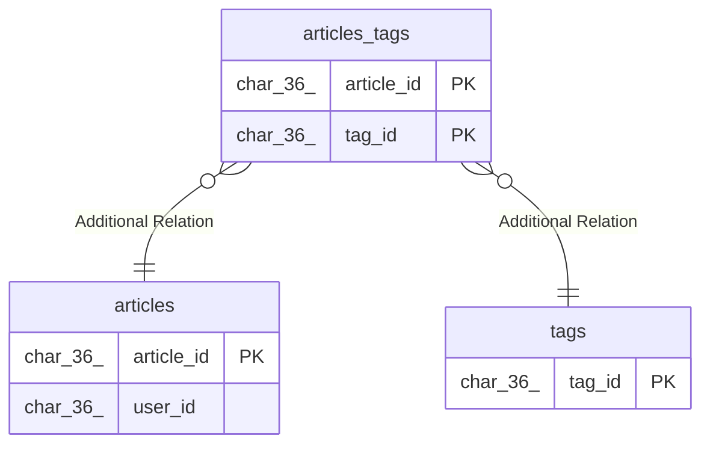

# articles_tags

## Description

<details>
<summary><strong>Table Definition</strong></summary>

```sql
CREATE TABLE `articles_tags` (
  `article_id` char(36) NOT NULL,
  `tag_id` char(36) NOT NULL,
  PRIMARY KEY (`article_id`,`tag_id`) /*T![clustered_index] CLUSTERED */,
  KEY `idx_articles_tags_tag_id` (`tag_id`)
) ENGINE=InnoDB DEFAULT CHARSET=utf8mb4 COLLATE=utf8mb4_bin
```

</details>

## Columns

| Name       | Type     | Default | Nullable | Children | Parents                 | Comment |
| ---------- | -------- | ------- | -------- | -------- | ----------------------- | ------- |
| article_id | char(36) |         | false    |          | [articles](articles.md) |         |
| tag_id     | char(36) |         | false    |          | [tags](tags.md)         |         |

## Constraints

| Name    | Type        | Definition                       |
| ------- | ----------- | -------------------------------- |
| PRIMARY | PRIMARY KEY | PRIMARY KEY (article_id, tag_id) |

## Indexes

| Name                     | Definition                                        |
| ------------------------ | ------------------------------------------------- |
| PRIMARY                  | PRIMARY KEY (article_id, tag_id) USING BTREE      |
| idx_articles_tags_tag_id | KEY idx_articles_tags_tag_id (tag_id) USING BTREE |

## Relations



---

> Generated by [tbls](https://github.com/k1LoW/tbls)
