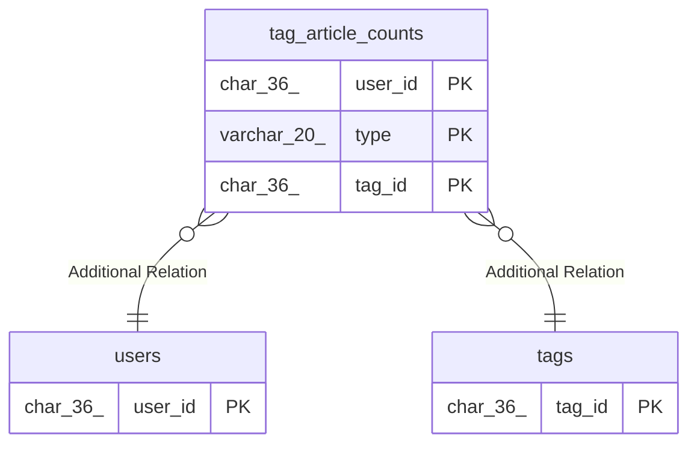

# tag_article_counts

## Description

<details>
<summary><strong>Table Definition</strong></summary>

```sql
CREATE TABLE `tag_article_counts` (
  `user_id` char(36) NOT NULL,
  `type` varchar(20) NOT NULL,
  `tag_id` char(36) NOT NULL,
  `article_count` bigint(20) NOT NULL DEFAULT '0',
  PRIMARY KEY (`user_id`,`type`,`tag_id`) /*T![clustered_index] CLUSTERED */
) ENGINE=InnoDB DEFAULT CHARSET=utf8mb4 COLLATE=utf8mb4_bin
```

</details>

## Columns

| Name          | Type        | Default | Nullable | Children | Parents           | Comment |
| ------------- | ----------- | ------- | -------- | -------- | ----------------- | ------- |
| user_id       | char(36)    |         | false    |          | [users](users.md) |         |
| type          | varchar(20) |         | false    |          |                   |         |
| tag_id        | char(36)    |         | false    |          | [tags](tags.md)   |         |
| article_count | bigint(20)  | 0       | false    |          |                   |         |

## Constraints

| Name    | Type        | Definition                          |
| ------- | ----------- | ----------------------------------- |
| PRIMARY | PRIMARY KEY | PRIMARY KEY (user_id, type, tag_id) |

## Indexes

| Name    | Definition                                      |
| ------- | ----------------------------------------------- |
| PRIMARY | PRIMARY KEY (user_id, type, tag_id) USING BTREE |

## Relations



---

> Generated by [tbls](https://github.com/k1LoW/tbls)
