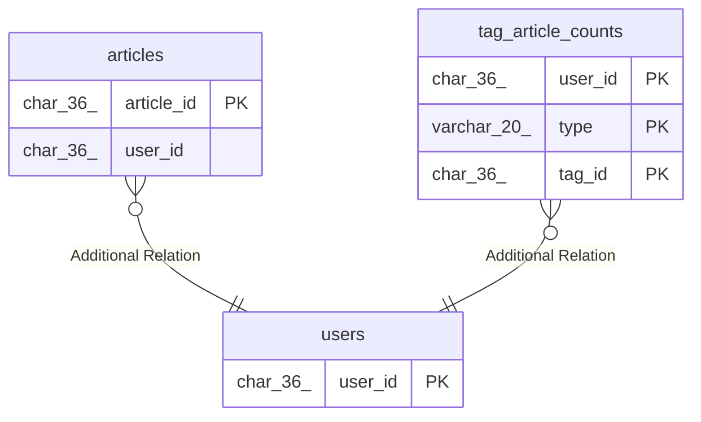

# users

## Description

<details>
<summary><strong>Table Definition</strong></summary>

```sql
CREATE TABLE `users` (
  `user_id` char(36) NOT NULL DEFAULT (uuid()),
  `name` varchar(255) NOT NULL,
  `email` varchar(255) NOT NULL,
  `github_installation_id` bigint(20) DEFAULT NULL,
  `created_at` datetime(6) NOT NULL DEFAULT CURRENT_TIMESTAMP(6),
  `updated_at` datetime(6) NOT NULL DEFAULT CURRENT_TIMESTAMP(6),
  PRIMARY KEY (`user_id`) /*T![clustered_index] CLUSTERED */,
  UNIQUE KEY `uq_users_name` (`name`),
  UNIQUE KEY `uq_users_email` (`email`),
  UNIQUE KEY `uq_users_github_installation_id` (`github_installation_id`)
) ENGINE=InnoDB DEFAULT CHARSET=utf8mb4 COLLATE=utf8mb4_bin
```

</details>

## Columns

| Name                   | Type         | Default              | Nullable | Extra Definition  | Children                                                            | Parents | Comment |
| ---------------------- | ------------ | -------------------- | -------- | ----------------- | ------------------------------------------------------------------- | ------- | ------- |
| user_id                | char(36)     | uuid()               | false    | DEFAULT_GENERATED | [articles](articles.md) [tag_article_counts](tag_article_counts.md) |         |         |
| name                   | varchar(255) |                      | false    |                   |                                                                     |         |         |
| email                  | varchar(255) |                      | false    |                   |                                                                     |         |         |
| github_installation_id | bigint(20)   |                      | true     |                   |                                                                     |         |         |
| created_at             | datetime(6)  | CURRENT_TIMESTAMP(6) | false    |                   |                                                                     |         |         |
| updated_at             | datetime(6)  | CURRENT_TIMESTAMP(6) | false    |                   |                                                                     |         |         |

## Constraints

| Name                            | Type        | Definition                                                          |
| ------------------------------- | ----------- | ------------------------------------------------------------------- |
| PRIMARY                         | PRIMARY KEY | PRIMARY KEY (user_id)                                               |
| uq_users_name                   | UNIQUE      | UNIQUE KEY uq_users_name (name)                                     |
| uq_users_email                  | UNIQUE      | UNIQUE KEY uq_users_email (email)                                   |
| uq_users_github_installation_id | UNIQUE      | UNIQUE KEY uq_users_github_installation_id (github_installation_id) |

## Indexes

| Name                            | Definition                                                                      |
| ------------------------------- | ------------------------------------------------------------------------------- |
| PRIMARY                         | PRIMARY KEY (user_id) USING BTREE                                               |
| uq_users_name                   | UNIQUE KEY uq_users_name (name) USING BTREE                                     |
| uq_users_email                  | UNIQUE KEY uq_users_email (email) USING BTREE                                   |
| uq_users_github_installation_id | UNIQUE KEY uq_users_github_installation_id (github_installation_id) USING BTREE |

## Relations



---

> Generated by [tbls](https://github.com/k1LoW/tbls)
