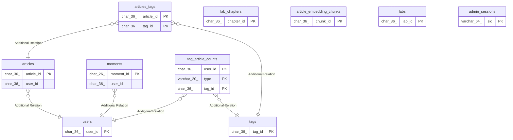

# blog_dev

## Tables

| Name                                                    | Columns | Comment | Type       |
| ------------------------------------------------------- | ------- | ------- | ---------- |
| [lab_chapters](lab_chapters.md)                         | 9       |         | BASE TABLE |
| [articles](articles.md)                                 | 13      |         | BASE TABLE |
| [article_embedding_chunks](article_embedding_chunks.md) | 10      |         | BASE TABLE |
| [labs](labs.md)                                         | 8       |         | BASE TABLE |
| [articles_tags](articles_tags.md)                       | 2       |         | BASE TABLE |
| [tag_article_counts](tag_article_counts.md)             | 4       |         | BASE TABLE |
| [tags](tags.md)                                         | 3       |         | BASE TABLE |
| [users](users.md)                                       | 6       |         | BASE TABLE |
| [admin_sessions](admin_sessions.md)                     | 8       |         | BASE TABLE |
| [moments](moments.md)                                   | 11      |         | BASE TABLE |

## Relations

---

> Generated by [tbls](https://github.com/k1LoW/tbls)
