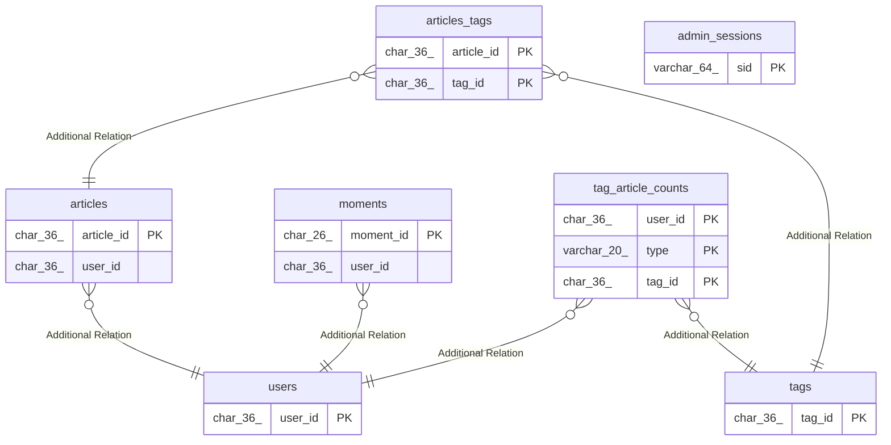

# blog_dev

## Tables

| Name                                        | Columns | Comment | Type       |
| ------------------------------------------- | ------- | ------- | ---------- |
| [articles_tags](articles_tags.md)           | 2       |         | BASE TABLE |
| [tags](tags.md)                             | 3       |         | BASE TABLE |
| [users](users.md)                           | 6       |         | BASE TABLE |
| [tag_article_counts](tag_article_counts.md) | 4       |         | BASE TABLE |
| [moments](moments.md)                       | 10      |         | BASE TABLE |
| [admin_sessions](admin_sessions.md)         | 7       |         | BASE TABLE |
| [articles](articles.md)                     | 13      |         | BASE TABLE |

## Relations

---

> Generated by [tbls](https://github.com/k1LoW/tbls)
