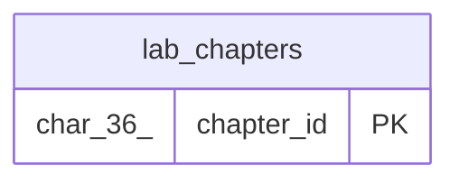

# lab_chapters

## Description

<details>
<summary><strong>Table Definition</strong></summary>

```sql
CREATE TABLE `lab_chapters` (
  `chapter_id` char(36) NOT NULL DEFAULT (uuid()),
  `lab_id` char(36) NOT NULL,
  `slug` varchar(255) NOT NULL,
  `title` varchar(500) NOT NULL,
  `position` int NOT NULL,
  `content` longtext NOT NULL,
  `content_html` longtext DEFAULT NULL,
  `created_at` datetime(6) NOT NULL DEFAULT CURRENT_TIMESTAMP(6),
  `updated_at` datetime(6) NOT NULL DEFAULT CURRENT_TIMESTAMP(6) ON UPDATE CURRENT_TIMESTAMP(6),
  PRIMARY KEY (`chapter_id`) /*T![clustered_index] CLUSTERED */,
  UNIQUE KEY `uq_lab_chapters_lab_slug` (`lab_id`,`slug`),
  KEY `idx_lab_chapters_lab_position` (`lab_id`,`position`)
) ENGINE=InnoDB DEFAULT CHARSET=utf8mb4 COLLATE=utf8mb4_bin
```

</details>

## Columns

| Name         | Type         | Default              | Nullable | Extra Definition                                 | Children | Parents | Comment |
| ------------ | ------------ | -------------------- | -------- | ------------------------------------------------ | -------- | ------- | ------- |
| chapter_id   | char(36)     | uuid()               | false    | DEFAULT_GENERATED                                |          |         |         |
| lab_id       | char(36)     |                      | false    |                                                  |          |         |         |
| slug         | varchar(255) |                      | false    |                                                  |          |         |         |
| title        | varchar(500) |                      | false    |                                                  |          |         |         |
| position     | int          |                      | false    |                                                  |          |         |         |
| content      | longtext     |                      | false    |                                                  |          |         |         |
| content_html | longtext     |                      | true     |                                                  |          |         |         |
| created_at   | datetime(6)  | CURRENT_TIMESTAMP(6) | false    |                                                  |          |         |         |
| updated_at   | datetime(6)  | CURRENT_TIMESTAMP(6) | false    | DEFAULT_GENERATED on update CURRENT_TIMESTAMP(6) |          |         |         |

## Constraints

| Name                     | Type        | Definition                                         |
| ------------------------ | ----------- | -------------------------------------------------- |
| PRIMARY                  | PRIMARY KEY | PRIMARY KEY (chapter_id)                           |
| uq_lab_chapters_lab_slug | UNIQUE      | UNIQUE KEY uq_lab_chapters_lab_slug (lab_id, slug) |

## Indexes

| Name                          | Definition                                                       |
| ----------------------------- | ---------------------------------------------------------------- |
| PRIMARY                       | PRIMARY KEY (chapter_id) USING BTREE                             |
| idx_lab_chapters_lab_position | KEY idx_lab_chapters_lab_position (lab_id, position) USING BTREE |
| uq_lab_chapters_lab_slug      | UNIQUE KEY uq_lab_chapters_lab_slug (lab_id, slug) USING BTREE   |

## Relations



---

> Generated by [tbls](https://github.com/k1LoW/tbls)
