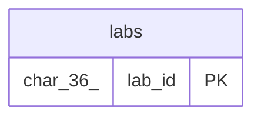

# labs

## Description

<details>
<summary><strong>Table Definition</strong></summary>

```sql
CREATE TABLE `labs` (
  `lab_id` char(36) NOT NULL DEFAULT (uuid()),
  `user_id` char(36) NOT NULL,
  `slug` varchar(255) NOT NULL,
  `title` varchar(500) NOT NULL,
  `summary` text DEFAULT NULL,
  `published` tinyint(1) NOT NULL DEFAULT '0',
  `created_at` datetime(6) NOT NULL DEFAULT CURRENT_TIMESTAMP(6),
  `updated_at` datetime(6) NOT NULL DEFAULT CURRENT_TIMESTAMP(6) ON UPDATE CURRENT_TIMESTAMP(6),
  PRIMARY KEY (`lab_id`) /*T![clustered_index] CLUSTERED */,
  UNIQUE KEY `uq_labs_slug` (`slug`),
  KEY `idx_labs_user_id` (`user_id`)
) ENGINE=InnoDB DEFAULT CHARSET=utf8mb4 COLLATE=utf8mb4_bin
```

</details>

## Columns

| Name       | Type         | Default              | Nullable | Extra Definition                                 | Children | Parents | Comment |
| ---------- | ------------ | -------------------- | -------- | ------------------------------------------------ | -------- | ------- | ------- |
| lab_id     | char(36)     | uuid()               | false    | DEFAULT_GENERATED                                |          |         |         |
| user_id    | char(36)     |                      | false    |                                                  |          |         |         |
| slug       | varchar(255) |                      | false    |                                                  |          |         |         |
| title      | varchar(500) |                      | false    |                                                  |          |         |         |
| summary    | text         |                      | true     |                                                  |          |         |         |
| published  | tinyint(1)   | 0                    | false    |                                                  |          |         |         |
| created_at | datetime(6)  | CURRENT_TIMESTAMP(6) | false    |                                                  |          |         |         |
| updated_at | datetime(6)  | CURRENT_TIMESTAMP(6) | false    | DEFAULT_GENERATED on update CURRENT_TIMESTAMP(6) |          |         |         |

## Constraints

| Name         | Type        | Definition                     |
| ------------ | ----------- | ------------------------------ |
| PRIMARY      | PRIMARY KEY | PRIMARY KEY (lab_id)           |
| uq_labs_slug | UNIQUE      | UNIQUE KEY uq_labs_slug (slug) |

## Indexes

| Name             | Definition                                 |
| ---------------- | ------------------------------------------ |
| PRIMARY          | PRIMARY KEY (lab_id) USING BTREE           |
| idx_labs_user_id | KEY idx_labs_user_id (user_id) USING BTREE |
| uq_labs_slug     | UNIQUE KEY uq_labs_slug (slug) USING BTREE |

## Relations



---

> Generated by [tbls](https://github.com/k1LoW/tbls)
