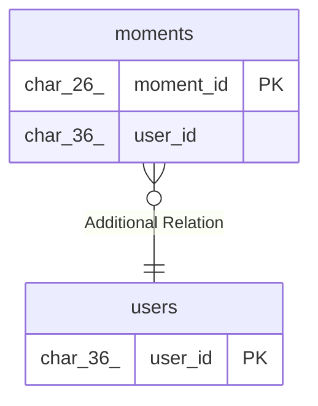

# moments

## Description

<details>
<summary><strong>Table Definition</strong></summary>

```sql
CREATE TABLE `moments` (
  `moment_id` char(26) NOT NULL,
  `user_id` char(36) NOT NULL,
  `text` varchar(180) NOT NULL,
  `image_key` varchar(255) NOT NULL,
  `fastener` enum('clip','tape') NOT NULL DEFAULT 'clip',
  `fastener_color` enum('pink','blue','yellow','green') DEFAULT NULL,
  `status` enum('published','draft') NOT NULL DEFAULT 'published',
  `published_at` datetime(6) DEFAULT NULL,
  `created_at` datetime(6) NOT NULL DEFAULT CURRENT_TIMESTAMP(6),
  `updated_at` datetime(6) NOT NULL DEFAULT CURRENT_TIMESTAMP(6) ON UPDATE CURRENT_TIMESTAMP(6),
  PRIMARY KEY (`moment_id`) /*T![clustered_index] CLUSTERED */,
  KEY `idx_moments_feed` (`user_id`,`status`,`published_at`,`moment_id`)
) ENGINE=InnoDB DEFAULT CHARSET=utf8mb4 COLLATE=utf8mb4_bin
```

</details>

## Columns

| Name           | Type                                 | Default              | Nullable | Extra Definition                                 | Children | Parents           | Comment |
| -------------- | ------------------------------------ | -------------------- | -------- | ------------------------------------------------ | -------- | ----------------- | ------- |
| moment_id      | char(26)                             |                      | false    |                                                  |          |                   |         |
| user_id        | char(36)                             |                      | false    |                                                  |          | [users](users.md) |         |
| text           | varchar(180)                         |                      | false    |                                                  |          |                   |         |
| image_key      | varchar(255)                         |                      | false    |                                                  |          |                   |         |
| fastener       | enum('clip','tape')                  | clip                 | false    |                                                  |          |                   |         |
| fastener_color | enum('pink','blue','yellow','green') |                      | true     |                                                  |          |                   |         |
| status         | enum('published','draft')            | published            | false    |                                                  |          |                   |         |
| published_at   | datetime(6)                          |                      | true     |                                                  |          |                   |         |
| created_at     | datetime(6)                          | CURRENT_TIMESTAMP(6) | false    |                                                  |          |                   |         |
| updated_at     | datetime(6)                          | CURRENT_TIMESTAMP(6) | false    | DEFAULT_GENERATED on update CURRENT_TIMESTAMP(6) |          |                   |         |

## Constraints

| Name    | Type        | Definition              |
| ------- | ----------- | ----------------------- |
| PRIMARY | PRIMARY KEY | PRIMARY KEY (moment_id) |

## Indexes

| Name             | Definition                                                                  |
| ---------------- | --------------------------------------------------------------------------- |
| idx_moments_feed | KEY idx_moments_feed (user_id, status, published_at, moment_id) USING BTREE |
| PRIMARY          | PRIMARY KEY (moment_id) USING BTREE                                         |

## Relations



---

> Generated by [tbls](https://github.com/k1LoW/tbls)
