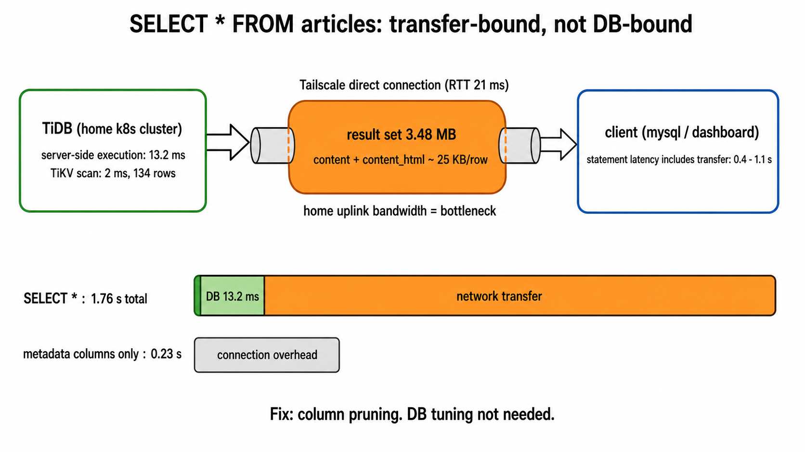

# `SELECT * FROM articles` が 0.4〜1.1s かかる原因（転送律速）

- 対象: 本番 TiDB クラスタ (`blog_prd.articles`)
- 調査日: 2026-07-23
- きっかけ: ダッシュボードで `SELECT * FROM articles;` が 0.4〜1.1s と表示されていた。134 行のテーブルにしては遅すぎる
- 関連: [`articles` 一覧クエリの実行プラン（IndexLookUp 経路）](../2026-06-30-tidb-articles-explain-plan/index.md)



## 背景

ダッシュボードの SQL Statements で以下の傾向が出ていた。

| クエリ | Latency | Max Memory |
| --- | ---: | ---: |
| `SELECT * FROM articles;` | 421ms〜1.1s | 3.3〜3.7 MiB |
| `SELECT * FROM articles LIMIT 30;` | 458.1ms | 953.9 KiB |
| `SELECT * FROM articles LIMIT 10;` | 300.6ms | 551.0 KiB |

行数ではなく Max Memory（≒結果セットサイズ）にレイテンシが比例している点が気になった。

## 結論

**DB は遅くない。`SELECT *` が持ち出す約 3.4MB の結果セットを、自宅クラスタから Tailscale 経由でクライアントへ転送する時間が支配項。**

- サーバー側の実行は 13.2ms（TiKV スキャン自体は 2ms）
- `articles` は `content`（longtext、平均 7.5KB）に加えて `content_html`（longtext、平均 17.5KB）を持ち、134 行の `SELECT *` で結果セットが約 3.4MB になる
- TiDB の statement レイテンシはクライアントへの結果送信まで含むため、ダッシュボード上は 0.4〜1.1s に見える。同一クエリでばらつくのもネットワーク要因
- 手元からの実測で `SELECT *` は 1.76s、カラムをメタデータ列に絞ると 0.23s（ほぼ接続オーバーヘッドのみ）
- 経路は DERP リレーではなく直接接続（RTT 21ms）。純粋に自宅回線の上り帯域で 3.4MB を流す時間

対処はクエリ側のカラムプルーニング。一覧はメタデータ列のみ、本文が必要な場合も `content` / `content_html` を用途ごとに片方だけ取る。DB 側のチューニングは不要。

## 根拠

### 行数と本文カラムのサイズ

```sql
SELECT COUNT(*) AS rows_cnt,
       ROUND(SUM(LENGTH(content))/1024/1024, 2) AS content_mb,
       ROUND(SUM(LENGTH(content_html))/1024/1024, 2) AS content_html_mb,
       ROUND(AVG(LENGTH(content))/1024, 1) AS avg_content_kb,
       ROUND(AVG(LENGTH(content_html))/1024, 1) AS avg_html_kb
  FROM articles;
```

```
rows_cnt  content_mb  content_html_mb  avg_content_kb  avg_html_kb
134       0.98        2.30             7.5             17.5
```

`information_schema.tables` でも `AVG_ROW_LENGTH=18933` / `DATA_LENGTH=2.42MB`。`content` + `content_html` で 1 行平均約 25KB あり、ダッシュボードの Max Memory 3.3〜3.7 MiB は結果セットサイズそのもの。

### サーバー側実行は 13.2ms

```sql
EXPLAIN ANALYZE SELECT * FROM articles;
```

```
TableReader_5      time:13.2ms, loops:2, RU:55.94,
                   cop_task: {num: 1, max: 11.8ms, proc_keys: 134, tot_proc: 7.21ms}
└─TableFullScan_4  tikv_task:{time:2ms, loops:3},
                   scan_detail: {total_process_keys: 134, total_process_keys_size: 3477792}
```

`total_process_keys_size: 3477792` ≒ 3.48MB がそのままクライアントへ流れる。

### クライアント実測（カラム絞り込みの効果）

```console
$ tailscale ping tidb.<tailnet>
pong from tidb (100.65.75.65) via 116.91.131.61:6939 in 21ms   # 直接接続（DERP 経由ではない）

$ time mysql -h tidb.<tailnet> -P 4000 -u root blog_prd \
    -e "SELECT * FROM articles;" > /dev/null
1.764 total

$ time mysql -h tidb.<tailnet> -P 4000 -u root blog_prd \
    -e "SELECT article_id, title, slug, status, published_at FROM articles;" > /dev/null
0.226 total
```

サーバー実行 13.2ms に対して E2E 1.76s。差分のほぼ全てが 3.4MB の転送時間で、カラムを絞ると接続オーバーヘッド込みでも 0.23s。

## 未検証 / TODO

- [ ] 自宅回線の上り実効帯域の計測（3.4MB で 0.4〜1.1s なら実効 25〜70Mbps 程度の計算になる）
- [ ] blog-api 側に `SELECT *`（または `content` + `content_html` を同時に引く）経路が残っていないかの確認
