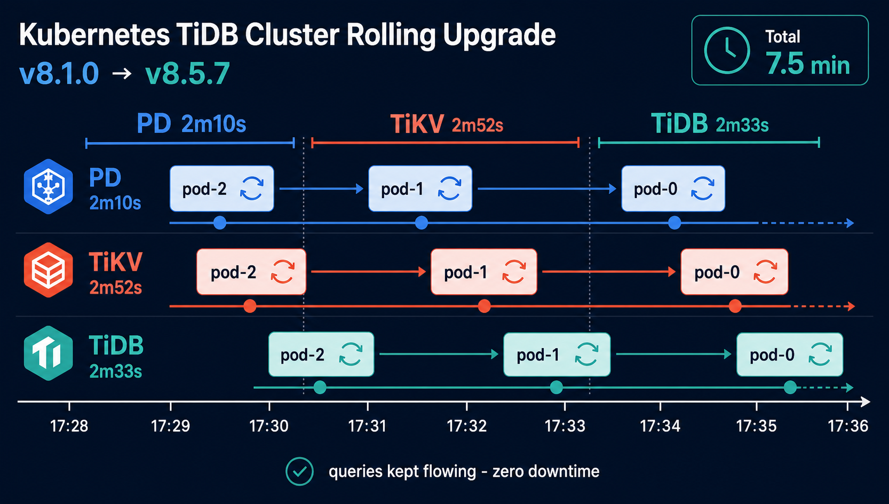

# TiDB クラスタ v8.1.0 → v8.5.7 ローリングアップグレード

- 起票日: 2026-07-10
- 関連: [2026-06-27 TiDB 構築まわり全消し → 作り直し手順](../2026-06-27-tidb-full-rebuild/index.md), [2026-07-05 本番 TiDB (blog_prd) の論理ダンプ手順](../2026-07-05-tidb-prd-dump/index.md), [`cluster/manifests/tidb-cluster/tidb-cluster.yaml`](../../../../cluster/manifests/tidb-cluster/tidb-cluster.yaml)
- ステータス: 完了

## 起票理由

現行の TiDB は v8.1.0（2024-05 GA）。同じ v8.1 LTS 系列でもパッチが v8.1.2 まで進んでおり、さらに新しい LTS 系列 v8.5 は v8.5.7（2026-07-09 リリース）まで出ている。v8.1.x → v8.5.x は公式サポートされた直接アップグレードパスなので、TiDB Operator のローリングアップグレードで v8.5.7 まで一気に上げる。

v8.5 系の主な取り込み: 列レベル権限管理（MySQL 互換）、スロークエリログの多次元出力制御、各種オプティマイザ改善。

## 設計方針

| 論点                    | 決定                                                                                                                                                       |
| ----------------------- | ---------------------------------------------------------------------------------------------------------------------------------------------------------- |
| ターゲットバージョン    | v8.5.7（v8.5 LTS の最新パッチ）                                                                                                                            |
| アップグレードパス      | v8.1.x → v8.5.x は直接アップグレード可（公式サポートパス）。中間バージョン経由は不要                                                                       |
| 方式                    | `TidbCluster` の `spec.version` 書き換え → `kubectl apply` による Operator ローリングアップグレード。PD / TiKV の Leader transfer は Operator が自動で行う |
| TiDB Operator           | v1.6.0 のまま（v1.6 系は TiDB v8.5 対応）。Operator 自体の更新は本作業のスコープ外                                                                         |
| ng-monitoring           | クラスタと同じ v8.5.7 に同時に上げる（`pingcap/ng-monitoring:v8.5.7` は公開済み、arm64 対応確認済み）                                                      |
| ロールバック            | **TiDB はダウングレード非対応**。失敗時は事前ダンプ + [全消し → 作り直し手順](../2026-06-27-tidb-full-rebuild/index.md) で復旧                             |
| TiDB Binlog 廃止 (v8.4) | v8.1 → v8.5 の間に TiDB Binlog が削除されるが、本クラスタは未使用のため影響なし                                                                            |

## 実装フェーズ

- [x] Phase A: 事前確認 + バックアップ（2026-07-10 実施）
- [x] Phase B: マニフェスト更新（リポジトリ側）（2026-07-10 実施）
- [x] Phase C: TidbCluster ローリングアップグレード（2026-07-10 実施、約 7 分 35 秒）
- [x] Phase D: ng-monitoring 更新（2026-07-10 実施）
- [x] Phase E: 動作確認（2026-07-10 実施、全項目 OK）
- [x] Phase F: ドキュメント同期（2026-07-10 実施）

## 前提

- `~/.kube/config-mycluster` から TiDB クラスタへ到達可能（Tailscale 経由）
- 手元 Mac に `mysql` クライアント（接続情報は環境に合わせる）
- リポジトリルート（`shuntaka-dev`）がカレントディレクトリ
- アップグレード中もクラスタは読み書き可能だが、**ローリング中は DDL を流さない**

```bash
export KUBECONFIG=~/.kube/config-mycluster
export TAILNET=$(tailscale status --json | jq -r '.MagicDNSSuffix')
```

## 想定所要時間

| フェーズ                       | 時間                                                                         |
| ------------------------------ | ---------------------------------------------------------------------------- |
| 事前確認 + バックアップ (A)    | 5-10 分（データ量による。blog_prd 2.5MB 規模なら数分）                       |
| ローリングアップグレード (C)   | 10-20 分（PD x3 → TiKV x3 → TiDB x3、TiKV は leader 退避込みで 1 台 2-5 分） |
| ng-monitoring + 動作確認 (D/E) | 5 分                                                                         |
| **合計**                       | **20-35 分**                                                                 |

---

## Phase A: 事前確認 + バックアップ

### A-1. 現行バージョンとクラスタ健全性

```bash
# TidbCluster が READY=True であること
kubectl get -n tidb-cluster tidbcluster

# 全 Pod Running（PD/TiKV/TiDB 各3 + discovery + ng-monitoring）
kubectl get -n tidb-cluster pods -o wide

# 現行バージョン確認
mysql -h tidb.${TAILNET} -P 4000 -u root -p \
  -e "SELECT TIDB_VERSION()\G"
# → Release Version: v8.1.0

# PD メンバー / TiKV store の健全性
kubectl -n tidb-cluster exec basic-pd-0 -- /pd-ctl health
# → 全メンバー health: true
kubectl -n tidb-cluster exec basic-pd-0 -- /pd-ctl store \
  | jq -r '.stores[] | [.store.address, .store.state_name] | @tsv'
# → 3 store すべて Up
```

**実行結果 (2026-07-10)** — 全項目 OK

<!-- cspell:disable -->

```text
$ kubectl get -n tidb-cluster tidbcluster
NAME    READY   PD                  STORAGE   READY   DESIRE   TIKV                  STORAGE   READY   DESIRE   TIDB                  READY   DESIRE   AGE
basic   True    pingcap/pd:v8.1.0   10Gi      3       3        pingcap/tikv:v8.1.0   100Gi     3       3        pingcap/tidb:v8.1.0   3       3        12d

$ kubectl get -n tidb-cluster pods -o wide   # IP / NOMINATED NODE 列は省略
NAME                               READY   STATUS    RESTARTS        AGE    NODE
basic-discovery-667dd6cbf9-c67rz   1/1     Running   1 (5d20h ago)   12d    node3
basic-pd-0                         1/1     Running   1 (5d20h ago)   12d    node1
basic-pd-1                         1/1     Running   2 (5d20h ago)   12d    node2
basic-pd-2                         1/1     Running   1 (5d20h ago)   12d    node3
basic-tidb-0                       2/2     Running   2 (5d20h ago)   12d    node1
basic-tidb-1                       2/2     Running   2 (5d20h ago)   12d    node2
basic-tidb-2                       2/2     Running   2 (5d20h ago)   12d    node3
basic-tikv-0                       1/1     Running   0               5d3h   node1
basic-tikv-1                       1/1     Running   0               5d2h   node3
basic-tikv-2                       1/1     Running   0               5d2h   node2
ng-monitoring-7664c85964-j5k8w     1/1     Running   1 (5d20h ago)   12d    node1

$ mysql -h tidb.${TAILNET} -P 4000 -u root -p -e "SELECT TIDB_VERSION()\G"
TIDB_VERSION(): Release Version: v8.1.0
Git Commit Hash: 945d07c5d5c7a1ae212f6013adfb187f2de24b23
UTC Build Time: 2024-05-21 03:51:57

$ kubectl -n tidb-cluster exec basic-pd-0 -- /pd-ctl health
basic-pd-0 / basic-pd-1 / basic-pd-2 の 3 メンバーすべて "health": true

$ kubectl -n tidb-cluster exec basic-pd-0 -- /pd-ctl store | jq ...
basic-tikv-2.basic-tikv-peer.tidb-cluster.svc:20160    Up
basic-tikv-1.basic-tikv-peer.tidb-cluster.svc:20160    Up
basic-tikv-0.basic-tikv-peer.tidb-cluster.svc:20160    Up
```

<!-- cspell:enable -->

### A-2. 進行中の DDL がないこと

アップグレード中の DDL は非推奨。進行中ジョブがあれば完了を待つ。

```bash
mysql -h tidb.${TAILNET} -P 4000 -u root -p \
  -e "ADMIN SHOW DDL JOBS 5;" | head
# → state が running / queueing のジョブが無いこと（done / synced のみなら OK）
```

**実行結果 (2026-07-10)** — 進行中 DDL なし、OK

```text
JOB_ID  DB_NAME    TABLE_NAME          JOB_TYPE      CREATE_TIME          STATE
323     blog_test                      drop schema   2026-07-05 05:11:10  synced
322     blog_prd   tag_article_counts  create table  2026-07-05 04:57:45  synced
320     blog_dev   tag_article_counts  create table  2026-07-05 04:55:12  synced
318     blog_test  tag_article_counts  create table  2026-07-05 03:41:26  synced
316     blog_test  articles_tags       create table  2026-07-05 03:41:26  synced
```

直近 5 件すべて `synced`（最新でも 2026-07-05）。running / queueing なし。

### A-3. バックアップ

ダウングレード不可のため、失敗時は「ダンプ + 全消し → 作り直し」が唯一の戻し手段。必ず取る。

```bash
# 本番 DB（scripts/dump-tidb.sh、mysqldump の SAVEPOINT 問題は対処済み）
bun run dump:prd
# → backup/blog_prd-<timestamp>.sql と backup/blog_prd-latest.sql

# dev DB も使っているなら同様に
./scripts/dump-tidb.sh --database blog_dev
```

詳細とリストア方法は [本番 TiDB (blog_prd) の論理ダンプ手順](../2026-07-05-tidb-prd-dump/index.md) を参照。

**実行結果 (2026-07-10)** — blog_prd / blog_dev とも取得済み

```text
$ bun run dump:prd
==> Dumping `blog_prd` from tidb.<tailnet>.ts.net:4000 to backup/blog_prd-20260710-172342.sql
==> Row count verification
  blog_prd.articles              131
  blog_prd.articles_tags         230
  blog_prd.tag_article_counts    82
  blog_prd.tags                  64
  blog_prd.users                 1
-rw-r--r--  2.5M  backup/blog_prd-20260710-172342.sql

$ ./scripts/dump-tidb.sh --database blog_dev
==> Dumping `blog_dev` ... to backup/blog_dev-20260710-172347.sql
==> Row count verification（blog_prd と同一件数）
-rw-r--r--  2.5M  backup/blog_dev-20260710-172347.sql
```

Phase E-2 の疎通確認では、この件数（articles 131 / articles_tags 230 / tag_article_counts 82 / tags 64 / users 1）と突き合わせる。

---

## Phase B: マニフェスト更新（リポジトリ側）

バージョン文字列を `v8.1.0` → `v8.5.7` に揃えて書き換える。対象は TidbCluster 本体（`spec.version`）、ng-monitoring の image タグ、monitoring README の記述の 3 ファイルだが、`cluster/manifests/` 配下の一括置換で足りる（macOS の `sed -i` は空引数が必要で罠なので `perl -i -pe` を使う）。

```bash
FROM=v8.1.0 TO=v8.5.7

# 置換対象の事前確認
grep -rn "$FROM" cluster/manifests/
# → tidb-cluster.yaml の spec.version / ng-monitoring の image / monitoring README の 3 箇所

# 一括置換
grep -rl "$FROM" cluster/manifests/ | xargs perl -i -pe "s/\Q$FROM\E/$TO/g"

# 書き換え後の確認
grep -rn "$FROM" cluster/manifests/ || echo "OK: $FROM の残りなし"
grep -rn "$TO" cluster/manifests/
# → 同じ 3 箇所が v8.5.7 になっていること
```

この時点では apply しない（Phase C / D で段階的に適用する）。

**実行結果 (2026-07-10)** — 3 ファイル書き換え済み

- `cluster/manifests/tidb-cluster/tidb-cluster.yaml` の `spec.version` → `v8.5.7`
- `cluster/manifests/monitoring/ng-monitoring/deployment.yaml` の image → `pingcap/ng-monitoring:v8.5.7`
- `cluster/manifests/monitoring/README.md` の構成ツリー内のイメージタグ記述 → `v8.5.7`
- `grep -rn "v8\.1\.0" cluster/` → ヒット 0 件

---

## Phase C: TidbCluster ローリングアップグレード

### C-1. apply

```bash
kubectl apply -f cluster/manifests/tidb-cluster/tidb-cluster.yaml
```

### C-1.5. クエリ断チェック（別ターミナルで回す）

ローリング中にクライアントから見て接続断が起きていないかを、1 秒間隔の新規接続プローブで観測する。認証が必要な環境では事前に `export MYSQL_PWD=<password>` を設定してから回す（ループ内 `read` はプロンプトが出ず固まって見えるので使わない）。

```bash
# TAILNET 未設定だと接続先が "tidb." になり全滅するので guard する
: "${TAILNET:?TAILNET が未設定。前提セクションの export を先に実行すること}"

LOG=/tmp/tidb-upgrade-probe-$(date +%Y%m%d-%H%M%S).log
while true; do
  ts=$(date '+%F %T')
  out=$(mysql -h tidb.${TAILNET} -P 4000 -u root --connect-timeout=2 -N \
        -e "SELECT COUNT(*) FROM blog_prd.articles;" 2>&1) \
    && echo "$ts OK articles=$out" \
    || echo "$ts NG $out"
  sleep 1
done | tee "$LOG"
```

ローリング完了後に Ctrl+C で止めて集計:

```bash
grep -c "^.* OK" "$LOG"   # 成功回数
grep "NG" "$LOG" || echo "断なし"   # 失敗があれば時刻と内容が出る
```

> このプローブが見るのは **新規接続** の成否。既存コネクションは自分が繋いでいた tidb Pod の再起動時に必ず切られるので、コネクションプールを持つアプリ（blog-api / sqlx）側では再接続 1 回分のエラーが出ることは想定内。

**実行結果 (2026-07-10)** — 計測は不完全（教訓あり）

- 本番プローブは 17:36:16 開始で、ローリング完了（17:36:08 頃）の後だった。さらに `TAILNET` 未設定のシェルで動いたため、接続先が `tidb.` になり全行 `ERROR 2005: Unknown MySQL server host 'tidb.'`。**ローリング中の連続計測は取れていない**
- 代わりに、プローブの動作確認で流した 5 回（17:32:52〜17:32:57）が偶然 tikv-0 の入れ替え（17:32:48 再作成）と重なり **5/5 成功**。TiKV 入れ替え中も新規接続 + 読み取りが通っていたことは部分的に確認できた
- 教訓: プローブは **apply の前に起動**し、最初の 1 行が `OK` で出ることを見てから apply する。上のコマンドには `TAILNET` の guard を追加済み

### C-2. 進捗観察

Operator が **PD → TiKV → TiDB** の順に 1 Pod ずつ入れ替える。新 Pod の Ready を確認してから次に進み、PD / TiKV は事前に Leader を退避してから止めるので、クライアント影響は接続断の瞬断程度。

```bash
# フェーズ進行の全体像（UpgradePhase を確認）
kubectl get -n tidb-cluster tidbcluster basic -o wide -w
# → Upgrade 中は各コンポーネントが順次入れ替わり、最終的に READY=True へ戻る

# Pod 単位の入れ替わりを見る場合
kubectl get -n tidb-cluster pods -w
# basic-pd-2 → 1 → 0、basic-tikv-2 → 1 → 0、basic-tidb-2 → 1 → 0 の順
# （StatefulSet の降順ローリング）
```

完了判定:

```bash
kubectl get -n tidb-cluster tidbcluster basic \
  -o jsonpath='{.status.pd.phase}{"\t"}{.status.tikv.phase}{"\t"}{.status.tidb.phase}{"\n"}'
# → Normal  Normal  Normal

# containers[0] だと tidb Pod は slowlog 用 alpine ヘルパーを指すので、全コンテナを列挙する
kubectl get -n tidb-cluster pods \
  -o jsonpath='{range .items[*]}{.metadata.name}{"\t"}{range .spec.containers[*]}{.image}{" "}{end}{"\n"}{end}' \
  | grep -E "^basic-(pd|tikv|tidb)"
# → pd / tikv / tidb すべて :v8.5.7（tidb Pod は alpine:3.16.0 が並ぶが helper なので正常）
```

事後にローリングの順序と所要時間を集計する場合は、新 Pod の `creationTimestamp` を並べる。

```bash
kubectl get -n tidb-cluster pods -o json \
  | jq -r '.items[] | select(.metadata.name | test("^basic-(pd|tikv|tidb)"))
      | [.metadata.creationTimestamp, .metadata.name] | @tsv' | sort
```

> ローリング中に `kubectl apply` で他の変更を重ねない。DDL / 大きなバッチ書き込みも避ける。

### C-3. 実行結果 (2026-07-10) — 完了、合計約 7 分 35 秒

新 Pod の `creationTimestamp` から復元したタイムライン（JST）。**PD → TiKV → TiDB** の順、各コンポーネント内は StatefulSet の降順（`-2` → `-1` → `-0`）で、想定どおりの順序だった。



| 時刻 (JST) | イベント                                 | 間隔 |
| ---------- | ---------------------------------------- | ---- |
| 17:28:33   | basic-pd-2 再作成（ローリング開始）      | —    |
| 17:29:18   | basic-pd-1 再作成                        | +45s |
| 17:30:20   | basic-pd-0 再作成                        | +62s |
| 17:30:43   | basic-tikv-2 再作成（TiKV フェーズ開始） | +23s |
| 17:31:50   | basic-tikv-1 再作成                      | +67s |
| 17:32:48   | basic-tikv-0 再作成                      | +58s |
| 17:33:35   | basic-tidb-2 再作成（TiDB フェーズ開始） | +47s |
| 17:34:47   | basic-tidb-1 再作成                      | +72s |
| 17:35:48   | basic-tidb-0 再作成（+20s で Ready）     | +61s |

- フェーズ別: PD 約 2 分 10 秒 / TiKV 約 2 分 52 秒 / TiDB 約 2 分 33 秒。1 Pod あたり 45〜75 秒
- 見積もり（10-20 分）より速く終わった。データ量が小さく TiKV の leader 退避が数十秒で済んだため
- 完了判定: `status.{pd,tikv,tidb}.phase` = `Normal Normal Normal`、全 Pod のイメージが `v8.5.7` を確認済み
- 旧 Pod の終了時に STATUS が `Completed` / `Error` と表示されるのは SIGTERM の終了コードの見え方で問題なし（full-rebuild 手順 A-3 と同じ挙動）

`kubectl get pods -w` の生ログ:

<!-- cspell:disable -->

```text
NAME                               READY   STATUS              RESTARTS        AGE
basic-discovery-667dd6cbf9-c67rz   1/1     Running             1 (5d20h ago)   12d
basic-pd-0                         1/1     Running             1 (5d20h ago)   12d
basic-pd-1                         0/1     ContainerCreating   0               8s
basic-pd-2                         1/1     Running             1 (15s ago)     53s
basic-tidb-0                       2/2     Running             2 (5d20h ago)   12d
basic-tidb-1                       2/2     Running             2 (5d20h ago)   12d
basic-tidb-2                       2/2     Running             2 (5d20h ago)   12d
basic-tikv-0                       1/1     Running             0               5d3h
basic-tikv-1                       1/1     Running             0               5d3h
basic-tikv-2                       1/1     Running             0               5d3h
ng-monitoring-7664c85964-j5k8w     1/1     Running             1 (5d20h ago)   12d
basic-pd-1                         1/1     Running             0               13s
basic-pd-0                         1/1     Terminating         1 (5d20h ago)   12d
basic-pd-0                         0/1     Completed           1 (5d20h ago)   12d
basic-pd-0                         0/1     Pending             0               0s
basic-pd-0                         0/1     ContainerCreating   0               0s
basic-pd-0                         1/1     Running             0               15s
basic-pd-1                         1/1     Running             0               77s
basic-tikv-2                       1/1     Terminating         0               5d3h
basic-tikv-2                       0/1     Completed           0               5d3h
basic-tikv-2                       0/1     Pending             0               0s
basic-tikv-2                       0/1     ContainerCreating   0               0s
basic-tikv-2                       1/1     Running             0               37s
basic-tikv-2                       1/1     Running             0               63s
basic-tikv-1                       1/1     Terminating         0               5d3h
basic-tikv-2                       1/1     Running             0               66s
basic-tikv-1                       0/1     Completed           0               5d3h
basic-tikv-1                       0/1     Pending             0               0s
basic-tikv-1                       0/1     ContainerCreating   0               0s
basic-tikv-1                       1/1     Running             0               16s
basic-tikv-1                       1/1     Running             0               41s
basic-tikv-0                       1/1     Terminating         0               5d3h
basic-tikv-1                       1/1     Running             0               57s
basic-tikv-0                       0/1     Completed           0               5d3h
basic-tikv-0                       0/1     Pending             0               0s
basic-tikv-0                       0/1     ContainerCreating   0               0s
basic-tikv-0                       1/1     Running             0               16s
basic-tidb-2                       2/2     Terminating         2 (5d20h ago)   12d
basic-tidb-2                       1/2     Terminating         2 (5d20h ago)   12d
basic-tidb-2                       0/2     Error               2 (5d20h ago)   12d
basic-tidb-2                       0/2     Pending             0               0s
basic-tidb-2                       0/2     ContainerCreating   0               0s
basic-tidb-2                       1/2     Running             0               13s
basic-tidb-2                       2/2     Running             0               41s
basic-tidb-1                       2/2     Terminating         2 (5d20h ago)   12d
basic-tidb-1                       1/2     Terminating         2 (5d21h ago)   12d
basic-tidb-1                       0/2     Error               2               12d
basic-tidb-1                       0/2     Pending             0               0s
basic-tidb-1                       0/2     ContainerCreating   0               0s
basic-tidb-1                       1/2     Running             0               12s
basic-tidb-1                       2/2     Running             0               30s
basic-tidb-0                       2/2     Terminating         2 (5d20h ago)   12d
basic-tidb-0                       1/2     Terminating         2 (5d20h ago)   12d
basic-tidb-0                       0/2     Error               2 (5d20h ago)   12d
basic-tidb-0                       0/2     Pending             0               0s
basic-tidb-0                       0/2     ContainerCreating   0               0s
basic-tidb-0                       1/2     Running             0               9s
basic-tidb-0                       2/2     Running             0               20s
```

<!-- cspell:enable -->

（同一 STATUS の重複イベント行は省略。全文は上記のとおり流れた）

---

## Phase D: ng-monitoring 更新

TiDB Dashboard の Top SQL / Continuous Profiling のバックエンド。クラスタ本体が v8.5.7 に揃ってから上げる。

```bash
kubectl apply -k cluster/manifests/monitoring/
kubectl -n tidb-cluster rollout status deploy/ng-monitoring --timeout=90s
```

**実行結果 (2026-07-10)** — OK

```text
deployment.apps/ng-monitoring configured （image 差分で configured、他リソースは unchanged）
podmonitor.monitoring.coreos.com/tidb-tikv configured
deployment "ng-monitoring" successfully rolled out
```

---

## Phase E: 動作確認

```bash
# E-1. バージョン
mysql -h tidb.${TAILNET} -P 4000 -u root -p \
  -e "SELECT TIDB_VERSION()\G"
# → Release Version: v8.5.7

# E-2. アプリデータ疎通（本番 DB の件数がダンプ時点と一致）
mysql -h tidb.${TAILNET} -P 4000 -u root -p \
  -e "SELECT COUNT(*) FROM blog_prd.articles;"

# E-3. Top SQL 設定が生きていること
#      （mysql.global_variables は PV に永続化されるので、再構築と違い消えないはず）
mysql -h tidb.${TAILNET} -P 4000 -u root -p \
  -e "SELECT @@global.tidb_enable_top_sql;"
# → 1

# E-4. TiDB Dashboard の ngm_state
DASHBOARD_PD=$(kubectl -n tidb-cluster exec basic-pd-0 -- /pd-ctl config show all 2>/dev/null | grep dashboard-address | sed -E 's/.*"http:\/\/([^.]+).*/\1/')
DASHBOARD_PD=${DASHBOARD_PD:-basic-pd-0}
kubectl -n tidb-cluster port-forward "$DASHBOARD_PD" 12379:2379 &
sleep 2
curl -s http://localhost:12379/dashboard/api/info/info | jq '{ngm_state, version: .version.standalone}'
# → ngm_state="started" / version が v8.5.7
pkill -f "port-forward.*12379"

# E-5. Prometheus で TiDB target が UP のまま
#      （http://node-grafana.<tailnet>.ts.net:3000 の Explore で
#       up{job=~"tidb-cluster/.*"} がすべて 1 でも可）
kubectl -n monitoring port-forward svc/kube-prom-stack-kube-prome-prometheus 9090:9090 &
sleep 2
curl -s "http://localhost:9090/api/v1/query?query=up%7Bjob%3D~%22tidb-cluster/.*%22%7D" \
  | jq -r '.data.result[] | [.metric.job, .value[1]] | @tsv'
# → tidb-cluster/tidb-pd / tidb-tidb / tidb-tikv すべて 1
pkill -f "port-forward.*9090"
```

最後にサイト（apps/web）から記事一覧・記事詳細が表示できることをブラウザで確認する。

**実行結果 (2026-07-10)** — 全項目 OK

```text
E-1: Release Version: v8.5.7（UTC Build Time 2026-07-09 23:07:02, go1.25.10）
E-2: articles 131 / articles_tags 230 / tag_article_counts 82 / tags 64 / users 1
     → A-3 のダンプ時点と完全一致
E-3: @@global.tidb_enable_top_sql = 1（アップグレード後も維持。PV が残るので消えない）
E-4: ngm_state = "started"
E-5: tidb-cluster/tidb-pd, tidb-tidb, tidb-tikv の全 9 Pod が up = 1
サイト: https://shuntaka.dev/ → 200、記事詳細 /shuntaka/articles/... → 200（TiDB 経由の読み取り正常）
```

---

## Phase F: ドキュメント同期

- [全消し → 作り直し手順](../2026-06-27-tidb-full-rebuild/index.md) の「構成バージョン」表を更新（TiDB `v8.1.0` → `v8.5.7`、ng-monitoring `v8.1.0` → `v8.5.7`）。同表の注記どおり、マニフェストと手順書のバージョン指定は常に揃える
- `cluster/manifests/monitoring/README.md` にイメージタグの記述があれば更新
- 97_survey の TiDB EXPLAIN プラン系サーベイ（2026-06-30 / 2026-07-01）は v8.1.0 前提の計測。プランが変わった形跡（アプリのレイテンシ悪化、Top SQL の顔ぶれ変化）があれば再計測して追記

**実行結果 (2026-07-10)** — full-rebuild 手順書の構成バージョン表と注記を v8.5.7 に同期。monitoring README は Phase B の一括置換で更新済み。survey の再計測は劣化の兆候が出たら実施（現時点でサイト応答は正常）

---

## 失敗パターンと対処

| 症状                                                        | 原因                                                        | 対処                                                                                                                                                                        |
| ----------------------------------------------------------- | ----------------------------------------------------------- | --------------------------------------------------------------------------------------------------------------------------------------------------------------------------- |
| TiKV の入れ替えが 1 台で長時間止まる                        | Leader 退避（evict-leader-scheduler）が完了しない           | `kubectl -n tidb-cluster exec basic-pd-0 -- /pd-ctl scheduler show` で evict-leader が残っているか確認。region が少なければ数分で終わるはずなので、store の状態も併せて確認 |
| 新バージョン Pod が CrashLoopBackOff でローリングが進まない | 設定非互換など                                              | `kubectl -n tidb-cluster logs <pod> --previous` を確認。**spec.version を v8.1.0 に戻してもダウングレードは不可**。復旧はダンプ + 全消し → 作り直し                         |
| PD がアップグレード中に quorum を失って進退不能             | PD Pod の異常と重なった等                                   | 最終手段として `kubectl -n tidb-cluster annotate tc basic tidb.pingcap.com/force-upgrade=true --overwrite` で強制続行（通常は不要。実施したら作業ログに残す）               |
| アップグレード後にクエリプランが変わって遅くなった          | v8.5 系オプティマイザ変更                                   | Top SQL / スロークエリログで対象特定 → 97_survey の EXPLAIN 手順で再計測。必要なら SQL バインディングで固定                                                                 |
| Dashboard の Top SQL が No Data                             | ng-monitoring とクラスタのバージョン不一致 / ngm 再登録失敗 | Phase D を流し直し、`kubectl -n tidb-cluster logs deploy/ng-monitoring` で self-register 成功を確認                                                                         |

## 参考

- [Upgrade a TiDB Cluster on Kubernetes | TiDB Docs](https://docs.pingcap.com/tidb-in-kubernetes/stable/upgrade-a-tidb-cluster/)
- [TiDB 8.5.7 Release Notes | TiDB Docs](https://docs.pingcap.com/tidb/stable/release-8.5.7/)
- [TiDB Release Timeline | TiDB Docs](https://docs.pingcap.com/tidb/stable/release-timeline/)

## 作業ログ

### 2026-07-10

- 起票。v8.5.7（2026-07-09 リリース）を確認し、手順を作成
- A-1 実施: クラスタ健全を確認（tc READY=True、全 Pod Running、PD 3 メンバー health、TiKV 3 store Up、現行 v8.1.0）
- A-2 実施: 進行中 DDL なしを確認（直近ジョブはすべて synced、最新 2026-07-05）
- A-3 実施: blog_prd / blog_dev を論理ダンプ（各 2.5MB、articles 131 / articles_tags 230 / tag_article_counts 82 / tags 64 / users 1）。Phase A 完了
- B 実施: tidb-cluster.yaml / ng-monitoring deployment.yaml / monitoring README のバージョン記述を v8.5.7 へ更新。Phase B 完了
- C 実施: apply 後、PD からローリング開始（pd-2 → pd-1 → pd-0 の降順）。pd-2 は新 Pod 起動直後に 1 回だけコンテナ再起動したがその後 Running（CrashLoop には進まず）
- C 完了: 17:28:33〜17:36:08 JST の約 7 分 35 秒で全 9 Pod が v8.5.7 に入れ替わり（PD 2m10s → TiKV 2m52s → TiDB 2m33s）。tc は Normal / Normal / Normal。タイムラインと生ログは C-3 参照
- 完了判定コマンドの罠を修正: `containers[0]` は tidb Pod だと slowlog 用 alpine helper を指すため、全コンテナ列挙方式に変更
- クエリ断プローブは開始が完了後 + `TAILNET` 未設定で本計測は失敗（C-1.5 の実行結果参照）。動作確認プローブが tikv-0 入れ替え中に 5/5 成功していたのが部分的な代替証拠
- D 実施: ng-monitoring を v8.5.7 に rollout、successfully rolled out
- E 実施: バージョン v8.5.7 / 件数一致 / top_sql 維持 / ngm_state started / Prometheus 全 target UP / サイト 200 をすべて確認
- F 実施: full-rebuild 手順書の構成バージョン表を v8.5.7 に同期。全フェーズ完了、ステータスを完了に変更
