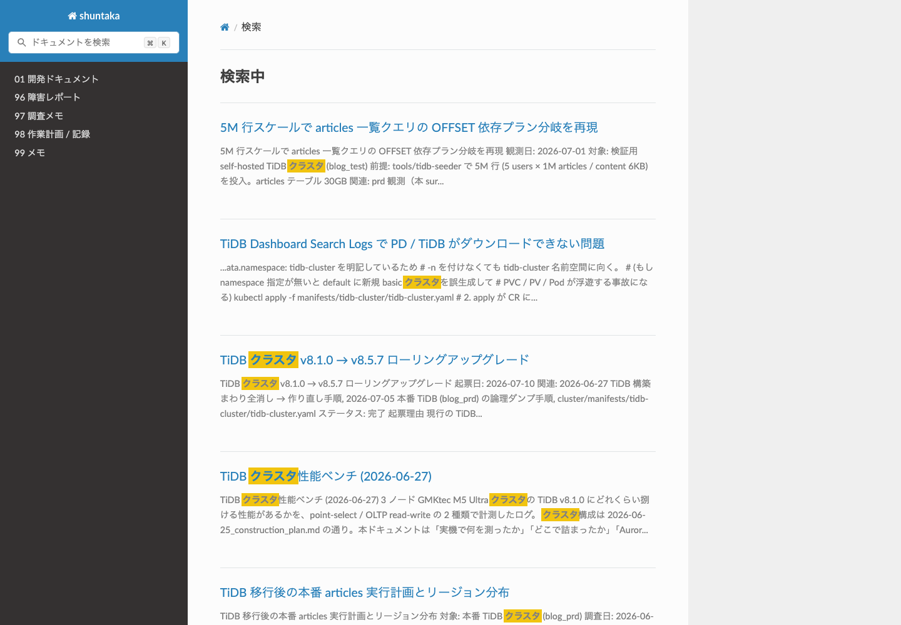
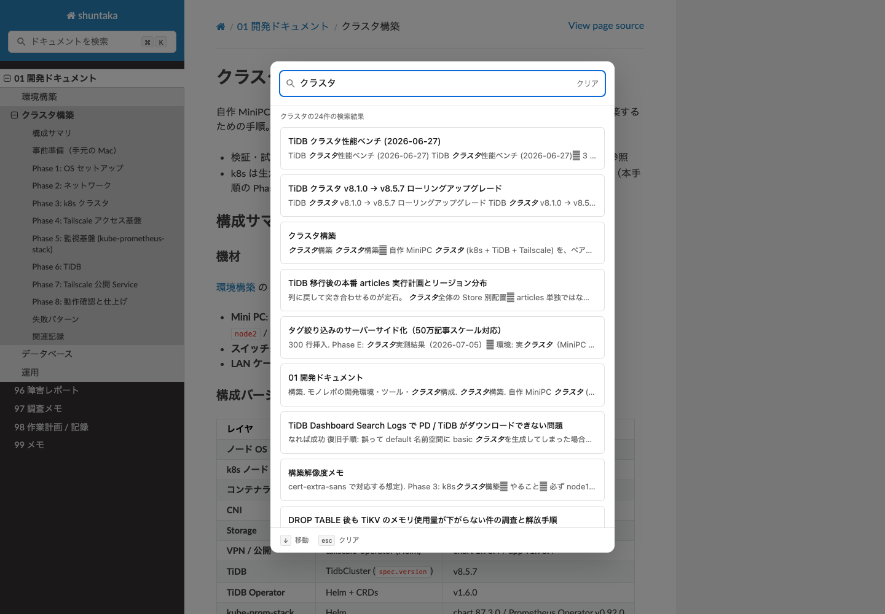

<!-- cspell:ignore searchtools -->

# Sphinx 日本語検索を Pagefind へ置き換える

- 起票日: 2026-07-15
- ステータス: 完了
- 対象: `docs/` の検索機能

## 結論

Sphinx は継続利用し、ブラウザの検索部分だけ Pagefind v1.5.2 (Extended) へ置き換えた。
同じ 66 ページに対する 5 クエリの比較では、期待ページを取得できるクエリが **3/5 から 5/5**、
0 件になるクエリが **2/5 から 0/5** へ改善した。該当ページ同士の順位は合否条件にしない。

これは RAG や意味検索ではない。日本語の技術用語を入力して目的ページへ到達するための全文検索改善である。
Codex / Claude へドキュメントについて質問するときは、別の RAG 基盤を設けず `@docs/` を参照させる。

## 変更前後

| 項目                   | 変更前                                           | 変更後                                                 |
| ---------------------- | ------------------------------------------------ | ------------------------------------------------------ |
| 検索エンジン           | Sphinx 組み込み検索                              | Pagefind v1.5.2 (Extended)                             |
| 日本語設定             | `language = "ja"` による Sphinx JapaneseSplitter | `force_language: ja` と Pagefind Extended の日本語分割 |
| UI                     | 検索結果ページへ遷移                             | `Command + K` 対応のモーダル内で即時表示               |
| 開発中のフォールバック | なし                                             | Pagefind 成果物がなければ Sphinx 検索欄を表示          |
| デプロイ成果物         | `searchindex.js`                                 | `searchindex.js` と `pagefind/`（通常UIは Pagefind）   |

### 変更前: Sphinx 組み込み検索



### 変更後: Pagefind



## 検索品質の比較

### 測定条件

- 測定日: 2026-07-15
- 対象: Sphinx が生成した同一の HTML 66 ページ
- 変更前: `search.html?q=<query>` による Sphinx 組み込み検索
- 変更後: 同じ HTML を Pagefind 1.5.2 Extended で索引化
- 順位: 期待するページが検索結果の何番目に現れたか（参考値であり合否条件にはしない）
- この測定ページは結果を汚染しないよう `nosearch: true` とし、両方の索引から除外

| クエリ                     | 期待するページ                                         |     変更前 |     変更後 | 判定       |
| -------------------------- | ------------------------------------------------------ | ---------: | ---------: | ---------- |
| `クラスタ`                 | クラスタ構築                                           | 6位 / 24件 | 3位 / 24件 | ヒット維持 |
| `ローリングアップグレード` | TiDB クラスタ v8.1.0 → v8.5.7 ローリングアップグレード |  1位 / 4件 |  1位 / 1件 | ノイズ削減 |
| `記事タグ`                 | 記事タグ機能（最大3階層）の追加と既存記事へのタグ付与  |  1位 / 4件 |  1位 / 1件 | ノイズ削減 |
| `全消し 作り直し`          | TiDB 構築まわり全消し → 作り直し手順                   |        0件 |  1位 / 5件 | 改善       |
| `撮影時刻`                 | moments の日付を EXIF 撮影時刻へ移行                   |        0件 |  1位 / 1件 | 改善       |

集計すると以下になる。

| 指標                         | 変更前 | 変更後 |
| ---------------------------- | -----: | -----: |
| 期待ページを取得できたクエリ |    3/5 |    5/5 |
| 0件になったクエリ            |    2/5 |    0/5 |

## Pagefind で改善する理由

今回の改善は意味検索や RAG によるものではない。主因は、**日本語の索引語と検索語を同じ規則で
分割できること**と、**タイトル・見出しを文書構造として順位へ反映すること**である。

### 日本語の索引語と検索語の分割が一致する

Sphinx 9.1 の日本語索引は、既定の TinySegmenter によりビルド時に本文を分割する。実際の
`searchindex.js` では、次の単位で索引化されていた。

| 入力              | Sphinx の索引語          |
| ----------------- | ------------------------ |
| `撮影時刻`        | `撮影`, `時刻`           |
| `全消し 作り直し` | `全消`, `し`, `作り直し` |

一方、今回 Sphinx が生成したブラウザ側の `_static/searchtools.js` は、検索文字列を空白や記号で
分割する汎用 `splitQuery` を使う。このため `撮影時刻` は分割されない1語、`全消し 作り直し` は
`全消し` と `作り直し` の2語になり、ビルド時の索引語と一致しない。Sphinx でこの2クエリが
0件だった直接の理由は、この索引時と検索時の分割差である。

Pagefind Extended は、日本語のように空白で単語を区切らない言語について、索引時と
ブラウザ検索時の双方でセグメンテーションする。そのため複合語の検索でも索引語と照合でき、
`撮影時刻` と `全消し 作り直し` が0件からヒットへ変わった。

- [Sphinx の日本語検索設定（既定は TinySegmenter）](https://www.sphinx-doc.org/ja/master/usage/configuration.html#confval-html_search_options)
- [Pagefind の日本語セグメンテーション](https://pagefind.app/docs/multilingual/#specialized-languages)

### タイトル・見出しが順位に強く反映される

Pagefind は既定で本文を重み1、`h1` から `h6` を重み7から2として扱い、ページタイトルの
一致も5倍にブーストする。今回は `layout.html` からページタイトルを `title` メタデータとして
明示的に渡している。この文書構造の重み付けと、語の出現頻度・文書長・語の類似度などを
組み合わせた順位計算により、本文中の偶発的な一致よりタイトルや見出しの一致が上がりやすい。

実測では、Sphinx で `クラスタ` の1位だったのはタイトルに検索語がない
「5M 行スケールで articles 一覧クエリの OFFSET 依存プラン分岐を再現」だったが、Pagefind では
「クラスタ構築」が6位から3位へ上がった。ただし各要素を個別に切り替えた比較ではないため、
順位差を単一の重みだけによるものとは断定しない。

- [Pagefind の見出し重み付け](https://pagefind.app/docs/weighting/)
- [Pagefind の順位計算とタイトルのブースト](https://pagefind.app/docs/ranking/)

### 件数比較の注意点

Sphinx の検索結果は見出しへのリンクを独立した結果として表示する場合がある。一方、今回の
Pagefind の件数はページ単位の `results.length` であり、ページ内の一致箇所は `sub_results` に
まとめられる。そのため「4件から1件」は純粋な検索精度だけでなく、結果をページ単位へ
集約した効果も含む。今回の比較で最も明確な改善根拠は、分割差で0件だった2クエリがヒットし、
期待ページへ到達できるようになったことである。

- [Pagefind のページ内サブ結果](https://pagefind.app/docs/sub-results/)

## 実装

- `docs/pagefind.yml`: `.document` だけを日本語として索引化
- `docs/source/_templates/searchbox.html`: Pagefind モーダルを読み込み、失敗時はSphinx検索へフォールバック
- `docs/source/_templates/layout.html`: タイトルをメタデータ化し、`nosearch: true` を Pagefind から除外
- `docs/source/_static/pagefind.css`: Read the Docs テーマ内の検索ボタンを調整
- `docs/scripts/check-search.ts`: 上記5ケースの期待ページを取得できることをビルドごとに検証
- `docs/package.json`: Sphinx → Pagefind → 検索品質チェックの順に実行
- `.github/workflows/docs.yaml`: GitHub Pages でも同じ `build-docs` を実行し、Pagefind の索引を成果物へ含める

```bash
bun run --cwd docs build-docs
```

検索品質だけ再確認する場合は、先に `docs/build/pagefind/` を生成してから実行する。

```bash
bun run --cwd docs check-search
```

このコマンドは現在の Pagefind に対する回帰チェックであり、Sphinx との比較を毎回実行するものではない。
ログには期待ページの取得可否・参考順位・総ヒットページ数・合格条件をそれぞれ名前付きで出力する。
順位は検索結果の観察用に残すが、該当ページ同士の並びが変わっても品質チェックは失敗させない。

## 制約

- 意味検索ではないため、長い自然文をそのまま入力する用途には向かない。2〜3個の技術用語で検索する。
- Pagefind が未生成の `sphinx-autobuild` 実行中は、従来の Sphinx 検索を使う。
- 配信先はドキュメントがドメイン直下に置かれる前提で、Pagefind のパスを `/pagefind/` としている。

## 作業ログ

### 2026-07-15

- 既存の Sphinx JapaneseSplitter の検索順位と0件クエリを測定した。
- Pagefind を追加し、66ページ・8,655語の日本語索引を生成した。
- 同じ5クエリで変更前後を比較し、期待ページ取得 3/5 → 5/5、0件 2/5 → 0/5を確認した。
- Sphinx と Pagefind の日本語分割・順位計算・結果単位を調査し、改善理由と比較上の注意点を記録した。
- GitHub Pages のビルドを `build-docs` に統一し、Pagefind 生成と検索品質チェックをデプロイ条件にした。
- 期待ページを取得できれば合格とし、該当ページ同士の順位を固定しない品質基準へ調整した。
- 日本語ディレクトリ配下からも検索モーダルを開けることを確認した。
- AIへの質問は `@docs/` で十分と判断し、RAG / Ollama / ベクトルDBは導入しない。
