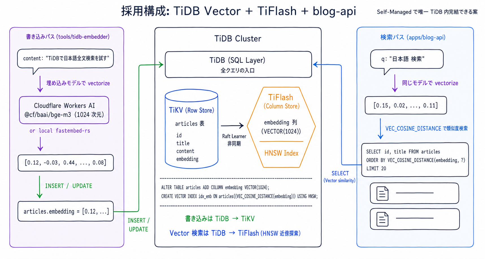
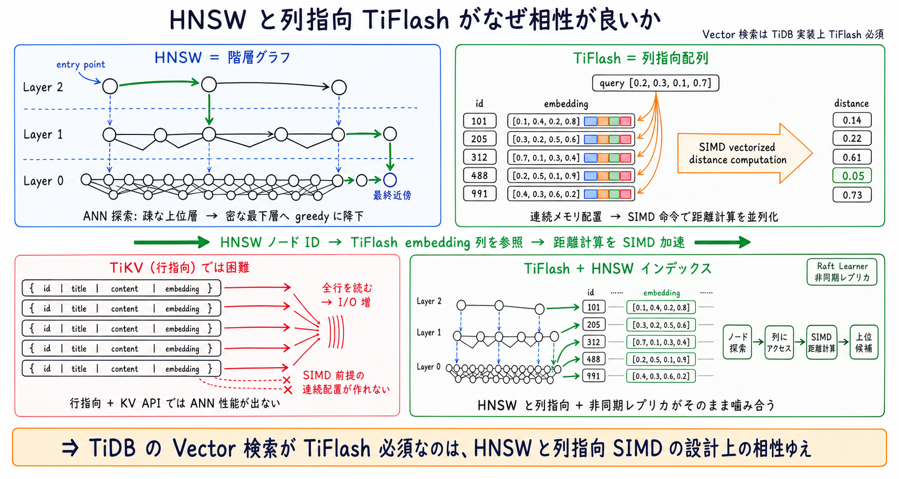
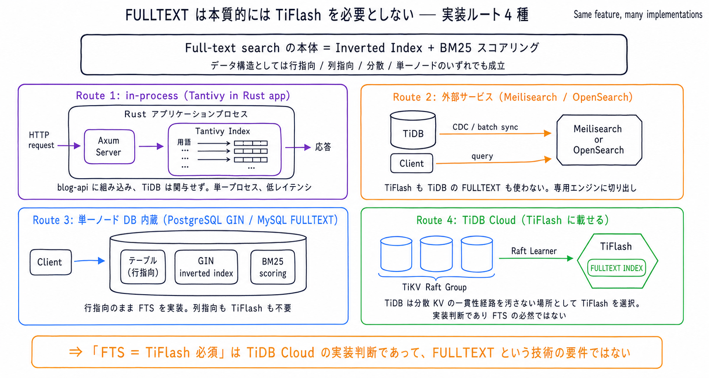
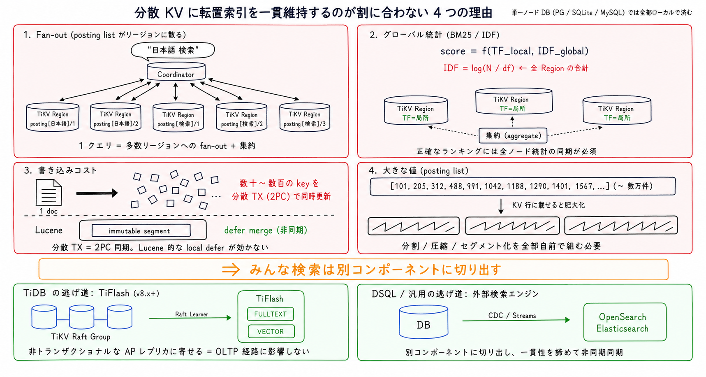
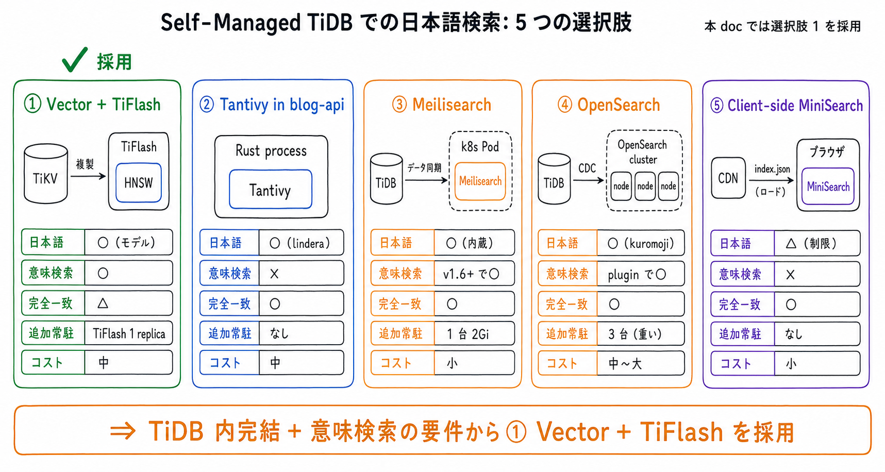

# TiDB Self-Managed で日本語全文検索を実現する方法 (Vector + TiFlash 採用)

- 起票日: 2026-07-15
- ステータス: 設計確定 (実装は別タスクで起票)
- 対象: `apps/blog-api` の記事検索、TiDB クラスタ (`cluster/manifests/tidb-cluster/`)

## 起票理由

`articles.content` に対する日本語全文検索が欲しい。初版 (#652 / #655) では TiDB v8.5 の FULLTEXT INDEX + TiFlash + kuromoji で組む Pattern A を採用と結論付けたが、公式ドキュメントで裏取りをしたところ **TiDB Self-Managed では FULLTEXT INDEX が動作しない** ことが判明した。本 doc は Self-Managed で実現可能な選択肢を再選定した訂正版として、Vector + TiFlash 案の採用理由と、なぜ他の選択肢ではなくこれなのかを整理する。

学習教材としての角度も兼ねて、以下 2 点を副軸に据える。

- なぜ TiDB の Vector 検索は TiFlash が必要か (実装論: HNSW と列指向 SIMD の相性)
- なぜ FULLTEXT は本質的には TiFlash を必要としないか (概念論: PostgreSQL / MySQL / Tantivy が証明済み)

## 前提: TiDB の FTS / Vector サポート状況 (2026-07 現在)

| 機能           | Cloud Starter / Essential         | Cloud Dedicated    | Self-Managed             | TiFlash             |
| -------------- | --------------------------------- | ------------------ | ------------------------ | ------------------- |
| FULLTEXT INDEX | ○ (Preview / 一部 AWS リージョン) | ✕ (構文パースのみ) | ✕ (構文パースのみ)       | TiDB の実装では必須 |
| VECTOR + HNSW  | ○                                 | ○ (v8.4.0 +)       | ○ (v8.4.0 +、v8.5+ 推奨) | 必須                |

「TiFlash 必須」の書き方に注意する。FULLTEXT については「TiDB の実装では必須」であって、FULLTEXT という技術が理論上 TiFlash を要求するわけではない (後述の「概念論」参照)。Vector + HNSW は TiDB の実装として必須で、これは HNSW と列指向 SIMD の設計上の相性による (後述の「実装論」参照)。

本 cluster は Self-Managed v8.5.7 なので、FULLTEXT INDEX を書いても index は作られず `fts_match_word` も動かない。Vector + HNSW は動く。

## 採用: Vector + TiFlash

Self-Managed で唯一 TiDB 内完結できる案として、Vector + TiFlash を採用する。



- articles テーブルに `embedding VECTOR(1024)` 列と HNSW インデックスを追加
- 埋め込み生成は都度スクリプト (`tools/tidb-embedder`) で、書き込み側と検索側で同じマルチリンガル埋め込みモデルを使う
- 埋め込みモデルは Cloudflare Workers AI `@cf/baai/bge-m3` (無料枠内、日本語対応) を第一候補、レイテンシや依存を減らしたければ Rust プロセス内で `fastembed-rs` を使う
- blog-api の検索エンドポイントは `VEC_COSINE_DISTANCE` で類似度検索

DDL の骨格

```sql
ALTER TABLE articles ADD COLUMN embedding VECTOR(1024);
ALTER TABLE articles SET TIFLASH REPLICA 1;
CREATE VECTOR INDEX idx_emb
  ON articles((VEC_COSINE_DISTANCE(embedding))) USING HNSW;

SELECT id, title
  FROM articles
 ORDER BY VEC_COSINE_DISTANCE(embedding, ?)
 LIMIT 20;
```

## なぜ TiDB の Vector 検索は TiFlash が必要なのか (実装論)



TiDB の Vector 検索は HNSW (Hierarchical Navigable Small World) というグラフ構造のインデックスを使う。HNSW は複数階層のグラフを重ねて、上位層は疎、最下層はすべてのベクトルを密に接続、というピラミッド状の探索構造を持つ。ANN (近似最近傍) 探索は上位層で greedy に降下して最下層で候補を絞り込む。

一方 TiFlash は列指向のストレージエンジンで、ベクトル列を連続メモリ上に配列として並べる。この配置は SIMD 命令 (Single Instruction, Multiple Data) による距離計算の並列化と極めて相性が良い。1 回の命令で複数ベクトルの距離を同時に計算できるため、HNSW の候補ノードに対する距離計算が高速に走る。

行指向の TiKV では

- ベクトルが行の中に埋め込まれるため、SIMD 前提の連続メモリ配置が作れない
- HNSW のようなグラフ構造を管理するための index 型が KV API に無い
- Raft consensus 経路を汚さずに派生インデックスを非同期で維持する仕組みが無い

TiFlash は Raft Learner として非同期にレプリカを受け取り、自前のストレージエンジン (DeltaTree) を持ち、その上に HNSW を含む新しい index 型をプラグイン追加できる。したがって「HNSW と列指向 SIMD と非同期レプリカ」が 3 点セットで噛み合うのが TiFlash 側で、TiKV 側にはこの噛み合わせが無い。これが TiDB の Vector 検索が TiFlash 必須である実装上の理由。

## なぜ FULLTEXT は本質的には TiFlash を必要としないのか (概念論)



Full-text search の本体は inverted index (転置索引) + BM25 スコアリング。データ構造としては「キー (トークン) がソート順に並ぶ / 前方一致・範囲スキャンできる / 1 キーに対して大きな posting list を効率的に読める」の 3 点さえ満たせば、行指向でも列指向でも、B-tree でも LSM でも成立する。実際、実装ルートは 4 種類ある。

- Route 1: **in-process (Tantivy in Rust app)** — blog-api に Tantivy を組み込み、TiDB は関与しない。単一プロセス、低レイテンシ
- Route 2: **外部サービス (Meilisearch / OpenSearch / Elasticsearch)** — TiDB からデータを同期し、専用エンジンで検索。分散環境で FTS を成立させる正攻法
- Route 3: **単一ノード DB 内蔵 (PostgreSQL GIN / MySQL FULLTEXT / SQLite FTS5)** — 行指向のまま FTS を実装。単一ノードなら列指向も TiFlash も不要
- Route 4: **TiDB Cloud (TiFlash に載せる)** — 分散 KV の一貫性経路の外側で inverted index を維持できる場所として TiFlash を選択

TiDB Cloud が Route 4 を採ったのは、分散 KV の OLTP 経路 (TiKV + Raft consensus) を汚さずに転置索引を維持するための実装判断であって、FTS という技術が TiFlash を要求しているわけではない。単一ノードなら Route 3、分散環境で正確なランキングが欲しければ Route 2、単一プロセスに閉じたければ Route 1、というふうに用途によって選べる。

### 補足: なぜ分散 KV で FTS を維持するのが割に合わないか



分散 KV で inverted index を一貫性を保ちつつ維持するのが辛いのは、Fan-out (posting list がリージョンに散る) / グローバル統計 (BM25 の IDF は全ノード統計の集約が必要) / 書き込みコスト (1 文書で数十〜数百 key を分散 TX 更新) / 大きな値 (posting list の圧縮・分割) の 4 点が同時にのしかかるため。だから Elasticsearch / OpenSearch は「eventually consistent + local defer」で一貫性を意図的に緩め、TiDB Cloud は「TiFlash という非トランザクショナルな AP レプリカに寄せる」ことで OLTP 経路を汚さないようにしている。どちらも「一貫性の緩い場所に FTS を追い出す」という同じ構造の設計判断。

## 選択肢の全体像



Self-Managed TiDB v8.5.7 で日本語検索を実現する現実的な選択肢は 5 種類ある。

| 選択肢                       | 実行場所        | 日本語形態素       | 意味検索    | 完全一致 | 追加常駐          | 実装コスト |
| ---------------------------- | --------------- | ------------------ | ----------- | -------- | ----------------- | ---------- |
| ① Vector + TiFlash (採用)    | TiDB 内         | 埋め込みモデル依存 | ○           | △        | TiFlash 1 replica | 中         |
| ② Tantivy in blog-api        | Rust プロセス内 | lindera 前処理     | ✕           | ○        | なし              | 中         |
| ③ Meilisearch                | k8s Pod         | 内蔵               | v1.6+ で ○  | ○        | 1 台 (2Gi RAM)    | 小         |
| ④ OpenSearch / Elasticsearch | k8s Pod         | kuromoji analyzer  | plugin で ○ | ○        | 3 台 (重い)       | 中〜大     |
| ⑤ Client-side MiniSearch     | ブラウザ        | 制限あり           | ✕           | ○        | なし              | 小         |

採用は ① の理由

- Self-Managed で TiDB 内完結できる唯一の選択肢
- 「関連記事」「自然文検索」のような意味検索的な要件が今後ほしくなる可能性が高い
- 既存 cluster に TiFlash を足すのは他の選択肢と比べても運用負荷が最小 (Meilisearch / OpenSearch を追加運用するより慣れているコンポーネント)

② / ③ / ④ は将来的に「型番・タイトルの完全一致検索」の要求が強くなった段階で、① と併用するハイブリッドとして再検討する。⑤ は記事数が数百〜数千規模を超えると client-side ロードが厳しくなるので、当面採らない。

## 実装フェーズ (別タスクで起票)

以下 4 フェーズを別途 `YYYY-MM-DD-tidb-vector-search-implementation/` として起票して進める。本 doc は設計判断の記録に留める。

- Phase 1: `cluster/manifests/tidb-cluster/tidb-cluster.yaml` に `spec.tiflash` を追加して `kubectl apply`
- Phase 2: `tools/dsql-cli/dsl-tidb/schema/` に `embedding VECTOR(1024)` 列 + HNSW インデックスの DDL を追加、`load.sh` で適用
- Phase 3: `tools/tidb-embedder/` を新規作成 (埋め込みモデルは Cloudflare Workers AI `@cf/baai/bge-m3` を第一候補、Tailnet 経由で dev DB 接続)
- Phase 4: `apps/blog-api` の検索エンドポイントを `VEC_COSINE_DISTANCE` で実装 (検索クエリも同じモデルで vectorize)

## 誤前提の訂正記録

- 初版 (#652) で TiDB FULLTEXT + kuromoji Pattern A を採用と結論付けた
- 続く追加 PR (#655) で「TiFlash が OLTP 一貫性の外にある」深掘り節を追加した
- 実際は Self-Managed / Cloud Dedicated では FULLTEXT INDEX が使えない (Cloud Starter / Essential 限定) ため、初版の Pattern A / B / D は全て成立しない
- 公式ドキュメントで裏取りをせずに機能存在を仮定していたのが根本原因
- 本 doc はその訂正版として、Self-Managed で実現可能な選択肢を再選定して Vector + TiFlash を採用に切り替えた
- 前 doc の以下の画像は誤前提の上に立っていたため削除した
  - `pattern-a-architecture.png` (Pattern A が Self-Managed で動く前提の構成図)
  - `fts-inverted-index-vs-column-store.png` (TiDB Self-Managed で列指向 FTS が動く前提の整理)
  - `tiflash-outside-oltp-plane.png` (Self-Managed で FULLTEXT + TiFlash 前提の深掘り)
- `distributed-fts-hard-spots.png` は一般論として正しいので保持

## 作業ログ

### 2026-07-15

- 初版で TiDB v8.5 の FULLTEXT + kuromoji Pattern A を採用と結論付け、深掘り節まで追加した
- 公式ドキュメントで裏取りしたところ Self-Managed では FULLTEXT INDEX が動作しないことが判明
- Vector + TiFlash を採用パターンとして再選定し、他 4 選択肢との比較で判断根拠を整理
- 学習教材として「Vector は TiFlash 必須 (実装論)」「FULLTEXT は TiFlash 不要 (概念論)」の対比を追加
- 実装は別タスクとして起票する
