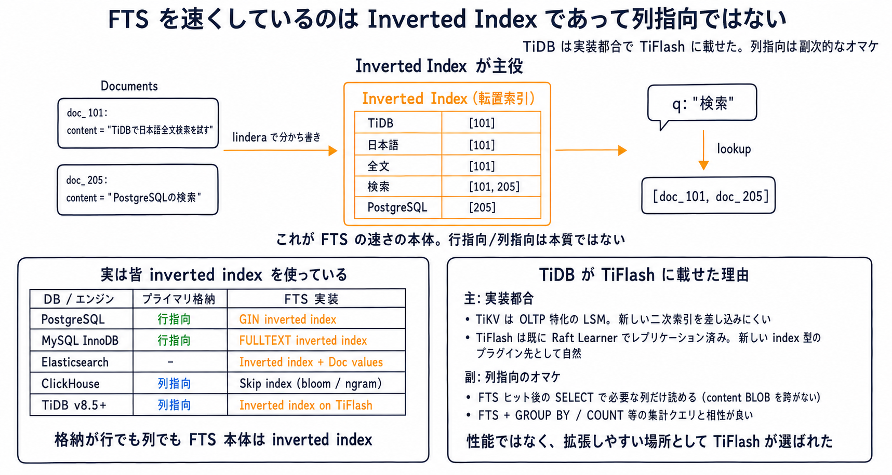
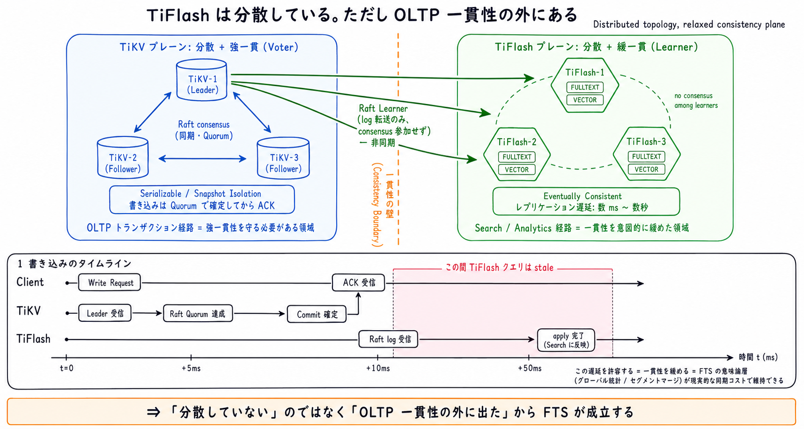
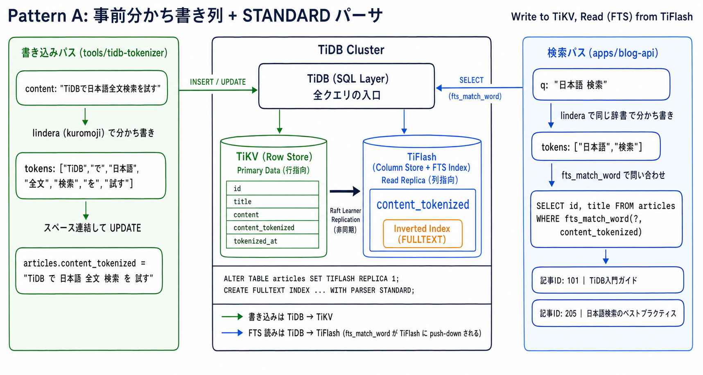

# TiDB FULLTEXT + kuromoji で日本語全文検索を実現する構成パターン整理

- 起票日: 2026-07-15
- ステータス: 設計確定 (実装は別タスクで起票)
- 対象: `apps/blog-api` の記事検索、TiDB クラスタ (`cluster/manifests/tidb-cluster/`)

## 起票理由

`articles.content` に対する日本語全文検索が欲しい。既存 TiDB (v8.5.7) に閉じたい一方で、TiDB 組み込みの FULLTEXT パーサに kuromoji は無いため、どのパターンで日本語トークナイズを担保するかを事前に決めておく。

## 前提

- TiDB v8.5 の FULLTEXT INDEX は `WITH PARSER STANDARD` (空白/句読点区切り) と `WITH PARSER MULTILINGUAL` (CJK は N-gram 相当) の2種のみ。
- FULLTEXT INDEX は TiFlash レプリカを必要とする。現クラスタは `cluster/manifests/tidb-cluster/tidb-cluster.yaml` に `spec.tiflash` が無く、追加が前提。
- 物理ノード余剰は 10〜15Gi/node 程度。TiFlash 3 レプリカで概ね埋まる。
- 日本語形態素解析は Rust 側の [`lindera`](https://github.com/lindera/lindera) で ipadic / unidic が使える。

## 補足: なぜ FTS が TiFlash に載っているか



「TiFlash = 列指向 = FTS に有利」という因果関係ではない。全文検索の速さの本体は inverted index (転置索引) というデータ構造で、格納が行指向でも列指向でも成立する。実際 PostgreSQL / MySQL InnoDB は行指向のまま FTS を実装しているし、ClickHouse は列指向でも FTS 本体は skip index (bloom / ngram) 相当を使う。

物理層 (B-tree / LSM のどちら) も本質ではない。inverted index に必要なのは「キー (トークン) がソート順に並ぶ / キーの前方一致・範囲スキャンができる / 1 キーに対して大きな posting list を効率的に読める」の 3 点で、B-tree でも LSM でも成立する。Lucene 自身が LSM 的 (immutable segment + merge)、SQLite FTS5 は B-tree 上に自前でセグメント構造を載せている。RocksDB ベースの TiKV も LSM でソート済み KV レンジスキャンができるので、原理的には転置索引を載せられる。

### コラム: 分散 KV に転置索引を一貫維持するのが割に合わない 4 つの理由


TiDB / DSQL のような分散 KV で FTS が辛いのは、B-tree か LSM かの話ではなく、以下の 4 点が同時にのしかかるから。

- Fan-out: posting list が広いキーレンジに散り、1 クエリで多数の region / node に fan-out する
- グローバル統計: BM25 / TF-IDF は全ノードの用語 df・文書数を集約しないと正確なランキングにならない。ローカルスコアだけでは順位が歪む
- 書き込みコスト: 1 文書 insert で数十〜数百の posting key を更新する必要があり、分散トランザクションだと 2PC の同期コストが跳ねる。Lucene は immutable local segment に書いて defer merge で逃げられるが、KV レイヤは逃げ場が無い
- 大きな値: 長い posting list をどう分割・圧縮するかを自前で組む必要があり、行指向 KV だと肥大化しやすい

要するに「B-tree じゃないから無理」ではなく、分散 KV の上でグローバル統計を要する転置索引を一貫性を保ちつつ維持するのが割に合わないので、みんな検索は別コンポーネントに切り出している、という話。単一ノードの PostgreSQL / SQLite / MySQL は全部ローカルで済むので、行指向のままでも FTS が持てる。

現状の逃げ道は 2 種類。

- TiDB → v8.x 以降、TiFlash 側でベクトル検索や FTS を実装する方向 (列指向・非トランザクショナルな AP レプリカに寄せて OLTP 経路を汚さない)
- DSQL → 素直に OpenSearch / Elasticsearch を横に置いて CDC で同期

### 深掘り: TiFlash は分散だが OLTP 一貫性の外にある



「TiFlash に載せると FTS が成立する」の直感的な誤解として「TiFlash は非分散だから楽」と受け取れるが、これは正確ではない。TiFlash も複数ノードで動かせて、データは TiKV と同じ region 単位でシャーディングされる。

本質は分散トポロジーではなく **consensus プロトコルへの参加有無**。TiKV は Voter として Raft consensus に参加し、書き込みが Quorum で確定してから ACK するため、書き込みごとに強一貫性を守る必要がある。TiFlash は Raft Learner で log を受け取るだけ、consensus には参加せず、非同期に apply する。書き込みタイムラインで見ると、Client が ACK を受け取った時点で TiFlash はまだ古い状態で、apply 完了まで数 ms〜数秒のギャップがある (この間の FTS クエリは stale なデータを返す)。

この遅延を許容することが、そのまま「FTS の意味論層 (グローバル統計 / セグメントマージ) を現実的な同期コストで維持できる」に繋がる。Elasticsearch や OpenSearch が採用している near-realtime + eventually consistent と同じ設計思想を、TiDB クラスタ内に取り込んだのが TiFlash である。

したがって「TiFlash に FTS が成立するのは分散していないから」ではなく「**OLTP 一貫性の外に出たから**」が正しい理解になる。この cluster で `TIFLASH REPLICA 1` を選ぶと副次的に全 region の TiFlash 複製が 1 ノードに集約されて実質単一ノード状態になり、分散 FTS の困難がさらに軽減されるが、これは SPOF (TiFlash 障害で FTS 縮退) との引き換えになる。

今回のように blog 検索が主目的なら、TiFlash レプリカを立てる運用コスト (メモリ / ストレージ / CPU) を承知の上で TiDB 内に閉じる、という選択になる。

## パターン一覧

### A. 事前分かち書き列 + STANDARD パーサ



「分かち書き」とは、`TiDBで日本語全文検索を試す` のような区切り文字の無い日本語文を、`TiDB / で / 日本語 / 全文 / 検索 / を / 試す` のように意味のある単位（形態素）で切り分け、スペース区切りの文字列にする処理を指す。TiDB の `STANDARD` パーサは空白と句読点でしかトークンを切り出せないため、事前にこの前処理を通した列を用意して、そこへ FULLTEXT INDEX を張る。

書き込みは `tools/tidb-tokenizer` (Rust CLI) が lindera (kuromoji) で分かち書きして `content_tokenized` を更新する。検索側 (`apps/blog-api`) も同じ辞書で入力クエリを分かち書きしてから `fts_match_word` に投げる。書き込み側と検索側で辞書が食い違うと再現率が落ちるので、lindera 呼び出しは共通 crate に切っておくのが後々効く。

```sql
ALTER TABLE articles
  ADD COLUMN content_tokenized MEDIUMTEXT NULL,
  ADD COLUMN tokenized_at TIMESTAMP(6) NULL;

ALTER TABLE articles SET TIFLASH REPLICA 1;
CREATE FULLTEXT INDEX idx_fts_content
  ON articles(content_tokenized) WITH PARSER STANDARD;

SELECT id, title
  FROM articles
 WHERE fts_match_word('技術 ブログ', content_tokenized)
 ORDER BY fts_match_word('技術 ブログ', content_tokenized) DESC
 LIMIT 20;
```

### B. MULTILINGUAL パーサに丸投げ

前処理列を持たず、TiDB の N-gram 相当パーサに任せる。

```sql
ALTER TABLE articles SET TIFLASH REPLICA 1;
CREATE FULLTEXT INDEX idx_fts_content
  ON articles(content) WITH PARSER MULTILINGUAL;
```

### C. TiDB Vector（FTS を使わない）

FULLTEXT を諦めて、埋め込みベクトルの類似検索で意味検索に寄せる。TiFlash 不要。

```sql
ALTER TABLE articles ADD COLUMN embedding VECTOR(768);
CREATE VECTOR INDEX idx_emb ON articles((VEC_COSINE_DISTANCE(embedding))) USING HNSW;

SELECT id, title
  FROM articles
 ORDER BY VEC_COSINE_DISTANCE(embedding, ?)
 LIMIT 20;
```

### D. A + C ハイブリッド

FTS で候補を広く取り、ベクトル類似度でリランクする（またはその逆）。TiDB 一台で両方を賄える。

```text
検索クエリ
  ├─ lindera 分かち書き → FULLTEXT で候補 50 件
  └─ 埋め込み変換       → VECTOR でリランク上位 20 件
```

## 比較

| 観点              | A (事前分かち書き) | B (MULTILINGUAL) | C (Vector)        | D (A+C)            |
| ----------------- | ------------------ | ---------------- | ----------------- | ------------------ |
| 日本語形態素      | ○ lindera 辞書依存 | △ N-gram 相当    | ○ 埋め込みモデル  | ○                  |
| 完全一致 (型番等) | ○                  | ○                | △ 苦手            | ○                  |
| 意味検索          | ✕                  | ✕                | ○                 | ○                  |
| TiFlash 必要      | 要                 | 要               | 不要              | 要                 |
| ストレージ増      | 本文とほぼ同量     | FTS 分のみ       | ベクトル列 + 索引 | A + C の合算       |
| 辞書更新時        | 全件再トークナイズ | 不要             | 不要              | 全件再トークナイズ |
| 実装コスト        | 中 (worker 要る)   | 小               | 中 (埋め込み生成) | 大                 |
| 実験機能に依存    | FULLTEXT 全般      | FULLTEXT + 精度  | Vector は v8.4 GA | 両方               |

## 分かち書き列 (パターン A / D) の更新方式

Rust 側で `content_tokenized` を埋める処理の起動方式。初手は都度スクリプト、規模が増えたら CronJob へ。

| 方式                             | 実装場所                       | 起動                      | 想定スコープ                         |
| -------------------------------- | ------------------------------ | ------------------------- | ------------------------------------ |
| ローカル CLI (手動)              | `tools/tidb-tokenizer/`        | 手元から `cargo make run` | 初手。都度実行で十分な間             |
| k8s CronJob                      | `cluster/manifests/tokenizer/` | 5 分間隔ポーリング        | 記事更新頻度が上がってから           |
| k8s Deployment 常駐              | `cluster/manifests/tokenizer/` | 5 秒間隔 or TiCDC 購読    | 投稿から数秒で検索反映が要る場合     |
| 書き込みトランザクション内で同期 | `apps/blog-api` ハンドラ       | INSERT / UPDATE 時        | 記事保存 API に lindera を同居させる |

いずれの方式でも「未処理 or 本文更新後」の判定は `tokenized_at IS NULL OR tokenized_at < updated_at` で共通化する。

## TiFlash 追加コスト（A / B / D 共通）

`spec.tiflash` を1レプリカ足す想定。現クラスタの余剰と競合するため、TiKV の `block-cache.capacity` を 4GB → 2GB に絞る等の並行チューニングが要る。

| コンポーネント       | 追加 request | 追加 limit | ストレージ                |
| -------------------- | ------------ | ---------- | ------------------------- |
| TiFlash × 3 replicas | 2Gi / node   | 8Gi / node | 100Gi / node (local-path) |

## 採用パターン

パターン A (事前分かち書き列 + STANDARD パーサ) + ローカル CLI (`tools/tidb-tokenizer/`) を採用する。

- B (MULTILINGUAL 丸投げ) は後から精度改善が効かないため、最初から A で組む。
- C (Vector 単独) は「意味検索」の要件が出た時点で別途検討する。今回のスコープは全文検索のみ。
- D (A + C ハイブリッド) は将来の拡張候補として保留。関連記事 / 自然文検索の要件が出た段階で追加する。

書き込み側 CLI は都度手動実行で開始し、記事更新頻度が上がってから CronJob 化を検討する。

## 実装フェーズ (別タスクで起票)

以下 4 フェーズを別途 `YYYY-MM-DD-tidb-fts-kuromoji-implementation/` として起票して進める。本ドキュメントは設計判断の記録に留める。

- Phase 1: `cluster/manifests/tidb-cluster/tidb-cluster.yaml` に `spec.tiflash` を追加して `kubectl apply`
- Phase 2: `tools/dsql-cli/dsl-tidb/schema/` に列追加 + FULLTEXT INDEX の DDL を追加、`load.sh` で適用
- Phase 3: `tools/tidb-tokenizer/` を新規作成 (lindera + sqlx、Tailnet 経由で dev DB 接続)
- Phase 4: `apps/blog-api` の検索エンドポイントで `fts_match_word` を叩く (検索語も lindera で分かち書き)

## 作業ログ

### 2026-07-15

- TiDB v8.5 の FULLTEXT パーサに kuromoji が無いことを確認し、4 パターン (A / B / C / D) を洗い出した。
- 分かち書き列の更新方式を「ローカル CLI → CronJob → 常駐」の順で段階移行することにした。
- FTS が TiFlash に載っている理由 (inverted index が主役、列指向はオマケ) を図で整理した。
- パターン A + ローカル CLI を採用パターンとして確定。実装は別タスクで起票する。
