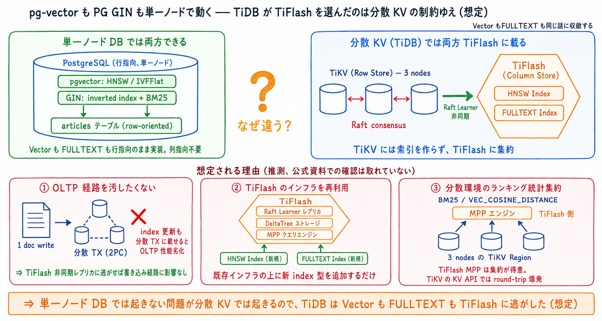

# TiDB Self-Managed で日本語全文検索を実現する方法 (Vector + TiFlash 採用)

- 起票日: 2026-07-15
- ステータス: 設計確定 (実装は別タスクで起票)
- 対象: `apps/blog-api` の記事検索、TiDB クラスタ (`cluster/manifests/tidb-cluster/`)

## 起票理由

`articles.content` に対する日本語全文検索が欲しい。初版 (#652 / #655) では TiDB v8.5 の FULLTEXT INDEX + TiFlash + kuromoji で組む Pattern A を採用と結論付けたが、公式ドキュメントで裏取りをしたところ **TiDB Self-Managed では FULLTEXT INDEX が動作しない** ことが判明した。本 doc は Self-Managed で実現可能な選択肢を再選定した訂正版として、Vector + TiFlash 案の採用理由と、なぜ他の選択肢ではなくこれなのかを整理する。

学習教材としての角度も兼ねて、以下を副軸に据える。

- TiDB (分散 KV) はなぜ Vector も FULLTEXT も TiFlash に載せたのか (想定): 単一ノード DB (pg-vector, PG GIN 等) との対比から、想定される理由を整理

## 前提: TiDB の FTS / Vector サポート状況 (2026-07 現在)

| 機能           | Cloud Starter / Essential         | Cloud Dedicated    | Self-Managed             | TiFlash             |
| -------------- | --------------------------------- | ------------------ | ------------------------ | ------------------- |
| FULLTEXT INDEX | ○ (Preview / 一部 AWS リージョン) | ✕ (構文パースのみ) | ✕ (構文パースのみ)       | TiDB の実装では必須 |
| VECTOR + HNSW  | ○                                 | ○ (v8.4.0 +)       | ○ (v8.4.0 +、v8.5+ 推奨) | 必須                |

「TiFlash 必須」の書き方に注意する。FULLTEXT については「TiDB の実装では必須」であって、FULLTEXT という技術が理論上 TiFlash を要求するわけではない (後述の「概念論」参照)。Vector + HNSW は TiDB の実装として必須で、これは HNSW と列指向 SIMD の設計上の相性による (後述の「実装論」参照)。

本 cluster は Self-Managed v8.5.7 なので、FULLTEXT INDEX を書いても index は作られず `fts_match_word` も動かない。Vector + HNSW は動く。

## 採用: Vector + TiFlash

Self-Managed で唯一 TiDB 内完結できる案として、Vector + TiFlash を採用する。


- articles テーブルに `embedding VECTOR(N)` 列と HNSW インデックスを追加 (N は採用モデルの次元)
- 埋め込みモデルは [`pfnet/plamo-embedding-1b`](https://huggingface.co/pfnet/plamo-embedding-1b) を採用 (Apache 2.0、日本語特化、CPU でも動く)
- 埋め込みモデルは k8s Pod として cluster 内に配置し、書き込み側 (`tools/tidb-embedder`) と検索側 (`apps/blog-api`) の双方が同じ endpoint に問い合わせる
- 外部 API (Cloudflare Workers AI 等) に依存しない構成にすることで、既存 cluster 運用モデル (Tailnet + k8s + self-hosted) と揃える
- blog-api の検索エンドポイントは `VEC_COSINE_DISTANCE` で類似度検索

DDL の骨格 (VECTOR の次元は plamo-embedding-1b のモデル config を確認して合わせる)

```sql
ALTER TABLE articles ADD COLUMN embedding VECTOR(2048);  -- 実装時にモデル次元と合わせる
ALTER TABLE articles SET TIFLASH REPLICA 1;
CREATE VECTOR INDEX idx_emb
  ON articles((VEC_COSINE_DISTANCE(embedding))) USING HNSW;

SELECT id, title
  FROM articles
 ORDER BY VEC_COSINE_DISTANCE(embedding, ?)
 LIMIT 20;
```

## TiDB (分散 KV) はなぜ Vector も FULLTEXT も TiFlash に載せたのか (想定)

前置きしておくと、本節は **推測を含む**。PingCAP は「TiDB の Vector 検索は TiFlash 必須」「TiDB Cloud の FULLTEXT は TiFlash 必須」という事実は公表しているが、「なぜ TiKV ではなく TiFlash を選んだのか」を明示した公式資料は本 doc 執筆時点で見つけられていない。以下は他 DB の実装から示唆される、TiDB がその選択をしたと想定される理由の整理。



### 事実 (裏取り済み)

- TiDB Self-Managed の **Vector 検索は TiFlash 必須** ([公式 doc](https://docs.pingcap.com/tidb/stable/vector-search-index/))
- TiDB Cloud の **FULLTEXT は TiFlash 必須** ([公式 doc](https://docs.pingcap.com/tidbcloud/vector-search-full-text-search-sql/): DDL 構文に `ADD_COLUMNAR_REPLICA_ON_DEMAND`、実行プランは TiFlash MPP 上の `textSearch` オペレータ)
- 単一ノード DB は Vector も FULLTEXT も行指向のまま実装できている
  - Vector: [pgvector](https://github.com/pgvector/pgvector) は PostgreSQL 拡張として IVFFlat / HNSW を行指向のまま実装
  - FULLTEXT: PostgreSQL GIN / MySQL InnoDB FULLTEXT / SQLite FTS5 / Lucene / Tantivy が inverted index を行指向のまま実装

つまり **HNSW 自体、inverted index 自体は列指向 (TiFlash) を要求しない** ことが、単一ノード DB の実装から示唆される。pg-vector が PostgreSQL 内で普通に動いているのがその直接的な反例。したがって TiDB が TiFlash を選んだのは技術的必然というより設計判断であろう、というのが本節の想定。

### 想定される理由 (推測)

TiDB が Vector も FULLTEXT も TiFlash に載せている想定される理由は、以下 3 点に集約される (推測)。

1. **OLTP 経路 (TiKV + Raft consensus) を汚したくない**
   複雑な index の更新 (Vector index の graph 更新も、FULLTEXT の posting list 更新も 1 文書で数十〜数百キー相当) を分散トランザクションに載せると、OLTP パフォーマンスが劣化する。TiFlash は Raft Learner で非同期に受け取るため、書き込みが確定してから TiFlash 側で index を作れば OLTP には影響しない。
2. **TiFlash のインフラを再利用できる**
   Raft Learner レプリカ + 独自ストレージエンジン (DeltaTree) + MPP クエリエンジンが既に揃っている場所に新しい index 型 (Vector, FULLTEXT) を追加する方が、TiKV に差し込むより実装コストが低い。
3. **分散環境でのランキング統計集約**
   BM25 の IDF や近傍探索の相対距離は、複数ノードの統計・データを集約しないと正確に計算できない。TiFlash の MPP エンジンは分析クエリ向けに設計されていて、この種の集約が得意 (TiKV の KV API では round-trip が爆発する)。

これらは公式に確認された理由ではなく、他 DB の実装事情と TiDB のアーキテクチャから逆算した仮説であることを再度強調しておく。単一ノードなら pg-vector / PG GIN のように行指向で普通にできることを、分散 KV で強一貫性を保ちつつやろうとすると割に合わない、というのが根っこにある構造だと想定している。

### 補足: 分散 KV に転置索引 / ベクトル索引を一貫維持するのが辛い理由


上の想定理由と表裏の関係で、分散 KV で複雑な index を一貫性を保ちつつ維持するのが辛いのは、Fan-out (posting list や HNSW graph が region に散る) / グローバル統計 (BM25 の IDF や相対距離は全ノード統計の集約が必要) / 書き込みコスト (1 文書で数十〜数百 key を分散 TX 更新) / 大きな値 (posting list や graph node は 1 キーあたり大きい) の 4 点が同時にのしかかるため。Elasticsearch / OpenSearch は「eventually consistent + local defer」で一貫性を意図的に緩めることでこの制約を回避し、TiDB は「TiFlash という非トランザクショナルな AP レプリカに寄せる」ことで OLTP 経路を汚さずに済ませている。どちらも「一貫性の緩い場所に複雑な index を追い出す」という同じ構造の設計判断。

## 選択肢の全体像


Self-Managed TiDB v8.5.7 で日本語検索を実現する現実的な選択肢は 5 種類ある。

| 選択肢                       | 実行場所        | 日本語形態素       | 意味検索    | 完全一致 | 追加常駐          | 実装コスト |
| ---------------------------- | --------------- | ------------------ | ----------- | -------- | ----------------- | ---------- |
| ① Vector + TiFlash (採用)    | TiDB 内         | 埋め込みモデル依存 | ○           | △        | TiFlash 1 replica | 中         |
| ② Tantivy in blog-api        | Rust プロセス内 | lindera 前処理     | ✕           | ○        | なし              | 中         |
| ③ Meilisearch                | k8s Pod         | 内蔵               | v1.6+ で ○  | ○        | 1 台 (2Gi RAM)    | 小         |
| ④ OpenSearch / Elasticsearch | k8s Pod         | kuromoji analyzer  | plugin で ○ | ○        | 3 台 (重い)       | 中〜大     |
| ⑤ Client-side MiniSearch     | ブラウザ        | 制限あり           | ✕           | ○        | なし              | 小         |

採用は ① の理由

- Self-Managed で TiDB 内完結できる唯一の選択肢
- 「関連記事」「自然文検索」のような意味検索的な要件が今後ほしくなる可能性が高い
- 既存 cluster に TiFlash を足すのは他の選択肢と比べても運用負荷が最小 (Meilisearch / OpenSearch を追加運用するより慣れているコンポーネント)

② / ③ / ④ は将来的に「型番・タイトルの完全一致検索」の要求が強くなった段階で、① と併用するハイブリッドとして再検討する。⑤ は記事数が数百〜数千規模を超えると client-side ロードが厳しくなるので、当面採らない。

## 実装フェーズ (別タスクで起票)

以下 4 フェーズを別途 `YYYY-MM-DD-tidb-vector-search-implementation/` として起票して進める。本 doc は設計判断の記録に留める。

- Phase 1: `cluster/manifests/tidb-cluster/tidb-cluster.yaml` に `spec.tiflash` を追加して `kubectl apply`
- Phase 2: `cluster/manifests/plamo-embedding/` に PLaMo Embedding 1B の Deployment + Service を追加 (Hugging Face から `pfnet/plamo-embedding-1b` を pull、`/embed` HTTP endpoint を公開)
- Phase 3: モデル config から実際の embedding dimension を確認し、`tools/dsql-cli/dsl-tidb/schema/` に `embedding VECTOR(N)` 列 + HNSW インデックスの DDL を追加、`load.sh` で適用
- Phase 4: `tools/tidb-embedder/` を新規作成 (PLaMo Embedding service に HTTP で問い合わせ、Tailnet 経由で dev DB に UPDATE)
- Phase 5: `apps/blog-api` の検索エンドポイントを `VEC_COSINE_DISTANCE` で実装 (検索クエリも PLaMo Embedding service で vectorize)

## 誤前提の訂正記録

- 初版 (#652) で TiDB FULLTEXT + kuromoji Pattern A を採用と結論付けた
- 続く追加 PR (#655) で「TiFlash が OLTP 一貫性の外にある」深掘り節を追加した
- 実際は Self-Managed / Cloud Dedicated では FULLTEXT INDEX が使えない (Cloud Starter / Essential 限定) ため、初版の Pattern A / B / D は全て成立しない
- 公式ドキュメントで裏取りをせずに機能存在を仮定していたのが根本原因
- 本 doc はその訂正版として、Self-Managed で実現可能な選択肢を再選定して Vector + TiFlash を採用に切り替えた
- 前 doc の以下の画像は誤前提の上に立っていたため削除した
  - `pattern-a-architecture.png` (Pattern A が Self-Managed で動く前提の構成図)
  - `fts-inverted-index-vs-column-store.png` (TiDB Self-Managed で列指向 FTS が動く前提の整理)
  - `tiflash-outside-oltp-plane.png` (Self-Managed で FULLTEXT + TiFlash 前提の深掘り)
- 訂正版で追加した以下の画像は、根拠付けが不十分だったため削除・差し替えた
  - `hnsw-tiflash-fit.png` (「HNSW と列指向 SIMD の相性」を必然のように描いていたが、pg-vector が反例。削除)
  - `fulltext-implementation-routes.png` (FULLTEXT のみの実装ルート比較。Vector も同じ話に収斂するため、統合図 `single-node-vs-distributed-kv.png` に差し替え)
- `distributed-fts-hard-spots.png` は一般論として正しいので保持

## 作業ログ

### 2026-07-15

- 初版で TiDB v8.5 の FULLTEXT + kuromoji Pattern A を採用と結論付け、深掘り節まで追加した
- 公式ドキュメントで裏取りしたところ Self-Managed では FULLTEXT INDEX が動作しないことが判明
- Vector + TiFlash を採用パターンとして再選定し、他 4 選択肢との比較で判断根拠を整理
- 埋め込みモデルを Cloudflare Workers AI から k8s Pod 上の PLaMo Embedding 1B (pfnet/plamo-embedding-1b, Apache 2.0) に変更
- 学習章の framing を「Vector は TiFlash 必須 (実装論) / FULLTEXT は TiFlash 不要 (概念論)」の 2 章から、pg-vector が反例になる指摘を受けて「TiDB (分散 KV) はなぜ Vector も FULLTEXT も TiFlash に載せたのか (想定)」の 1 章に統合。単一ノード DB (pg-vector, PG GIN) の反例を対比として並置
- 実装は別タスクとして起票する
