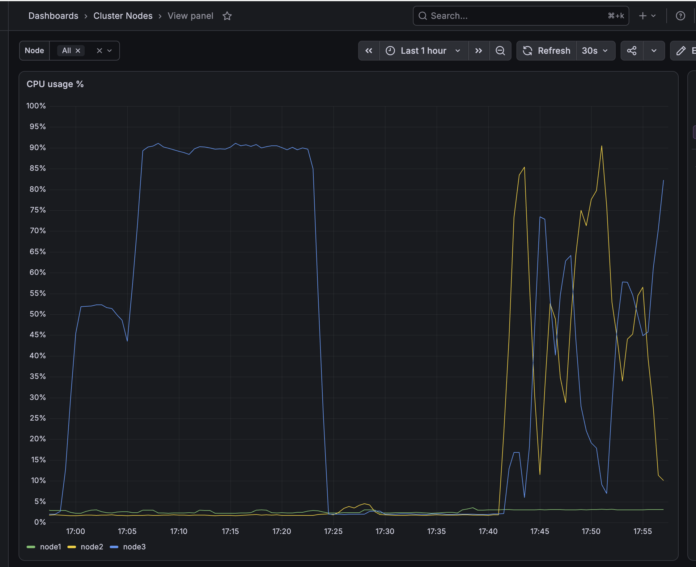

<!-- cspell:ignore fastapi huggingface pretrained pydantic QVEC sentencepiece urlencode uvicorn -->

# TiDB Vector 検索実装 (PLaMo Embedding 1B + TiFlash)

- 起票日: 2026-07-15
- 関連: [2026-07-15 TiDB FTS 構成調査 (Vector + TiFlash 採用)](../2026-07-15-tidb-fts-kuromoji-patterns/index.md), [`cluster/manifests/tidb-cluster/tidb-cluster.yaml`](../../../../cluster/manifests/tidb-cluster/tidb-cluster.yaml), [`tools/dsql-cli/dsl-tidb/schema/`](../../../../tools/dsql-cli/dsl-tidb/schema/), [`apps/blog-api/`](../../../../apps/blog-api/)
- ステータス: 進行中

## 起票理由

前タスク ([2026-07-15 TiDB FTS 構成調査](../2026-07-15-tidb-fts-kuromoji-patterns/index.md)) で「Self-Managed TiDB で日本語検索を実現するには Vector + TiFlash が唯一の TiDB 内完結案」という結論に至った。本 doc はその実装タスクとして、TiFlash 追加から検索エンドポイント公開までを 7 フェーズに分解し、各フェーズの具体的な作業内容・検証手順・本番展開手順を整理する。

## 全体アーキテクチャ

```
                                          ┌─ blog-api (search endpoint)
                                          │       │
                                          ▼       │ q="..."
                             PLaMo Embedding Service ◀─┘
                         (k8s Pod, /chunks + /embed HTTP)
                                          ▲
                                          │ PLaMO tokenizerでchunk化 + document embedding
        tidb-embedder (ローカル backfill) ─┤
        (source hashが変わった記事だけ)   │
                                          ▼
                                TiDB (blog_dev / blog_prd)
                                article_embedding_chunks.embedding VECTOR(2048)
                                + HNSW index on TiFlash replica

  ─ ─ ─ (最終フェーズ) ─ ─ ─
   GitHub webhook → blog-api が記事変更時にchunkを再生成・記事単位で差し替え
```

- 書き込み経路 (初期): ローカルから `tools/tidb-embedder` を実行し、記事を最大1024 tokens、128 tokens overlapでchunk化して専用テーブルへ保存する
- 読み取り経路: blog-api がクエリをPLaMOでvectorizeし、近いchunkを検索して記事単位に集約する
- 継続更新 (webhook 経路): 全体が動き始めてから最後に組み込む。それまでは記事更新後に再度ローカルスクリプトを実行する

## 実装フェーズ (チェックボックス管理)

- [x] Phase 1: TiFlash 追加 (manifest 編集 → apply → replica 確認) — 2026-07-15 完了
- [x] Phase 2: PLaMo Embedding Service (k8s Pod + HTTP wrapper) — 2026-07-15 完了
- [x] Phase 3: `articles.embedding` による1記事1vectorの検証 — 2026-07-15 完了、Phase 4でchunk方式へ移行
- [x] Phase 4: PLaMO tokenizerによるchunk backfill + HNSWインデックス作成 — 2026-07-15 完了
- [ ] Phase 5: `blog-api` 検索エンドポイント + `apps/web` 検索 UI 実装
- [ ] Phase 6: 本番 (blog_prd) 適用 (TiFlash replica + DDL + backfill)
- [ ] Phase 7: GitHub webhook 経路への embedding 生成組み込み (継続更新)

## 前提

- `~/.kube/config-mycluster` から k8s クラスタに到達可能 (Tailscale 経由)
- `mysql` クライアントで dev DB (`blog_dev`) に接続できる
- リポジトリルート (`shuntaka-dev`) がカレントディレクトリ
- 開発環境のインフラ適用 (`kubectl apply`, DDL 実行, ツール実行) は **ユーザーが手動で実施する**。本 doc の作業指示は「編集内容 + 実行コマンド」のセットで書く

```bash
export KUBECONFIG=~/.kube/config-mycluster
export TAILNET=$(tailscale status --json | jq -r '.MagicDNSSuffix')
```

## 想定所要時間 (dev 環境)

| フェーズ                               | 目安時間                    |
| -------------------------------------- | --------------------------- |
| Phase 1: TiFlash 追加                  | 10 - 20 分                  |
| Phase 2: PLaMo Embedding Service       | 30 - 60 分 (初回 pull 込み) |
| Phase 3: DDL 適用                      | 5 分                        |
| Phase 4: tidb-embedder 実装 + 埋め戻し | 60 分 + データ量依存        |
| Phase 5: 検索エンドポイント + Web UI   | 120 - 240 分                |
| Phase 6: 本番適用                      | 30 分                       |
| Phase 7: webhook 組み込み (継続更新)   | 30 分                       |

---

## Phase 1: TiFlash 追加

### 1-1. 前提確認

TiFlash は各 k8s ノードのローカルディスクに DeltaTree ストレージを持つ。dev では 1 replica で十分。

- ノードに空きストレージがあること (`local-path` provisioner の PV が確保できる領域)
- 記事データは 2.5MB 程度と小さいので 20Gi あれば十分だが、将来の拡張を見越して **50Gi** で確保する
- MiniPC は Ryzen 7 7730U (**amd64**) なので `pingcap/tiflash:v8.5.7` の amd64 manifest が pull される

```bash
kubectl -n tidb-cluster get tc basic -o jsonpath='{.spec.version}'
# → v8.5.7 が出ればよい

kubectl get nodes -o custom-columns=NAME:.metadata.name,ARCH:.status.nodeInfo.architecture
# → amd64 が並ぶこと (MiniPC = Ryzen 7 7730U)
```

### 1-2. TidbCluster manifest 編集

`cluster/manifests/tidb-cluster/tidb-cluster.yaml` の `spec` に `tiflash` セクションを追加する。既存の `pd` / `tikv` / `tidb` と同じ書式 (baseImage, requests, config, topologySpreadConstraints, additionalVolumes) を踏襲する。

追加内容 (末尾に追記):

```yaml
tiflash:
  baseImage: pingcap/tiflash
  replicas: 1
  requests:
    cpu: '500m'
    memory: '4Gi'
  limits:
    memory: '8Gi'
  storageClaims:
    - resources:
        requests:
          storage: 50Gi
      storageClassName: local-path
  config:
    config: |
      [logger]
        level = "info"
      [profiles.default]
        max_memory_usage = 0
    proxy: |
      log-level = "info"
  topologySpreadConstraints:
    - topologyKey: kubernetes.io/hostname
      maxSkew: 1
```

TiFlash 特有の注意点:

- `spec.tiflash.config` は `config` (tiflash 本体) と `proxy` (組み込み TiKV Learner) の 2 サブキーを持つ (`pd` / `tikv` / `tidb` の `config: |` 単一とは書式が違う)
- `storageClaims` は list。TiFlash は data ディレクトリを複数 PV に分散できる設計だが dev では 1 本
- log 出力先はデフォルトで良い (TiKV のような `[log.file]` 明示は不要。DeltaTree エンジンのログは stdout に流れて `kubectl logs` で見える)
- `additionalVolumes` (log emptyDir) は付けない — TiKV は debug 用に `/var/log/tikv` を分けているが TiFlash は使用頻度が低いので割愛

### 1-3. 反映 (ユーザー実行)

```bash
kubectl -n tidb-cluster apply -f cluster/manifests/tidb-cluster/tidb-cluster.yaml
```

Operator が `basic-tiflash-0` StatefulSet を作成し、Pod が起動するのを待つ (5 - 15 分)。

```bash
kubectl -n tidb-cluster get pods -l app.kubernetes.io/component=tiflash -w
# basic-tiflash-0   4/4   Running が出れば OK
```

### 1-4. 動作確認 (ユーザー実行)

TiFlash が Region を認識しているか確認。

```bash
kubectl -n tidb-cluster exec -it basic-pd-0 -- /pd-ctl store
# store.labels に engine=tiflash が付いたノードが 1 つあること
```

MySQL クライアントから `INFORMATION_SCHEMA.tiflash_replica` を叩いて、まだ TiFlash replica を張ったテーブルが無いことを確認 (Phase 3 で articles に張る)。

```bash
mysql -h tidb.${TAILNET} -P 4000 -u root -e \
  "SELECT * FROM INFORMATION_SCHEMA.TIFLASH_REPLICA;"
# → Empty set が出れば正常
```

### Phase 1 完了条件

- [x] `basic-tiflash-0` Pod が `4/4 Running`
- [x] `pd-ctl store` に engine=tiflash が 1 store 見える (store id 7097, state Up, v8.5.7)
- [x] `INFORMATION_SCHEMA.TIFLASH_REPLICA` が空 (テーブル未指定なので正常。TiFlash store の `region_count: 0` からも確認可能)

---

## Phase 2: PLaMo Embedding Service

### 2-1. 設計

PLaMo Embedding 1B (`pfnet/plamo-embedding-1b`, Apache 2.0) は `AutoModel` から `encode_query(text)` / `encode_document(text)` を呼び出すカスタム実装 (sentence-transformers ではない)。したがって **Python FastAPI wrapper を自作** して HTTP エンドポイント化する。

- 依存: `torch` (CPU), `transformers`, `sentencepiece`, `fastapi`, `uvicorn`
- エンドポイント: `POST /embed` — body `{"text": "...", "mode": "query" | "document"}` → `{"vector": [float; N]}`
- モデルは Pod 起動時に 1 回だけ load して常駐 (メモリに乗せる)
- 次元数 (N) は `/embed` の query / document 両モードで **2048 次元** と実測済み
- 記事本文 (~数千文字) 1 本の encode は CPU で 100 - 500 ms 程度を想定

### 2-2. ディレクトリ構成 (実装済み)

```
cluster/manifests/plamo-embedding/
├── server.py          # FastAPI + transformers wrapper
├── Dockerfile         # linux/amd64, model を build 時に焼き込み
├── deployment.yaml    # Namespace + Deployment (2 replicas) + Service (ClusterIP)
└── build-and-push.sh  # ローカル build & ghcr push
```

実体は [`cluster/manifests/plamo-embedding/`](../../../../cluster/manifests/plamo-embedding/) を参照。

### 2-3. 設計メモ

- **model 事前焼き込み**: Dockerfile の build 時に HuggingFace から model を pull し image に含める。image サイズは ~5GB になるが、Pod 起動時のダウンロード時間 / ネットワーク依存を消せる (registry pull は node ごとに 1 回で済む)
- **`snapshot_download` を使う理由**: 素直に `AutoModel.from_pretrained()` で pre-warm すると model を RAM に全展開して verify するため、Docker Desktop 既定メモリ (2-4GB) を超えて OOM (`Killed`, `cannot allocate memory`) になる。`huggingface_hub.snapshot_download` はファイル DL のみで RAM を使わないので build が通る。runtime の `AutoModel.from_pretrained()` は HF cache から読むので network 不要のまま
- **CPU 版 torch**: `--index-url https://download.pytorch.org/whl/cpu` で fetch。amd64 wheel が公式提供されている (target が Ryzen MiniPC = amd64)
- **2 replicas**: node1 は TiFlash 用に空け、node2 / node3 へ PLaMo を1 Podずつ配置する。`podAntiAffinity` で同居を禁止する
- **Deployment strategy: RollingUpdate**: `maxSurge: 0`, `maxUnavailable: 1` とし、更新中に追加 Pod を作らずモデル分のメモリ増加を防ぐ
- **Tailnet 公開**: `cluster/manifests/tailscale/plamo-embedding-public.yaml` で `plamo-embedding.<tailnet>` をServiceへ接続する。`port-forward svc/...` は1 Podへ直接転送されるため、複数Podへの分散には使わない
- **依存バージョン (Dockerfile)**: `torch==2.5.1`, `transformers==4.46.0`, `sentencepiece==0.2.0`, `fastapi==0.115.4`, `uvicorn==0.32.0`, `pydantic==2.9.2` を pin
- **`--provenance=false --sbom=false` (build-and-push.sh)**: buildx はデフォルトで OCI index に attestation manifest を追加するが、k3s/MiniPC の古めの containerd がそれで `no match for platform in manifest` と誤判定して pull に失敗する (`ImagePullBackOff`)。attestation を切ることで single-platform manifest だけになり pull が通る

### 2-4. ghcr ログイン (初回のみ、ユーザー実行)

ghcr.io は Docker のパスワード認証を受け付けない (MFA の有無に関わらず PAT 必須)。既存の `gh` CLI 認証に `write:packages` / `read:packages` を後付けして、`gh auth token` の出力で docker login するのが最短。

```bash
# 現状の scope 確認 (write:packages が無ければ次のコマンドで追加)
gh auth status

# scope を後付け (ブラウザで one-time code の入力を求められる)
gh auth refresh --scopes write:packages,read:packages

# gh のトークンで ghcr にログイン
gh auth token | docker login ghcr.io -u shuntaka9576 --password-stdin
# → "Login Succeeded" が出れば OK
```

**トラブルシュート**: `docker login ghcr.io` で対話的に password を入力すると `denied: denied` になる。これは GitHub の web パスワードを渡しているため。必ず PAT (もしくは `gh auth token` の出力) を stdin から渡すこと。

### 2-5. Image ビルド + push (ユーザー実行)

Apple Silicon Mac (native arm64) から実行するのが速い。

```bash
cd cluster/manifests/plamo-embedding
./build-and-push.sh
# → ghcr.io/shuntaka9576/plamo-embedding:latest を build & push
# タグを分けたい場合: TAG=2026-07-15 ./build-and-push.sh
```

初回 build は torch install + model download で 10-20 分程度。

**なぜ workflow_dispatch action ではないか**: PLaMo image は「Python deps か server.py を変えるまで更新しない」性質で、更新頻度が低い。`deploy-tidb-proxy.yaml` のような頻繁な更新は想定しないため、まずローカルスクリプトで済ませる。更新頻度が上がってきたら (~ 月次) workflow 化を検討する。

### 2-6. Package を public 化 (初回のみ、ユーザー実行)

ghcr は **push した package が必ず private で作成される** (リポジトリが public でも独立)。private のままだと kubelet が pull できず `ErrImagePull` になる。無料運用のため public に切り替える。

**個人アカウントの package visibility は REST API から変更できない** (org packages 用の PATCH はあるが user packages 側は 404)。Web UI からのみ操作可能。

```bash
open "https://github.com/users/shuntaka9576/packages/container/plamo-embedding/settings"
```

ページ末尾 **Danger Zone** → **"Change package visibility"** → **Public** → package name (`plamo-embedding`) を入力して確定。

確認 (API では visibility 取得は可能):

```bash
gh api /user/packages/container/plamo-embedding | jq '.visibility'
# → "public"
```

一度 public 化すれば同名 package への以降の push でも visibility は維持される。**将来別 image (例: `tidb-embedder`) を追加する場合はそれぞれ改めて public 化が必要**。

### 2-7. 反映 (ユーザー実行)

```bash
kubectl apply -f cluster/manifests/plamo-embedding/deployment.yaml
kubectl apply -f cluster/manifests/tailscale/plamo-embedding-public.yaml
kubectl -n plamo-embedding get pods -w
# node2 / node3 の2 Podが Running / READY 1/1 になるまで待つ
```

### 2-8. 動作確認 (ユーザー実行)

Tailnet公開Serviceへ接続する。

```bash
curl -s -X POST http://plamo-embedding.${TAILNET}/embed \
  -H 'Content-Type: application/json' \
  -d '{"text":"日本語の検索テスト","mode":"query"}' | jq '.dim'
# → 2048 が返れば OK。異なる値なら Phase 3 の VECTOR(N) を実測値に合わせる
```

`document` モードも一応叩いておく:

```bash
curl -s -X POST http://plamo-embedding.${TAILNET}/embed \
  -H 'Content-Type: application/json' \
  -d '{"text":"これは記事本文の例です","mode":"document"}' | jq '{dim, head: .vector[0:3]}'
```

### Phase 2 完了条件

- [x] `plamo-embedding` Pod が Ready
- [x] `/embed` (query / document 両方) が 2048 (実測値) 次元の float 配列を返す
- [x] `dim = 2048` を Phase 3 の DDL に反映する値として記録した

---

## Phase 3: `articles.embedding` 列 + TiFlash replica (旧方式・実施記録)

このフェーズでは1記事の本文全体を1vectorにしたが、長文でタイトルや検索対象の話題が薄まり、PLaMOの最大context長4096 tokensを超える部分はtruncationされる。2026-07-15の精度確認を受け、Phase 4から `article_embedding_chunks` へ移行する。以下はTiFlash障害を含む実施記録として残し、新規環境のschemaには `articles.embedding` を追加しない。

### 3-1. 当初適用したDDL (履歴)

`tools/dsql-cli/dsl-tidb/schema/04_articles.sql` の末尾に、他のマイグレーションと同じ形式で追記する (専用ファイルを切らないのは既存の `content_html` 追加も同ファイル末尾に置いているため)。

```sql
-- 2026-07-15 Vector 検索: articles.embedding + TiFlash replica
-- N は PLaMo Embedding 1B の実測次元 (Phase 2-8 で確認した値 = 2048)
ALTER TABLE `${SCHEMA}`.`articles`
  ADD COLUMN `embedding` VECTOR(2048) NULL AFTER `content_html`;

-- TiFlash replica を張る (Phase 1 で TiFlash store が起動済みであること)
ALTER TABLE `${SCHEMA}`.`articles` SET TIFLASH REPLICA 1;

-- HNSW index は embedding の backfill と TiFlash COMPACT の完了後に作成する。
```

### 3-2. 適用 (ユーザー実行)

`load.sh` は差分マイグレーションではなく、`schema/*.sql` を先頭から実行する初期構築用スクリプトである。既存の `blog_dev` では、適用済みのカラムやインデックスを再追加しようとしてエラーになるため、今回は新しい2文だけを実行する。

```bash
mysql -h tidb.${TAILNET} -P 4000 -u root blog_dev <<'SQL'
ALTER TABLE articles ADD COLUMN embedding VECTOR(2048) NULL AFTER content_html;
ALTER TABLE articles SET TIFLASH REPLICA 1;
SQL
```

このDDLは旧方式であり、現在の `04_articles.sql` からは削除済み。新規環境では実行しない。

```bash
cd tools/dsql-cli/dsl-tidb
./load.sh --database blog_dev --host tidb.${TAILNET}
```

### 3-3. 動作確認 (ユーザー実行)

TiFlash replica の同期が完了しているか確認。

```bash
mysql -h tidb.${TAILNET} -P 4000 -u root -e "
SELECT TABLE_SCHEMA, TABLE_NAME, REPLICA_COUNT, AVAILABLE, PROGRESS
  FROM INFORMATION_SCHEMA.TIFLASH_REPLICA
 WHERE TABLE_SCHEMA = 'blog_dev' AND TABLE_NAME = 'articles';"
# AVAILABLE = 1, PROGRESS = 1 になれば同期完了 (数分〜十数分)
```

### Phase 3 完了条件

- [x] `articles.embedding` 列が `vector(2048)` で存在
- [x] `TIFLASH_REPLICA.AVAILABLE = 1, PROGRESS = 1`

### 3-4. HNSW先行作成によるTiFlashクラッシュと復旧 (2026-07-15)

初回は全133記事の `embedding` が NULL の状態で HNSW index を作成した。その後、TiFlash v8.5.7 が `DMFileVectorIndexWriter` で既存DMFileのindexを構築する際、checksum frame size 0を除算して `Floating point exception` (exit 136) でCrashLoopした。

```text
EnsureStableLocalIndex - Begin building index
Received signal Floating point exception(8).
Integer divide by zero.
FramedChecksumReadBuffer<XXH3>::doSeek
DMFileVectorIndexWriter::buildIndexForFile
```

TiDB側のindex定義はdrop済みだが、TiFlashはPVC上に残った古いlocal-index taskをschema同期より先に再開し、同じクラッシュを繰り返した。`SHOW CREATE TABLE` にindexがないことを確認してから、一度TiFlash replicaを0にしてlocal replicaを切り離す。以下はユーザーが実行する。

```bash
mysql -h tidb.${TAILNET} -P 4000 -u root -e \
  "SHOW CREATE TABLE blog_dev.articles\G"
# idx_articles_embedding がないこと

mysql -h tidb.${TAILNET} -P 4000 -u root blog_dev -e \
  "ALTER TABLE articles SET TIFLASH REPLICA 0;"

mysql -h tidb.${TAILNET} -P 4000 -u root -e "
SELECT * FROM INFORMATION_SCHEMA.TIFLASH_REPLICA
 WHERE TABLE_SCHEMA = 'blog_dev' AND TABLE_NAME = 'articles';"
# 0 rowsになること

# CrashLoopのbackoffを待たず、replica=0の最新schemaで起動し直す
kubectl -n tidb-cluster delete pod basic-tiflash-0

kubectl -n tidb-cluster get pods -l app.kubernetes.io/component=tiflash -w
# basic-tiflash-0 が 4/4 Running に戻ること
```

[TiDB公式のTiFlash replica作成手順](https://docs.pingcap.com/tidb/stable/create-tiflash-replicas/)でも `SET TIFLASH REPLICA 0` はreplicaの削除を意味する。これだけで復旧しない場合は、壊れた分析用replicaのPVCを再作成する。元データはTiKVにあるため、backfill後にreplicaを1へ戻すと再同期される。

```bash
# TiFlashだけを停止する (TiDB / TiKVには影響しない)
kubectl -n tidb-cluster patch tidbcluster basic --type merge \
  -p '{"spec":{"tiflash":{"replicas":0}}}'
kubectl -n tidb-cluster wait --for=delete pod/basic-tiflash-0 --timeout=5m

# 現在の分析用replica PVCと、Retainされるnode上の実データを削除する
PV=$(kubectl -n tidb-cluster get pvc data0-basic-tiflash-0 \
  -o jsonpath='{.spec.volumeName}')
PV_NODE=$(kubectl get pv "${PV}" \
  -o jsonpath='{.spec.nodeAffinity.required.nodeSelectorTerms[0].matchExpressions[0].values[0]}')
PV_PATH=$(kubectl get pv "${PV}" -o jsonpath='{.spec.hostPath.path}')
kubectl -n tidb-cluster delete pvc data0-basic-tiflash-0
kubectl -n tidb-cluster wait \
  --for=delete pvc/data0-basic-tiflash-0 --timeout=5m

# pvReclaimPolicy=Retainのため、対象pathを表示・確認してから削除する
echo "${PV_NODE}:${PV_PATH}"
# /opt/local-path-provisioner/*_tidb-cluster_data0-basic-tiflash-0 であること
ssh "${PV_NODE}" sudo rm -rf --one-file-system -- "${PV_PATH}"
kubectl delete pv "${PV}" --wait=false
kubectl wait --for=delete "pv/${PV}" --timeout=5m

# source manifestと同じ1 replicaへ戻す
kubectl -n tidb-cluster patch tidbcluster basic --type merge \
  -p '{"spec":{"tiflash":{"replicas":1}}}'
kubectl -n tidb-cluster get pods -l app.kubernetes.io/component=tiflash -w
# 新しいbasic-tiflash-0が4/4 Runningになること
```

#### PVCを先に削除して`Terminating`になった場合

Podを停止する前にPVCの削除を開始すると、`kubernetes.io/pvc-protection` finalizerにより、PodがPVCを使用している間は削除が完了しない。2026-07-15の作業では以下の中途状態になった。

- `data0-basic-tiflash-0`: `Terminating`
- `basic-tiflash-0`: 古いPVCを使用したまま `3/4 CrashLoopBackOff`
- TiDB: `REPLICA_COUNT = 1`のまま (`SET TIFLASH REPLICA 0`のDDL履歴なし)
- PV: `pvc-01d5b048-5bd0-4348-9bcb-b4f8bfd73d35`, reclaim policyは`Retain`

この場合はfinalizerを強制削除せず、次の順序で復旧を続ける。

```bash
# 削除中PVCのPV、node、hostPathをPVCが消える前に記録する
PV=$(kubectl -n tidb-cluster get pvc data0-basic-tiflash-0 \
  -o jsonpath='{.spec.volumeName}')
PV_NODE=$(kubectl get pv "${PV}" \
  -o jsonpath='{.spec.nodeAffinity.required.nodeSelectorTerms[0].matchExpressions[0].values[0]}')
PV_PATH=$(kubectl get pv "${PV}" -o jsonpath='{.spec.hostPath.path}')

# DB上のTiFlash replicaを外す
mysql -h tidb.${TAILNET} -P 4000 -u root blog_dev -e \
  "ALTER TABLE articles SET TIFLASH REPLICA 0;"

# TiFlash Podを停止するとPVC protectionが解除され、PVC/PVの削除が進む
kubectl -n tidb-cluster patch tidbcluster basic --type merge \
  -p '{"spec":{"tiflash":{"replicas":0}}}'
kubectl -n tidb-cluster wait --for=delete pod/basic-tiflash-0 --timeout=5m
kubectl -n tidb-cluster wait \
  --for=delete pvc/data0-basic-tiflash-0 --timeout=5m

# pvReclaimPolicy=Retainのため、旧データとReleased PVを明示削除する
if kubectl get pv "${PV}" >/dev/null 2>&1; then
  echo "${PV_NODE}:${PV_PATH}"
  # /opt/local-path-provisioner/*_tidb-cluster_data0-basic-tiflash-0 であること
  ssh "${PV_NODE}" sudo rm -rf --one-file-system -- "${PV_PATH}"
  kubectl delete pv "${PV}" --wait=false
  kubectl wait --for=delete "pv/${PV}" --timeout=5m
fi

# 空のPVCでTiFlashを再作成する
kubectl -n tidb-cluster patch tidbcluster basic --type merge \
  -p '{"spec":{"tiflash":{"replicas":1}}}'
kubectl -n tidb-cluster get pods -l app.kubernetes.io/component=tiflash -w
# 新しいPVC名になり、basic-tiflash-0が4/4 Runningを維持すること
```

旧 `articles.embedding` のHNSW indexは、Phase 4のchunk方式を検証してから削除する。それまでは比較・rollback用として残す。

---

## Phase 4: PLaMO tokenizerによるchunk backfill + HNSW作成

### 4-1. chunk設計 (実装済み)

[PLaMO-Embedding-1B公式model card](https://huggingface.co/pfnet/plamo-embedding-1b)では最大context長は4096 tokensだが、学習時のcontext長とbenchmark計測は1024 tokens。これに合わせ、文字数近似ではなくPLaMO Pod内の同じtokenizerで分割する。

- MarkdownのATX見出し (`#`〜`######`) をsection境界にし、見出し階層を保持する
- code fence内の `#` は見出しとして扱わない
- 1 chunkはmetadataを含め最大1024 tokens、長いsectionは128 tokens overlapでwindow分割する
- 各embedding入力は `タイトル + 見出し階層 + 概要 + 本文chunk` とする
- metadataは最大256 tokensに制限し、本文用budgetを確保する
- `source_hash` はchunking version、token設定、title、description、contentからSHA-256で作る

PLaMO Serviceへ `POST /chunks` を追加した。ここでtokenizeだけ行い、返された `embedding_text` を既存の `POST /embed` (`mode=document`) へ渡す。

```text
cluster/manifests/plamo-embedding/
├── chunking.py
├── chunking_test.py
├── server.py
└── Dockerfile
```

### 4-2. PLaMO Service更新 (ユーザー実行)

```bash
cd cluster/manifests/plamo-embedding
./build-and-push.sh

kubectl -n plamo-embedding rollout restart deployment/plamo-embedding
kubectl -n plamo-embedding rollout status deployment/plamo-embedding --timeout=15m
```

`/chunks` がversion、token数、embedding用textを返すことを確認する。

```bash
curl -s -X POST http://plamo-embedding.${TAILNET}/chunks \
  -H 'Content-Type: application/json' \
  -d '{
    "title":"TiDB Vector検索",
    "description":"動作確認用の記事",
    "content":"# 概要\nPLaMOで記事を分割します。",
    "max_tokens":1024,
    "overlap_tokens":128
  }' | jq '{version, max_tokens, overlap_tokens, chunks}'
```

### 4-3. chunkテーブル作成 (ユーザー実行)

`09_article_embedding_chunks.sql` を追加した。既存の `blog_dev` には過去の非冪等な `ALTER TABLE` が適用済みなので `load.sh` は再実行せず、今回のファイルだけを流す。

```bash
cd tools/dsql-cli/dsl-tidb
SCHEMA=blog_dev
sed "s|\${SCHEMA}|${SCHEMA}|g" schema/09_article_embedding_chunks.sql \
  | mysql -h tidb.${TAILNET} -P 4000 -u root
```

```sql
CREATE TABLE article_embedding_chunks (
  chunk_id CHAR(36) NOT NULL DEFAULT (UUID()),
  article_id CHAR(36) NOT NULL,
  chunk_index INT UNSIGNED NOT NULL,
  heading VARCHAR(1000) NULL,
  content LONGTEXT NOT NULL,
  token_count INT UNSIGNED NOT NULL,
  chunking_version VARCHAR(64) NOT NULL,
  source_hash CHAR(64) NOT NULL,
  embedding VECTOR(2048) NOT NULL,
  created_at DATETIME(6) NOT NULL DEFAULT CURRENT_TIMESTAMP(6),
  PRIMARY KEY (chunk_id),
  UNIQUE KEY uq_article_embedding_chunks_article_index (article_id, chunk_index)
);
ALTER TABLE article_embedding_chunks SET TIFLASH REPLICA 1;
```

HNSW indexはbackfillとTiFlash compactionの後に作る。`embedding` は最初から `NOT NULL` でinsertするため、旧方式の「全NULLのDMFileへindexを先行作成」した状態にはならない。

### 4-4. `tools/tidb-embedder` (実装済み)

CLIは全記事を読み、保存済み `source_hash` と現在の記事内容から計算したhashが違う記事だけを対象にする。

- `--dry-run` は `/chunks` まで実行し、chunk数とtoken数を表示する。embedding生成とDB更新は行わない
- 本実行は全chunkの2048次元vector生成が成功してから、記事単位のtransactionで旧chunkを削除・新chunkをinsertする
- 途中のAPI失敗では既存chunkを保持し、終了コードを非0にする
- `--all` でhash一致記事も再生成できる
- 全件実行時は削除済み記事の孤立chunkも検出し、本実行で削除する
- リクエストごとにHTTP connectionを閉じ、2 Podへconnection単位で分散する

```text
--endpoint <url>          TiDB接続先
--embed-endpoint <url>    PLaMO Service
--all                     source hash一致記事も再生成
--slug <slug>             特定slugだけ処理
--dry-run                 chunk数/token数だけ確認
--concurrency <n>         同時embedding request数 (default: 1、2 Pod時は2)
--timeout <ms>            PLaMO API 1 requestのtimeout (default: 120000)
--max-tokens <n>          1 chunkの最大token数 (default: 1024)
--overlap-tokens <n>      window間の重複token数 (default: 128)
```

### 4-5. backfill (ユーザー実行)

Tailnet公開Service経由でnode2/node3の2 Podへ分散する。`kubectl port-forward svc/...` は1 Podへ直接転送されるため使用しない。

```bash
cd tools/tidb-embedder
bun install
bun run backfill \
  --endpoint "mysql://root@tidb.${TAILNET}:4000/blog_dev" \
  --embed-endpoint "http://plamo-embedding.${TAILNET}" \
  --concurrency 2 \
  --max-tokens 1024 \
  --overlap-tokens 128 \
  --dry-run

# chunk数と最大token数を確認後、--dry-runを外す
bun run backfill \
  --endpoint "mysql://root@tidb.${TAILNET}:4000/blog_dev" \
  --embed-endpoint "http://plamo-embedding.${TAILNET}" \
  --concurrency 2 \
  --max-tokens 1024 \
  --overlap-tokens 128
```

PLaMOは1リクエストでも約14/16 logical CPUを使用した。2 Podに対して `--concurrency 2` (1 Podあたり1リクエスト目安) とし、それ以上はCPU oversubscriptionで逆に遅くなるため増やさない。

#### 2 Pod backfill時のCPU使用率 (2026-07-15、旧1記事1vector時)



17:23頃まではnode3の単一Podが約90%のCPUを継続使用していた。2 Pod化した17:41頃以降はnode2/node3の両方に負荷が分散し、TiFlashを配置するnode1は約2〜3%を維持した。chunk方式はrequest数が増えるが、同じく2 Pod、同時実行2を上限にする。

### 4-6. backfillとHNSWの確認 (ユーザー実行)

全記事にchunkがあり、token上限違反が0件であることを確認する。

```bash
mysql -h tidb.${TAILNET} -P 4000 -u root blog_dev -e "
SELECT COUNT(*) AS chunks,
       COUNT(DISTINCT article_id) AS chunked_articles,
       MIN(token_count) AS min_tokens,
       MAX(token_count) AS max_tokens,
       SUM(token_count > 1024) AS over_limit
  FROM article_embedding_chunks;

SELECT COUNT(*) AS missing_articles
  FROM articles AS a
  LEFT JOIN article_embedding_chunks AS c ON c.article_id = a.article_id
 WHERE c.chunk_id IS NULL;"
```

`chunked_articles = 133`、`missing_articles = 0`、`over_limit = 0`を確認する。TiFlash replica同期後にcompactし、HNSW indexを作る。

```bash
mysql -h tidb.${TAILNET} -P 4000 -u root -e "
SELECT TABLE_SCHEMA, TABLE_NAME, REPLICA_COUNT, AVAILABLE, PROGRESS
  FROM INFORMATION_SCHEMA.TIFLASH_REPLICA
 WHERE TABLE_SCHEMA = 'blog_dev'
   AND TABLE_NAME = 'article_embedding_chunks';"
# AVAILABLE = 1, PROGRESS = 1まで待つ

mysql -h tidb.${TAILNET} -P 4000 -u root blog_dev <<'SQL'
ALTER TABLE article_embedding_chunks COMPACT;
CREATE VECTOR INDEX idx_article_embedding_chunks_embedding
  ON article_embedding_chunks ((VEC_COSINE_DISTANCE(embedding))) USING HNSW;
SQL
```

```bash
mysql -h tidb.${TAILNET} -P 4000 -u root -e "
SELECT TIDB_DATABASE, TIDB_TABLE, INDEX_NAME,
       ROWS_STABLE_INDEXED, ROWS_STABLE_NOT_INDEXED,
       ROWS_DELTA_INDEXED, ROWS_DELTA_NOT_INDEXED, ERROR_MESSAGE
  FROM INFORMATION_SCHEMA.TIFLASH_INDEXES
 WHERE TIDB_DATABASE = 'blog_dev'
   AND TIDB_TABLE = 'article_embedding_chunks';"
```

`ROWS_STABLE_NOT_INDEXED = 0`、`ROWS_DELTA_NOT_INDEXED = 0`、`ERROR_MESSAGE` が空ならbuild完了。

2026-07-15の実行結果:

- 133記事から1,101 chunksを生成 (`missing_articles = 0`)
- token数は最小20、最大1024、1024超過は0件
- HNSWは `ROWS_STABLE_INDEXED = 1101`、Stable/Deltaの未index行はともに0、errorなし

### 4-7. サンプル検索と旧vector削除 (ユーザー実行)

```bash
QVEC=$(curl -s -X POST http://plamo-embedding.${TAILNET}/embed \
  -H 'Content-Type: application/json' \
  -d '{"text":"Rust Axum API","mode":"query"}' \
  | jq -c '.vector')

mysql -h tidb.${TAILNET} -P 4000 -u root blog_dev -e "
SELECT c.article_id, LEFT(a.title, 55) AS title, c.heading,
       VEC_COSINE_DISTANCE(c.embedding, '${QVEC}') AS dist
  FROM article_embedding_chunks AS c
  JOIN articles AS a ON a.article_id = c.article_id
 ORDER BY VEC_COSINE_DISTANCE(c.embedding, '${QVEC}')
 LIMIT 20;"
```

2026-07-15に `Rust Axum API` で確認したところ、旧1記事1vector方式では対象記事のdistanceが `0.4674` で上位に入らなかったのに対し、chunk方式では「Rust(axum) on Lambda × Aurora DSQL × Next.js on Vercelで個人ブログをリーアーキした話」が1位 (`0.35846897784588017`) になった。

このqueryはタイトルとの一致が強いため、同じ記事の複数chunkが上位20件に現れる。chunk近傍検索としては想定どおりであり、Phase 5の検索APIでは候補を多めに取得した後、`article_id` ごとにdistance最小のchunkへ集約する。

HNSW利用可否はjoinや記事単位の集約を外し、TiFlashを固定した最小queryで確認する。

```bash
mysql -h tidb.${TAILNET} -P 4000 -u root blog_dev -e "
EXPLAIN
SELECT /*+ READ_FROM_STORAGE(TIFLASH[c]) */
       c.article_id,
       VEC_COSINE_DISTANCE(c.embedding, '${QVEC}') AS dist
  FROM article_embedding_chunks AS c
 ORDER BY VEC_COSINE_DISTANCE(c.embedding, '${QVEC}')
 LIMIT 20;"
```

`TableFullScan` の `operator info` に `index:idx_article_embedding_chunks_embedding` と `annIndex:COSINE` があれば利用可能。件数が小さい間、hintなしではoptimizerがTiKV全走査を選ぶことがある。

2026-07-15の実行計画では、TiFlash MPPへTopN (`count:20`) がpushdownされ、chunk用HNSW indexを使う `annIndex:COSINE` を確認できた。vector部分は2048次元のため省略表記。

```text
TableReader_24                               MppVersion: 2, data:ExchangeSender_23
└─ExchangeSender_23            mpp[tiflash] ExchangeType: PassThrough
  └─TopN_22                    mpp[tiflash] offset:0, count:20
    └─TableFullScan_21         mpp[tiflash] table:c,
      index:idx_article_embedding_chunks_embedding(embedding)
      keep order:false, annIndex:COSINE(embedding..[...], limit:20)
```

chunk検索の精度を確認できた後、比較・rollback用に残していた旧vectorを削除する。

```bash
mysql -h tidb.${TAILNET} -P 4000 -u root blog_dev <<'SQL'
ALTER TABLE articles DROP INDEX idx_articles_embedding;
ALTER TABLE articles SET TIFLASH REPLICA 0;
ALTER TABLE articles DROP COLUMN embedding;
SQL
```

### Phase 4 完了条件

- [x] 全133記事に1件以上のchunkがあり、1024 tokens超過が0件
- [x] TiFlashが `4/4 Running` のままchunk HNSW buildを完了し、未index行が0件
- [x] `Rust Axum API` など旧方式で弱かったqueryの順位が改善する
- [x] TiFlash固定の `EXPLAIN` に `annIndex:COSINE` が現れる
- [x] 検証後に旧 `articles.embedding`、HNSW、TiFlash replicaを削除する

---

## Phase 5: `blog-api` 検索エンドポイント + `apps/web` 検索 UI

### 5-1. 全体設計

- **API**: `GET /users/{name}/articles/search?q=<query>&tags=<a,b>&mode=and|or&limit=20`
- **認証**: 既存の公開記事一覧と同じく認証不要。`status = 'published'` の記事だけを返す
- **ハンドラフロー**:
  1. `q` を PLaMo Embedding Service で vectorize (mode=query)
  2. `article_embedding_chunks` から近傍chunkを `limit * 10` 件取得する
  3. `article_id` ごとに最小distanceのchunkを残し、記事の公開条件+タグ絞り込み条件を適用する
  4. 検索用DTOに `distance` (cosine distance) を付けて返す
- **UI コンセプト**: 既存 `FloatingTagFilter` を検索・タグ統合フローティングへ拡張。意味検索とタグ絞り込みを1つのピル + 1つのpanelにまとめ、検索入力・類似度付きpreview・タグtreeを同時に見せる

### 5-2. API 実装ポイント

- **`infrastructure/src/embedding/client.rs`** を新規作成し、`PLAMO_EMBED_ENDPOINT` を環境変数から読んで `reqwest` で `POST /embed` を叩くclientを置く (query / document両方に対応。Phase 7でも同じものを流用する)
- **`kernel/src/repository/users_articles.rs`** に `search_published_by_user_name(name, vector, tag_filter, candidate_limit, limit)` メソッドを追加
- **`adapter/src/repository/users_articles.rs`** でSQL実装:
  ```sql
  WITH nearest_chunks AS (
    SELECT article_id, heading, content,
           VEC_COSINE_DISTANCE(embedding, ?) AS dist
      FROM article_embedding_chunks
     ORDER BY VEC_COSINE_DISTANCE(embedding, ?)
     LIMIT ? -- API limit * 10 (tags 併用時は絞り込みで欠けるので * 30 まで拡張してよい)
  ),
  best_chunk_per_article AS (
    SELECT *, ROW_NUMBER() OVER (PARTITION BY article_id ORDER BY dist) AS rn
      FROM nearest_chunks
  )
  SELECT a.article_id, a.title, a.slug, a.description, a.thumbnail,
         a.type, a.published_at, c.dist
    FROM best_chunk_per_article AS c
    JOIN articles AS a ON a.article_id = c.article_id
   WHERE c.rn = 1 AND a.user_id = ? AND a.status = 'published'
     AND (
       ? = 0  -- tags 未指定なら常に TRUE
       OR a.article_id IN (
         SELECT article_id FROM articles_tags
          WHERE tag_path IN (?)
          GROUP BY article_id
         HAVING COUNT(DISTINCT tag_path) = ?  -- AND: 選択タグ数と一致 / OR: 1 以上
       )
     )
   ORDER BY c.dist
   LIMIT ?
  ```
  - inner queryのTopNがHNSWへpushdownされるか、実データで `EXPLAIN` を確認する
  - 同じ記事の複数chunkが候補に入るため、window関数で記事単位にdeduplicateする
  - タグ絞り込みは HNSW 後の post-filter。restrictive なタグ組み合わせで結果が空になる場合は inner LIMIT を上げる (`limit * 30` あたりまで)
- **`api/src/route/users_articles.rs`** に `/search` サブルート追加
- **`api/src/handler/users_articles.rs`** でembedding clientを呼び、`tags` / `mode` クエリを受けてrepositoryへ渡す。`q` は空文字不可・500文字以内、`limit` は1 - 100件に制限する
- レスポンスDTO: `ArticleSearchResultResponse` に `distance: f64` を持たせ、通常の記事一覧DTOへ検索固有フィールドを混ぜない
- タグなしは `limit * 10`、タグありはpost-filterで候補が減るため `limit * 30` のchunkをANN候補にする (最大3000件)
- `PLAMO_EMBED_ENDPOINT` が未設定でもAPI自体は起動し、検索endpointだけ `503 Service Unavailable` を返す。PLaMO呼び出し失敗は `502 Bad Gateway` を返す

### 5-3. UI 実装ポイント (`apps/web`)

**新規コンポーネント** (すべて `src/components/` 配下。Story 必須):

| ファイル                      | 役割                                                                   |
| ----------------------------- | ---------------------------------------------------------------------- |
| `FloatingSearchTagFilter.tsx` | 既存 `FloatingTagFilter` を差し替える検索・タグ統合コンポーネント      |
| `SearchInput.tsx`             | 検索入力欄 (debounce 300ms、× でクリア)                                |
| `SimilarityMeter.tsx`         | 類似度バー (`1 - distance/2` を0 - 100%で可視化、`--color-accent`単色) |

**拡張**:

- `SearchProvider` を `TagFilterProvider` の内側へ追加し、`query` / `submittedQuery` / `searchResults` とdebounce・request cancelを管理する
- `TagFilterProvider` のURL更新時は検索queryを保持し、検索とタグが互いのquery parameterを消さないようにする
- `lib/api.ts` に `searchArticles(userName, { q, tags, mode, limit, signal })` を追加
- `ActiveTagBar` に検索クエリチップを追加表示 (× で解除)
- `ArticleCard` に `distance?: number` prop を追加 (指定時は右端に `SimilarityMeter` を表示)
- `FilteredArticleList` は `query || tags.length > 0` を絞り込み条件に拡張

**ピル形状** (下端中央、既存 `FloatingTagFilter` と同じ位置):

```
┌──────────────────┐
│  search  tag  3  │   検索とタグを一体化した1ピル
└──────────────────┘
```

- クリックで検索 + タグの統合panel全体を開閉する
- `filtering || query` のときはピル全体を `--color-text`、それ以外は `--color-text-muted`

**統合panel**:

```
┌──────────────────────────────────────┐
│ [ 気になることを日本語で… ]      × │  ← SearchInput
├──────────────────────────────────────┤
│  # tech/rust  ×    AND               │  ← 選択中タグチップ (存在時のみ)
├──────────────────────────────────────┤
│  TiDBのFTS Kuromoji調査       92%▮▮▮│  ← 上位 3 件のプレビュー
│  Vector検索 実装ノート         87%▮▮ │     クリックで記事へ直遷移
│  PLaMo Embedding 触ってみる    83%▮▮ │
│                                       │
│  ─────── 全 12 件を一覧で見る → ─── │  ← main list を検索結果に差し替え
├──────────────────────────────────────┤
│  tech/                                │
│    rust                         (12)  │  ← 既存 TagFilterTree
│    aws/                         (24)  │
└──────────────────────────────────────┘
```

**URL 同期**: `?q=xxx&tags=tech/rust&mode=and` (既存 `pushFilterUrl` を拡張)

**併用時の挙動**:

- `q` と `tags` は AND で併用。ActiveTagBar は「search: "xxx" × / #tech/rust × / AND / 12件 / クリア」の順で表示
- 一覧本体は `FilteredArticleList` が `searchResults` を優先表示。各 `ArticleCard` は `distance` を持つので類似度メーターを右端に付ける
- 検索結果 0 件時は「AND を OR に切り替える」ではなく「検索クエリを外す」ボタンを見せる (ミスヒット時に一撃で戻れる)
- 検索inputは300ms debounceし、Enterでは即時確定する。新しい検索やタグ変更時は直前requestを `AbortController` でcancelする
- Escapeはinputに値がある場合は1回目で検索を解除し、空の状態でもう一度押すとpanelを閉じる

### 5-4. 動作確認 (ユーザー実行)

```bash
# blog-api ローカル起動 (別ターミナル)
cd apps/blog-api
PLAMO_EMBED_ENDPOINT=http://plamo-embedding.${TAILNET} \
  DATABASE_URL="mysql://root@tidb.${TAILNET}:4000/blog_dev" \
  PORT=43003 cargo run --bin server

# API 単体
curl -sG "http://localhost:43003/users/<user_name>/articles/search" \
  --data-urlencode 'q=Rust Axum API' --data-urlencode 'limit=5' | jq '.'
curl -sG "http://localhost:43003/users/<user_name>/articles/search" \
  --data-urlencode 'q=Rust Axum API' \
  --data-urlencode 'tags=tech/rust,tech/aws/lambda' \
  --data-urlencode 'mode=and' --data-urlencode 'limit=5' | jq '.'
curl -sG "http://localhost:43003/users/<user_name>/articles/search" \
  --data-urlencode 'q=Rust Axum API' \
  --data-urlencode 'tags=tech/rust,tech/aws/lambda' \
  --data-urlencode 'mode=or' --data-urlencode 'limit=5' | jq '.'

# UI (Storybook で先に mock 確認)
cd apps/web
bun run storybook
# → Components/FloatingSearchTagFilter / SearchInput / SimilarityMeter

# UI (実 API 接続)
bun run dev
# http://localhost:43000/ でfloating pillをクリック
```

2026-07-15に `blog_dev` とPLaMOを使って確認した結果:

- `q=Rust Axum API&limit=5`: 5件。先頭は「Rust(axum) on Lambda × Aurora DSQL × Next.js on Vercelで個人ブログをリーアーキした話」
- 上記query + `tags=tech/rust,tech/aws/lambda&mode=and`: 両方のタグを持つ上記記事だけ1件
- 上記query + 同じtags + `mode=or`: 片方以上のタグを持つ5件
- PLaMOのquery vector生成、TiDB検索、タグ取得を含むAPI全体の応答時間は約0.8秒 (ローカルからTailnet経由)
- `PLAMO_EMBED_ENDPOINT` 未設定時は `/health` が204のまま、検索endpointだけ503になる

### 5-5. `EXPLAIN` 確認

```sql
EXPLAIN
SELECT article_id, VEC_COSINE_DISTANCE(embedding, '[...]') AS dist
  FROM article_embedding_chunks
 ORDER BY VEC_COSINE_DISTANCE(embedding, '[...]') ASC
 LIMIT 200;
```

- `TableFullScan` の `operator info` に `annIndex:COSINE` があること (HNSW index利用時もexecutor名は `TableFullScan`)
- 効かない場合: chunkテーブルのTiFlash replica同期 (Phase 4) とHNSW build完了を確認
- tags 併用時も inner query (HNSW pushdown) が先に評価され、外側の JOIN + tag subquery が post-filter になっていることを確認

2026-07-15にタグAND条件を含む実装SQLで確認した。`nearest_chunks LIMIT 600` がTiFlash MPPへpushdownされ、次のoperatorが出力された。

```text
TableFullScan_177  mpp[tiflash]
table:c, index:idx_article_embedding_chunks_embedding(embedding)
keep order:false, annIndex:COSINE(embedding..[...], limit:600)
```

### Phase 5 完了条件

- [x] 検索エンドポイントが 200 を返す (q のみ / q + tags AND / q + tags OR の 3 パターン)
- [ ] 上位 20 件が意味的に妥当
- [x] `EXPLAIN` で HNSW / TiFlash 経路が使われている
- [x] 未認証で他人の下書きが返らないこと (`status = 'published'` を検索SQLのpost-filterで強制)
- [x] UI: floating pillから検索 + タグの統合panelを開ける
- [x] UI: 検索クエリ入力で上位3件がpanel内に類似度メーター付きで即previewされる
- [x] UI: 「全 N 件を一覧で見る」でmain listが検索結果に差し替わる
- [x] UI: タグ選択と検索クエリのAND併用が動作する (`ActiveTagBar` に両方chipが出る)
- [x] UI: URLに `q` / `tags` / `mode` が同期する (直link・戻る/進むで復元)
- [x] UI: Storybookに `SimilarityMeter` / `SearchInput` / `FloatingSearchTagFilter` のStoryがある

---

## Phase 6: 本番 (blog_prd) 適用

### 6-1. 事前バックアップ

`docs/source/98_tasks/2026-07-05-tidb-prd-dump/index.md` の手順で `blog_prd` を論理ダンプ。

### 6-2. TiFlash store確認 (本番)

Phase 1でclusterレベルのTiFlash追加は完了しているため、本番でも同じstoreを共有できる。`article_embedding_chunks` のreplica設定は6-3のDDLに含まれる。

```bash
kubectl -n tidb-cluster get pods -l app.kubernetes.io/component=tiflash
# basic-tiflash-0 が4/4 Runningであること
```

### 6-3. DDL 適用 (本番)

既存 `blog_prd` でも `load.sh` は再実行せず、追加ファイルだけ適用する。

```bash
cd tools/dsql-cli/dsl-tidb
SCHEMA=blog_prd
sed "s|\${SCHEMA}|${SCHEMA}|g" schema/09_article_embedding_chunks.sql \
  | mysql -h tidb.${TAILNET} -P 4000 -u root
```

### 6-4. 埋め戻し (本番)

ユーザーが手元から実行 (Tailnet 経由で prd DB と PLaMo Pod の両方に到達可能)。

```bash
cd tools/tidb-embedder
bun run backfill \
  --endpoint "mysql://root@tidb.${TAILNET}:4000/blog_prd" \
  --embed-endpoint "http://plamo-embedding.${TAILNET}" \
  --concurrency 2 \
  --dry-run
# 件数確認後に --dry-run を外して本実行
```

全記事のbackfill完了後にcompactとHNSW index作成を行う。

```bash
mysql -h tidb.${TAILNET} -P 4000 -u root blog_prd <<'SQL'
ALTER TABLE article_embedding_chunks COMPACT;
CREATE VECTOR INDEX idx_article_embedding_chunks_embedding
  ON article_embedding_chunks ((VEC_COSINE_DISTANCE(embedding))) USING HNSW;
SQL
```

### 6-5. 本番 blog-api → PLaMo Service の到達経路 (案 1: tidb-proxy に L4 中継を増設)

本番 blog-api は AWS Lambda 上で動き、TiDB へは `tidb-proxy` (ECS Fargate + Tailscale tsnet) 経由で TCP 中継している。PLaMo Embedding Service は Tailnet 上の `plamo-embedding.<tailnet>` (HTTP) にしか存在せず、Lambda から直接は到達できない。

#### 方式選定

Tailnet 到達性は `tidb-proxy` コンテナ内の **forwarder プロセスの `tsnet.Server` にしか無い**。squid は同じ VPC 上の別プロセスで Tailnet ノードではないため、`plamo-embedding.<tailnet>` の MagicDNS 名を解決も WireGuard ルーティングもできない (`squid.conf` も CONNECT 443 のみ許可で、PLaMo の平文 HTTP:80 は通らない)。したがって:

- **案 2 (squid で中継)**: squid を Tailnet ノードにできないため不可。成立するのは PLaMo を Funnel 等で公開 HTTPS にする場合のみで、private 推論サービスをインターネットに晒すことになるので却下
- **案 3 (cluster 内に検索サービスを別建て)**: blog-api の公開判定・認可 policy を二重実装し read-path が 2 ランタイムに割れる。Lambda を Tailnet から完全に外す強い理由がある時のみ検討
- **案 1 (forwarder に PLaMo 用ポートを増設)**: `plamo-embedding.<tailnet>` は `tidb.<tailnet>` と同じ Tailscale operator LoadBalancer で公開されており、既存 `tag:proxy → tag:k8s` ACL がそのまま効く。HTTP は TCP ストリームなので L4 転送でそのまま流せる。既存パターンの素直な拡張で追加の攻撃面もゼロ (VPC 内 ENI からのみ到達可)

→ **案 1 を採用する。**

#### 確認済みの事実 (2026-07-15, `tailscale status --json`)

| デバイス               | HostName          | タグ        |
| ---------------------- | ----------------- | ----------- |
| PLaMo Service          | `plamo-embedding` | `tag:k8s`   |
| TiDB                   | `tidb`            | `tag:k8s`   |
| forwarder (tidb-proxy) | `tidb-proxy`      | `tag:proxy` |

- Tailnet suffix: `tailea8e2.ts.net`
- TiDB は本番で既に `tag:proxy → tidb.<tailnet>:4000` に到達できている。PLaMo も同じ `tag:k8s` なので、**残る論点は既存 ACL がポート限定か全ポートか、と PLaMo の 80 が通るかだけ**

#### (1) Go forwarder をマルチターゲット化 — `apps/tidb-proxy/cmd/forwarder/main.go`

現状は単一ターゲット (`TIDB_HOSTNAME`/`TIDB_PORT` → `0.0.0.0:13306` の 1 listener)。これを forward ルールのリストにし、同じ `ts *tsnet.Server` を共有したまま listener を 2 本立てる。PLaMo listener はオプション (`PLAMO_HOSTNAME` が空なら張らない = 後方互換)。

```
PLAMO_LISTEN_ADDR=0.0.0.0:18080
PLAMO_HOSTNAME=plamo-embedding
PLAMO_PORT=80
```

- `loadConfig()` が `[]forwardRule{ListenAddr, Target, UpstreamName}` を返すようにし、ルールごとに `net.Listen` → `go runForwarder(ts, listener, rule.Target, tel, rule.UpstreamName)`
- pre-warm dial も各 Target に対して回す
- **注意**: telemetry の `upstreamName` は現状 `setupTelemetry` で単一固定 (`otel.go`)。`forwardConn` が読む `tel.upstreamName` を `runForwarder` から渡す per-forward の名前 (`"tidb"` / `"plamo-embedding"`) に差し替えて、span/metric で 2 経路を区別する

#### (2) ecspresso task def — `iac/aws/ecspresso/tidb-proxy/ecs-task-def.jsonnet`

```jsonnet
environment: [
  // ... 既存 ...
  { name: 'PLAMO_HOSTNAME', value: 'plamo-embedding' },
  { name: 'PLAMO_PORT', value: '80' },
  { name: 'PLAMO_LISTEN_ADDR', value: '0.0.0.0:18080' },
],
portMappings: [
  { containerPort: 13306, protocol: 'tcp' },
  { containerPort: 3128, protocol: 'tcp' },
  { containerPort: 18080, protocol: 'tcp' },   // 追加
],
healthCheck: {
  command: ['CMD-SHELL',
    'nc -z localhost 13306 && nc -z localhost 3128 && nc -z localhost 18080'],
  // interval / timeout / retries / startPeriod は据え置き
},
```

#### (3) CDK: Lambda の SG と env — `iac/aws/lib/api/blog-api-construct.ts`

```ts
lambdaSg.addEgressRule(proxySecurityGroup, ec2.Port.tcp(18080), 'plamo embedding via tidb-proxy');
proxySecurityGroup.addIngressRule(
  lambdaSg,
  ec2.Port.tcp(18080),
  `plamo from lambda-sg-${props.stageName}`,
);

// environment に追加
PLAMO_EMBED_ENDPOINT: `http://${proxyDnsName}:18080`, // = http://tidb-proxy.internal:18080
```

既存の `NO_PROXY` に `tidb-proxy.internal` が含まれるため、reqwest は `PLAMO_EMBED_ENDPOINT` を `HTTP_PROXY` (squid) に回さず **直で TCP 接続**し、forwarder → tsnet に乗る。追加設定不要。

#### (4) Tailscale ACL — `tag:k8s:80` を追加

ACL の正は [`02_cluster.md` の ACL 設定](../../01_開発ドキュメント/02_cluster.md)。現行は `tag:proxy → tag:k8s:4000` (TiDB のみ)。PLaMo も同じ `tag:k8s` なので dst に `tag:k8s:80` を足すだけ。<https://login.tailscale.com/admin/acls> で保存する (`tagOwners` は変更不要)。

```json
{ "action": "accept", "src": ["tag:proxy"], "dst": ["tag:k8s:4000", "tag:k8s:80"] }
```

#### (5) blog-api embedding client

Phase 5-2 で作る reqwest クライアントが `PLAMO_EMBED_ENDPOINT` を読んで POST するだけなので **コード変更不要**。ローカルは `http://plamo-embedding.<tailnet>`、Lambda は `http://tidb-proxy.internal:18080` と env が違うだけ。

#### (6) 検証 (デプロイ後)

ECS exec 内でも `nc plamo-embedding.<tailnet> 80` は通らない (Tailnet 到達性は forwarder プロセス内の tsnet に閉じており、コンテナ OS の `nc` は MagicDNS を解決できない)。検証は **18080 listener 経由**で行う。

```bash
TASK=$(aws ecs list-tasks --cluster tidb-proxy --query 'taskArns[0]' --output text)
aws ecs execute-command --cluster tidb-proxy --task "$TASK" \
  --container tidb-proxy --interactive \
  --command "wget -qO- --post-data '{\"text\":\"疎通確認\",\"mode\":\"query\"}' \
    --header 'Content-Type: application/json' http://localhost:18080/embed | head -c 200"
# → vector 配列が返れば ACL + forwarder 経路ともに OK
```

#### 落とし穴

- **Host ヘッダ**が `tidb-proxy.internal:18080` になる。uvicorn / FastAPI はデフォルトで Host を検証しないので問題ないが、将来 `TrustedHostMiddleware` を入れたら許可が要る
- **Pod 分散**: forwarder は接続ごとに `plamo-embedding.<tailnet>:80` へ dial するので operator LB / Service が分散する。本番検索は 1 リクエストにつき embedding 1 回 (query のみ) で backfill ほどシビアでない
- **タイムアウト**: forwarder の 5s dial timeout は tsnet 接続確立まで。PLaMo 推論 (100–500ms) はストリーム転送側で forwarder は追加 timeout を持たない。実効タイムアウトは Lambda 側 reqwest で握る

### Phase 6 完了条件

- [ ] `blog_prd.article_embedding_chunks` に全記事のchunkがある
- [ ] `TIFLASH_REPLICA.AVAILABLE = 1` for `blog_prd.article_embedding_chunks`
- [ ] `idx_article_embedding_chunks_embedding` の未index行が0件
- [ ] forwarder に PLaMo 用 18080 listener を追加し、ECS exec の 18080 経由で `/embed` が vector を返す
- [ ] Tailscale ACL tests に `tag:proxy → plamo-embedding:80` が含まれ、保存できている
- [ ] Lambda の `PLAMO_EMBED_ENDPOINT` が `http://tidb-proxy.internal:18080` を指し、本番検索 API が 200 を返す

---

## Phase 7: GitHub webhook 経路への embedding 生成組み込み (継続更新)

Phase 4のローカルbackfillは、実行時点でsource hashが変わった記事のchunkを記事単位で差し替える。以降の記事追加・更新をwebhook契機で自動化するのが本フェーズ。

### 7-1. 変更方針

`apps/blog-api/api/src/handler/webhooks.rs` は `content_html` を「contentが変わったとき」に生成している。同じ条件を起点にchunkも再生成する。

- title、description、contentのいずれかの変更でchunkを再生成する
- Phase 5-2で作ったPLaMO clientを使い、`/chunks` と `/embed` を呼ぶ
- 全vector生成成功後、`article_embedding_chunks` をtransactionで記事単位に差し替える
- 本番の到達性 (Phase 6-5) が解決していない間は、環境変数 `PLAMO_EMBED_ENDPOINT` が未設定なら生成をスキップする実装にしておく (dev のみ有効化)

### 7-2. `adapter/src/repository/articles.rs` のSQL追加

記事upsertとは別transactionで、対象 `article_id` の既存chunkを削除し、新chunkをinsertするrepository methodを追加する。PLaMO呼び出し失敗時はこのtransactionを開始せず、既存chunkを残す。

### 7-3. `handler/webhooks.rs` の修正

`content_html` 生成の直後にchunk生成を追加する。PLaMO endpoint未設定または呼び出し失敗はログに出し、記事更新を成功させつつ既存chunkを保持する。

### 7-4. 動作確認

- ローカルで `PLAMO_EMBED_ENDPOINT=http://plamo-embedding.${TAILNET}` を渡して webhook を再送
- 対象記事のtitle、description、contentを変更したコミットでsource hashとchunkが更新されること
- endpoint 未設定でも記事更新自体は成功すること

### Phase 7 完了条件

- [ ] webhookで記事が変わった場合、chunkが記事単位で差し替わる (dev)
- [ ] PLaMo endpoint 未設定 / 呼び出し失敗でも記事更新自体は成功する
- [ ] PLaMO失敗時に既存chunkが削除されない

---

## 作業ログ

### 2026-07-15

- タスク doc 起票、Phase 1 の manifest 編集まで実施
- Phase 1 実施完了。`kubectl apply` 後、`basic-tiflash-0` が Up (store id 7097)、`pd-ctl store` で engine=tiflash 1 store 確認
- Phase 4 dry-run中のクラスタ負荷を確認。node3のPLaMoが約14.1/16 CPUを使用する一方、node1/node2は各約0.2 CPU、available memoryは各ノード約21〜24GiBあり、node2/node3の2 Pod分散を採用
- `kubectl port-forward svc/plamo-embedding` は1 Podへ直接転送されるため、Tailnet LoadBalancer Service (`plamo-embedding.<tailnet>`) 経由へ変更
- TiFlashが `3/4 CrashLoopBackOff` になっていることを検出。全133記事のembeddingがNULLの状態でHNSWを先行作成した結果、`DMFileVectorIndexWriter` → `FramedChecksumReadBuffer::doSeek` でframe size 0の除算が発生 (exit 136)
- TiDB側でindexをdropした後も、TiFlashはPVC上の古いlocal-index taskを起動直後に再開してCrashLoopを継続。replicaを0へ切り替え、必要時は分析用PVCを再作成する復旧手順を3-4へ記録
- HNSW作成をPhase 4のbackfill + TiFlash replica再同期 + `ALTER TABLE articles COMPACT` 後へ移動
- 1記事1vectorの精度確認では `Rust Axum API` に対し本文全体がdistance 0.4674、タイトルのみが0.3815となり、長文による話題の希釈を確認
- PLaMOの学習時context長1024 tokensに合わせ、同じtokenizerでMarkdownを見出し単位 + 128 tokens overlapに分割する方式へ変更
- `article_embedding_chunks` とsource hashによる差分backfillを実装。全vector生成後に記事単位transactionで差し替える
