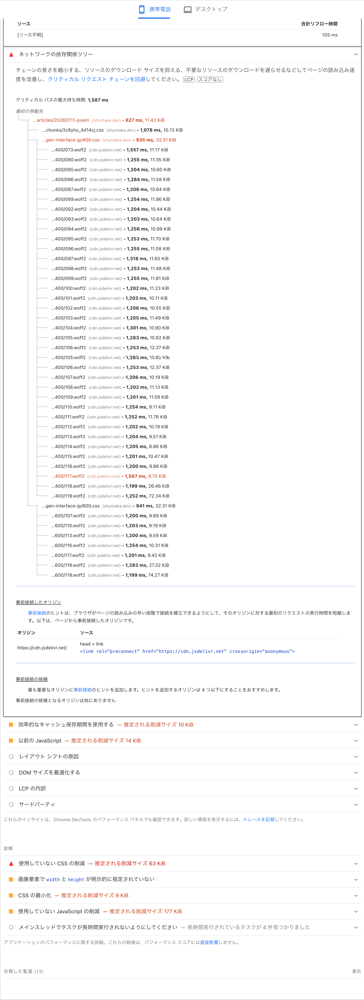

<!-- cspell:ignore jsdelivr fontsource Kaku Meiryo woff -->

# apps/web: 日本語 Web フォント撤去（Zenn 方式へ移行）

- 起票日: 2026-07-17
- 対象: `apps/web`
- 関連: [フォント配信の最適化（ウェイト削減 / 重複サブセット解消）](../2026-07-12-web-font-delivery-optimization/index.md)
- ステータス: 対応済み

## 起票理由

記事ページ `/shuntaka/articles/20260711-poem` を Lighthouse のモバイル条件で計測したところ、Gen Interface JP の日本語サブセットがクリティカルリクエストチェーンに大量に入った。



前回対応で配信ウェイトを 5 本から 400 / 600 の 2 本へ削減済みだったが、長い日本語記事では本文の文字が多数の `unicode-range` に分散する。必要なグリフを揃えるために多数の woff2 が同時取得され、サブセット方式の利点が逆転していた。

## Lighthouse で確認した値

| 項目                           | 結果                           |
| ------------------------------ | ------------------------------ |
| クリティカルパスの最大待ち時間 | 1,587 ms                       |
| HTML                           | 627 ms / 11.42 KiB             |
| アプリケーション CSS           | 1,078 ms / 10.13 KiB           |
| Gen Interface JP 400 CSS       | 935 ms / 32.31 KiB             |
| Gen Interface JP 600 CSS       | 941 ms / 32.31 KiB             |
| 400 woff2                      | 34 ファイル / 445.24 KiB       |
| 600 woff2                      | 7 ファイル / 149.99 KiB        |
| **フォント関連合計**           | **43 リクエスト / 659.85 KiB** |

jsDelivr には `preconnect` 済みで、Lighthouse も追加の事前接続候補なしと判定している。接続確立ではなく、CSS から多数の日本語フォントファイルを発見する依存関係と転送量が原因である。

同じレポートには以下の別課題もある。今回のスコープはフォント依存チェーンに限定する。

- 効率的なキャッシュ保持期間: 推定 10 KiB
- 以前の JavaScript: 推定 14 KiB
- 使用していない CSS: 推定 63 KiB
- `width` / `height` が明示されていない画像
- CSS の最小化: 推定 9 KiB
- 使用していない JavaScript: 推定 177 KiB
- 長時間実行タスク: 4 件

## 比較対象: Zenn のフォント構成

Zenn は記事本文・日本語見出し・日本語記事タイトルへ Web フォントを配信していない。

```css
--font-base:
  -apple-system, BlinkMacSystemFont, 'Hiragino Kaku Gothic ProN', 'Hiragino Sans', Meiryo,
  sans-serif, 'Segoe UI Emoji';
```

Latin-only Inter はナビ、ボタン、数値など英数字中心の UI に限定し、600 / 700 の2ファイルだけを配信している。この責務分離を shuntaka.dev に採用する。

## 決定

### 日本語

記事本文、見出し、記事タイトル、一覧タイトルは OS 標準の日本語サンセリフを使う。

- macOS / iOS: Hiragino
- Windows: Meiryo
- その他: OS の `sans-serif`

プラットフォーム間の字形差は許容する。ブログのブランドはフォントの完全一致より、マスコット、単一アクセント色、余白、レイアウトで維持する。

### Latin UI

`@fontsource/inter` の Latin-only 400 / 600 を次の UI に限定適用する。

- ロゴ `shuntaka.dev`
- `posts` / `moments` / `about`
- 記事日時、一覧日付、タグパス
- ページ番号、検索結果の数値

Inter の woff2 は 23,664 bytes + 24,452 bytes = 48,116 bytes（約 47 KiB）。ビルド時にハッシュ付き静的アセットとして自ドメイン配信する。

## 実施内容

- `globals.css`
  - 日本語用 `--font-base` と Latin UI 用 `--font-latin-ui` を追加
  - `body` をシステムフォントへ変更
  - 限定適用用 `.font-latin-ui` を追加
- `layout.tsx`
  - `@fontsource/inter/latin-{400,600}.css` を読み込み
  - Gen Interface JP の CSS 2 本を撤去
  - jsDelivr `preconnect` を撤去
- `public/fonts/gen-interface-jp/`
  - 旧 400 / 600 CSS を削除
- Storybook
  - `preview.tsx` から本番と同じ `@fontsource/inter/latin-{400,600}.css` を読み込み
- `DESIGN.md`
  - Typography とフォント配信仕様を新構成へ同期

## 期待効果

| 項目             | Before                     | After                               |
| ---------------- | -------------------------- | ----------------------------------- |
| 日本語 Web font  | Gen Interface JP 400 / 600 | なし                                |
| フォント要求数   | 43                         | 最大 2                              |
| フォント転送量   | 約 659.85 KiB              | 約 47 KiB + 小量の `@font-face` CSS |
| 外部フォント CDN | jsDelivr                   | なし                                |

概算で約 613 KiB（約 93%）と 41 リクエストを削減し、`HTML → フォント CSS → jsDelivr woff2` の依存チェーンを解消する。

## 検証

```sh
bun run --filter @shuntaka-dev/web type-check
bun run lint:fmt
bun run lint:vp
bun run spell-check
bun run --filter @shuntaka-dev/web test
bun run --filter @shuntaka-dev/web build
bun run --filter @shuntaka-dev/web build-storybook
bun run --filter docs build-docs
```

デプロイ後、同じ記事・Lighthouse モバイル条件で再計測する。

確認項目:

1. `cdn.jsdelivr.net` と `gen-interface-jp` のリクエストが 0 件
2. Inter は Latin 400 / 600 の最大 2 ファイルだけ
3. 記事本文と日本語記事タイトルの computed `font-family` がシステムスタック
4. クリティカルリクエストチェーンからフォント CSS と日本語 woff2 が消える
5. Light / Dark、macOS / Windows 相当でレイアウト崩れがない
