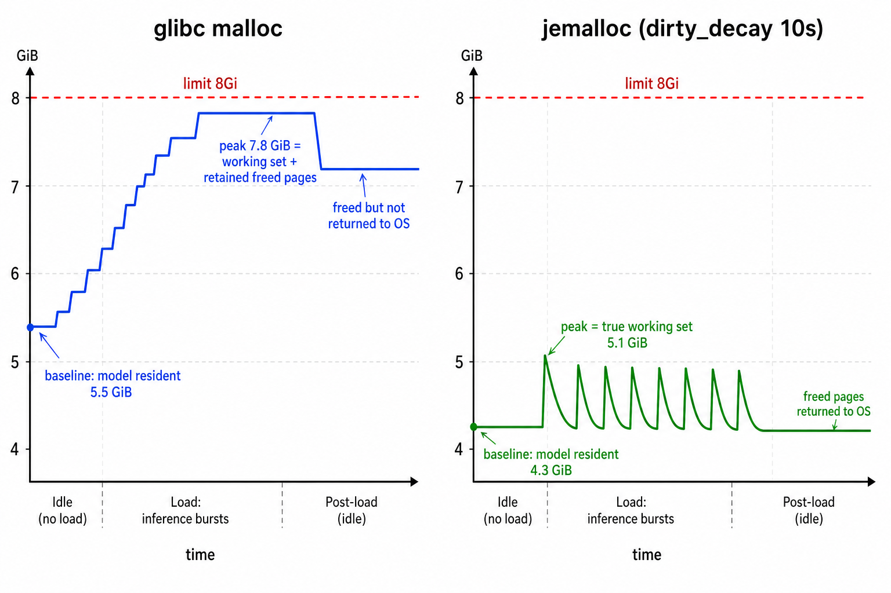
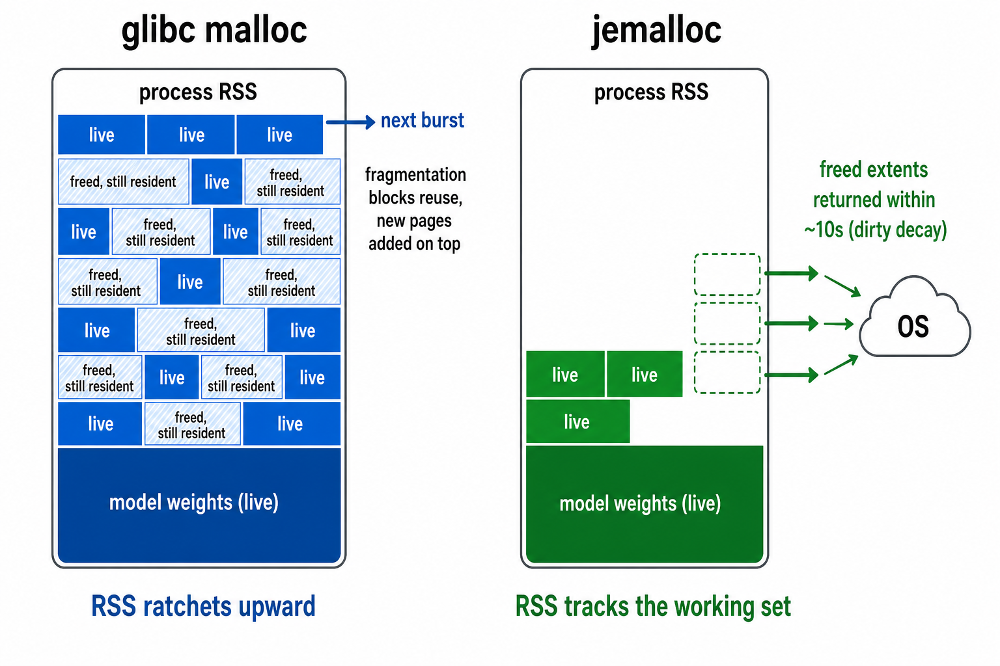

# PLaMo Embedding の投入後メモリ滞留 (glibc malloc) を jemalloc で解消

- 観測日: 2026-07-18
- 対象: plamo-embedding namespace の PLaMo Embedding Pod (node2 / node3)
- 関連: [`cluster/manifests/plamo-embedding/Dockerfile`](../../../../cluster/manifests/plamo-embedding/Dockerfile), [2026-07-15 TiDB Vector 検索実装](../2026-07-15-tidb-vector-search-implementation/index.md), PR #684 (メモリ上限 8Gi 引き上げ)

## 症状

embedding backfill の投入が終わっても、node2 / node3 のノードメモリが 38〜40% のまま投入前の 31〜32% へ戻らない。正体は PLaMo Pod で、投入完了から約 7 時間後のアイドル状態でも投入前より 1〜1.8GiB 増えたままだった。

| PLaMo Pod | 投入前アイドル | 投入中ピーク (memory.peak) | 投入後アイドル |
| --------- | -------------- | -------------------------- | -------------- |
| node2 側  | 5.72GiB        | 7.31GiB                    | 6.81GiB        |
| node3 側  | 5.45GiB        | 7.81GiB                    | 7.21GiB        |

増加分は cgroup の内訳を見るとほぼ全量が anon (ヒープ)。ノード全体の増加分 (2〜2.5GB) のうち Pod で説明できない残りは、書き込みを受けた TiKV 側のキャッシュ類とみられる。

## 原因

リークではなく glibc malloc の設計によるもの。同時リクエストの推論用に確保したアクティベーションの free 済みヒープを、glibc が OS へ返さず保持し続ける。この構成で起きやすい理由は 2 つ。

- server.py のエンドポイントは同期 `def` のため uvicorn がスレッドプールで捌き、複数スレッドからの malloc で glibc の arena が分散して trim されにくくなる
- glibc は「mmap で確保 → free」された大きなブロックを見ると mmap 閾値を動的に引き上げる (最大 32MiB) ため、数 MiB〜数十 MiB のアクティベーション確保が途中からヒープ側に載り、free しても OS へ返らなくなる

確保済み領域は次の推論で再利用されるため実害は「使用量がピークに張り付いて見える」ことだけだが、監視でノードメモリの異常と見分けづらくなるため対処した。

## 対処

アロケータを jemalloc に差し替えた (`cluster/manifests/plamo-embedding/Dockerfile`)。

```dockerfile
# apt に追加
libjemalloc2

# 実行時環境変数
ENV LD_PRELOAD=/usr/lib/x86_64-linux-gnu/libjemalloc.so.2
ENV MALLOC_CONF=background_thread:true,dirty_decay_ms:10000
```

- jemalloc の返却は「free したら即」ではなく「free 済みページが 10 秒間再利用されなければ OS へ返す」という遅延解放で、この待ち時間が decay (`dirty_decay_ms:10000` = 10 秒)。直後のバーストは確保済みページをそのまま再利用できて速く、使われなくなったぶんだけが確実に返る
- `background_thread:true` が肝で、この返却を専属のバックグラウンドスレッドが行う。glibc と違い、アプリがアイドルで malloc / free が一切呼ばれなくなっても返却が進む
- jemalloc は 8MiB 以上の確保を専用 arena で扱い free 時に即返すため、推論アクティベーションのような大きなブロックが滞留しない
- `.so` のパスは amd64 固定ビルド前提 (build-and-push.sh 参照)

### LD_PRELOAD で malloc が差し替わる仕組み

環境変数 2 つで Python が jemalloc を「使ってくれる」ように見えるが、Python 側は何も知らないし何の協力もしていない。プロセス内の malloc がまるごと jemalloc にすり替わっている。

- `LD_PRELOAD` は Python ではなく動的リンカ (ld.so) の機能。指定した .so を他のどのライブラリよりも先にプロセスへマップする。シンボル解決は「先にロードされたものが勝つ」ため、libjemalloc.so.2 がエクスポートする `malloc` / `free` / `calloc` / `realloc` / `posix_memalign` が glibc (libc.so.6) の同名関数より優先される
- 結果、プロセス内で malloc を呼ぶすべてのコードが、書き換えも再コンパイルもなしに jemalloc へ着地する。CPython 本体、PyTorch の C++ 部分、C 拡張 (sentencepiece 等) すべてが対象。今回の主役であるテンソル確保は c10 の CPUAllocator が `posix_memalign` を呼ぶので、数 MiB〜数十 MiB のアクティベーションバッファがまさにここを通る
- 反映確認で `/proc/1/maps` に libjemalloc.so.2 を探すのは、「プロセスにマップ済み = malloc が差し替わっている」ことの確認
- `MALLOC_CONF` は jemalloc 自身が初期化時に読む設定用環境変数 (glibc は見ない)。逆に glibc 向けの `MALLOC_ARENA_MAX` 等は、malloc が glibc を通らなくなった時点で意味を失う
- 効くのは動的リンクされたバイナリのみ (python は動的リンク)。静的リンクバイナリや setuid バイナリには効かない
- CPython は小さな Python オブジェクト用に pymalloc という独自レイヤーを持つが、これは OS から直接 mmap でアリーナを取る別経路。滞留していたのは PyTorch 側の malloc 経由の確保なので、そこが差し替われば十分

### 検討した代替案

| 案                                                         | 見送り理由                                                                       |
| ---------------------------------------------------------- | -------------------------------------------------------------------------------- |
| glibc の env 調整 (`MALLOC_ARENA_MAX=2` + mmap 閾値の固定) | image 変更不要で最軽量だが、返却はアロケータ任せで挙動の確実性が jemalloc に劣る |
| server.py で `malloc_trim(0)` を定期実行                   | 確実に効くがアプリコードにアロケータ都合の処理が混ざる                           |

image 再ビルドのコストが低いため、一番挙動がきれいな jemalloc 差し替えを採用した。

## 反映手順

```bash
./cluster/manifests/plamo-embedding/build-and-push.sh
kubectl -n plamo-embedding rollout restart deployment/plamo-embedding
kubectl -n plamo-embedding rollout status deployment/plamo-embedding --timeout=10m

# jemalloc がロードされているか確認 (必ず rollout 完了後に実行)
kubectl -n plamo-embedding exec deploy/plamo-embedding -- grep -m1 jemalloc /proc/1/maps
```

> ロールアウト中に `exec deploy/...` を実行すると旧 image の Pod に入ることがあり、grep が exit 1 になる。maxSurge=0 のローリング更新は image pull (数 GB) を挟んで Pod 1 台ずつ数分かかるため、必ず `rollout status` の完了を待ってから確認する。
>
> 実測 (2026-07-18 反映直後): 両 Pod とも `/proc/1/maps` に libjemalloc.so.2 を確認。memory.current は node2 / node3 とも約 4.3GiB (モデルロード直後のベースライン)。

効果確認は、次回 backfill 完了から 1 分ほど置いて Pod の RSS (または cgroup の anon) が投入前水準へ戻ることを見る。

```bash
kubectl -n plamo-embedding exec <pod> -- sh -c '
  cat /sys/fs/cgroup/memory.current
  grep -E "^anon " /sys/fs/cgroup/memory.stat'
```

## 効果 (10 万チャンク backfill での実測、途中経過)

反映直後から約 9 万チャンクの backfill (同時 4) を開始し、2 時間 40 分経過時点 (2026-07-18 06:47 UTC) の実測。

|                                 | glibc (前回 1 万投入)                           | jemalloc (今回) |
| ------------------------------- | ----------------------------------------------- | --------------- |
| ベースライン (モデルロード直後) | 5.45〜5.72GiB                                   | 約 4.3GiB       |
| 投入中の memory.peak            | 開始 1 時間前後で約 6.1GiB、最終 7.31 / 7.81GiB | 5.01 / 5.12GiB  |
| 8Gi limit への余裕              | 200MiB 弱                                       | 約 3GiB         |

滞留の解消に加えて、当初「下がらない」と想定していた memory.peak も 7.81GiB → 5.12GiB へ大きく下がった。



種明かしは、cgroup の memory.peak が記録している値の意味にある。peak は「同時に本当に必要だった量」ではなく「常駐ページ量の最大値」である。glibc では free 済みページが常駐に残り、断片化 (スレッドごとの arena 分散、リクエストごとに異なる確保サイズ) のせいで次のバーストが残骸を完全には再利用できず、バーストのたびに「実需要 + 過去の残骸」が常駐へ積み重なる。glibc 時代の peak 7.81GiB は同時 4 の実需要ではなく、この滞留込みの高水位だった。



jemalloc は「free 済みページが 10 秒間再利用されなければ OS へ返す」ため、常駐は常に「実需要 + 直近 10 秒分」程度に保たれ、peak が実需要を超えて育たない。今回の peak 5.1GiB はベース 4.3GiB + 同時 4 のアクティベーション約 0.8GiB という実需要そのもので、この約 0.8GiB は旧 6Gi limit 時代の OOMKill (常駐約 5.5GiB + 同時リクエストで 6Gi 超え) とも整合する。

なお jemalloc で解消できたこと自体が「リークではなく滞留だった」ことの証明になっている。リーク (参照喪失で free されないメモリ) はアロケータから見ると使用中のため、差し替えても OS へは返せない。

backfill 完走時 (約 86 時間) の peak と、完了後アイドルでベースラインへ戻るかは完走後に追記する。

## 注意

- 当初は「jemalloc に替えても memory.peak は下がらない (ピーク = 同時 4 の実需要)」と想定していたが、実測では 7.81GiB → 5.12GiB へ大きく下がった (上の「効果」参照)。glibc 時代の peak は実需要に滞留が積み上がった値だった。並列度を上げる余地の判断を memory.peak で行う方針は変わらない (jemalloc 化後の peak はほぼ実需要そのものを示すため、むしろ判断材料として素直になった)
- メモリを OS へ返すぶん、アイドル後の初回バーストはページ再確保でわずかに遅くなる (この QPS では誤差レベル)
