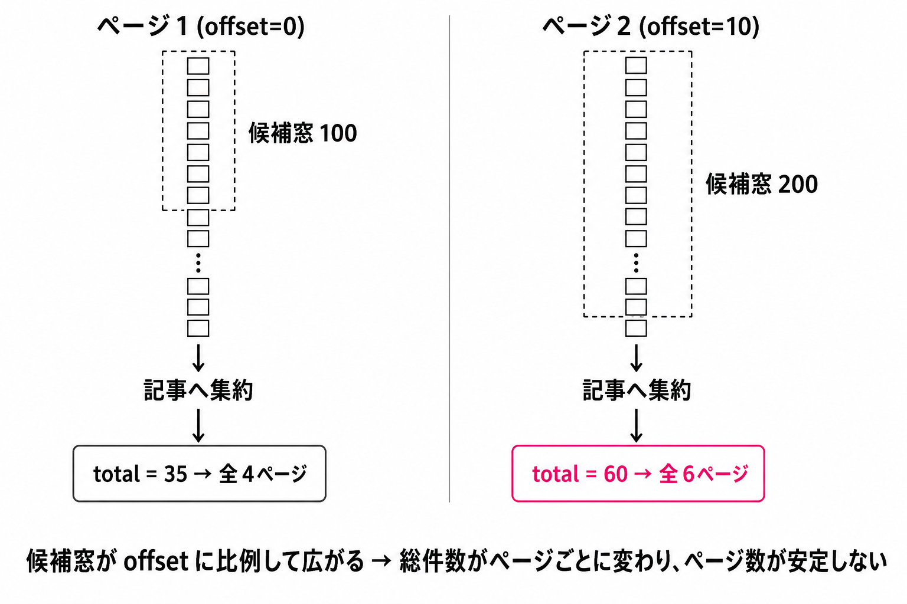
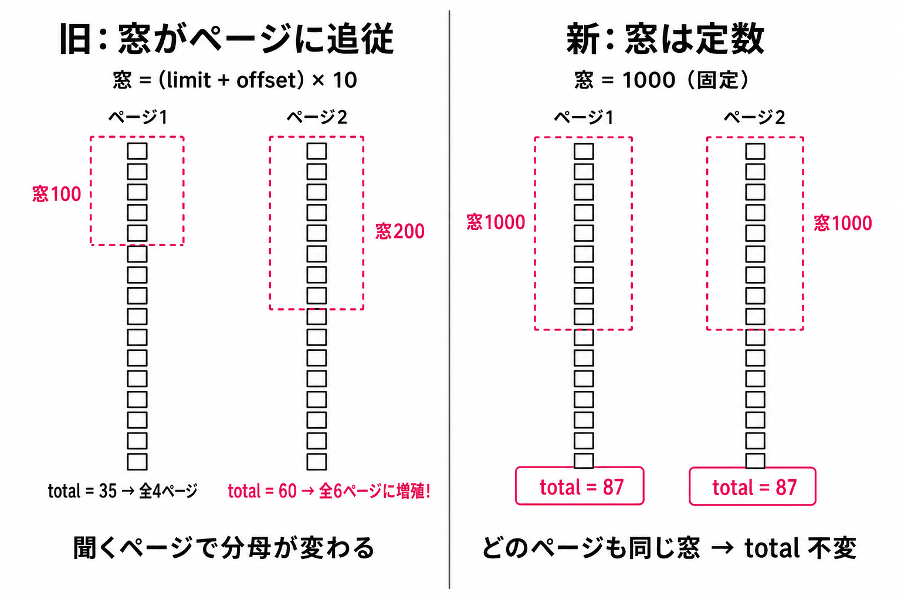
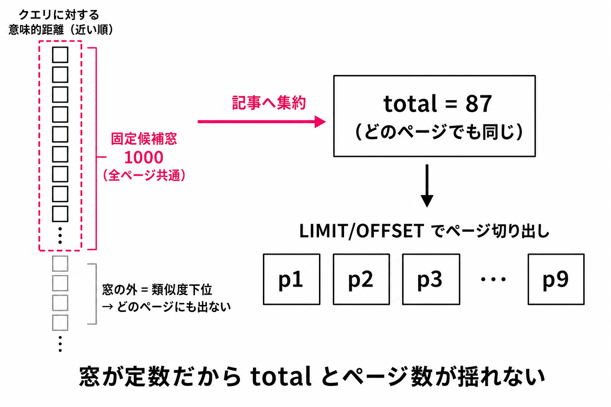
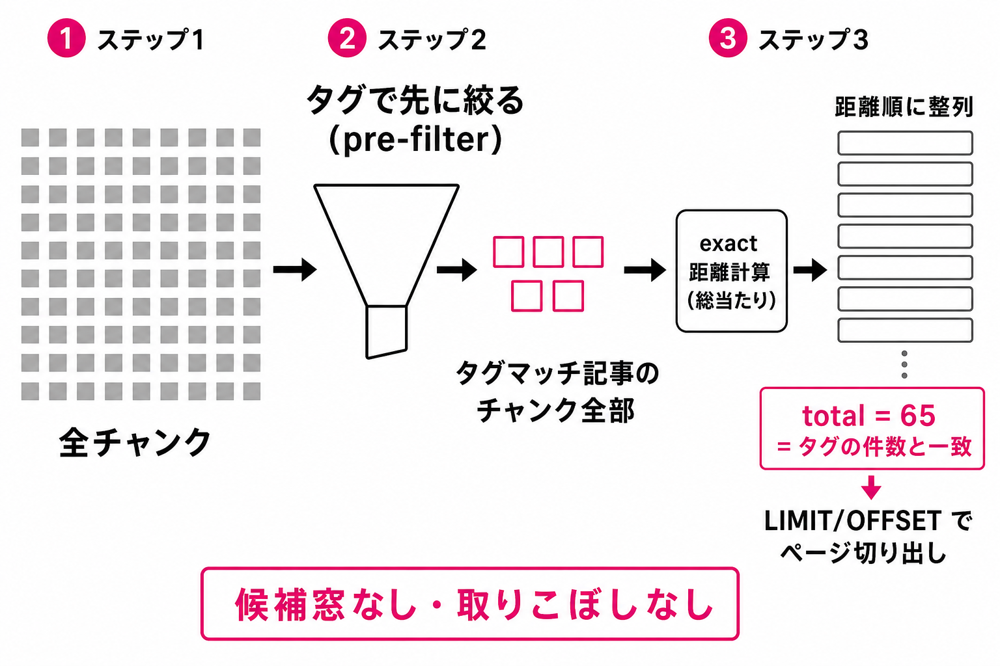

# ベクトル検索ページネーションの破綻分析と pre-filter exact 方式への再設計

- 起票日: 2026-07-18
- 関連: [TiDB ベクトル検索の実装](../2026-07-15-tidb-vector-search-implementation/index.md)、[タグ絞り込みのサーバーサイド化](../2026-07-05-server-side-tag-filter/index.md)
- ステータス: 完了（実機 UI 確認済み）

## 起票理由

検索機能（セマンティック検索）のページネーションが破綻している疑いから調査した。結論として **OFFSET は SQL 上は機械的に効いているが、total_count の算出方法が ANN の構造と噛み合っておらず、ページネーションとして成立していない**ことが確定した。本ドキュメントは破綻の仕組みの分析と、再設計の方針をまとめる。

## 現行実装の構造

検索 API (`GET /users/{name}/articles/search`) の処理フロー。

1. クエリ文字列を PLaMo embedding でベクトル化
2. `article_embedding_chunks` に対して HNSW ANN で距離順に **candidate_limit 件**のチャンクを取得
3. 取得後に published / user / タグ条件で post-filter
4. `ROW_NUMBER()` でチャンク → 記事に dedupe
5. `COUNT(*) OVER()` で total_count を集計し、`LIMIT ? OFFSET ?` でページを切り出す

candidate_limit は `(limit + offset) × 10`（タグあり時は ×30、上限 3000 チャンク）で決まる（`apps/blog-api/api/src/handler/users_articles.rs` の `search_candidate_limit`）。

## 破綻の仕組み

### 1. total_count が offset 依存の「候補窓」の中でしか数えられない

total_count は「候補窓に入ったチャンクを記事に dedupe した件数」でしかない。候補窓のサイズが `(limit + offset) × multiplier` で **offset に比例して広がる**ため、ページを進めるたびに total_count が増える。

- ページ1 (offset=0): 上位 100 チャンク内のユニーク記事数 → 例えば total=35 → 「全4ページ」
- ページ2 (offset=10): 上位 200 チャンク内 → total=60 → 「全6ページ」に増殖

フロント (`SearchProvider`) は毎レスポンスで totalPages を再計算するため、**ページを進めるほど総ページ数が伸びていく**。



### 2. ベクトル検索には「総件数」の概念自体がない

`VEC_COSINE_DISTANCE` は全記事を距離順に並べるだけで、マッチの閾値が存在しない。母集合は常に全公開記事であり、候補窓を広げれば total_count は最終的に全記事数まで膨らむ。検索のページ送りは実質「全記事を距離順に眺める」行為になる。

### 3. OFFSET に処理的メリットがない、どころかマイナス

通常の一覧ページネーションと違い、この構造では OFFSET は計算量を一切減らさない。

- ページ送りのたびに embedding 推論 + ANN + dedupe 集計をフル再実行し、先頭 offset 件を読み捨てるだけ
- candidate_limit が offset に比例するため、**後ろのページほど重くなる**
- 節約できているのはレスポンスのペイロードサイズのみ

### 4. ハイブリッド（検索 + タグ）は post-filter では構造的に行き止まり

タグを HNSW の内側に入れると TiFlash 全走査になるため、現行は「先に全チャンクから ANN → 後からタグで post-filter」している。×30 の multiplier は「候補窓の中にタグ付き記事が引っかかることを祈る」ヒューリスティックであり、次の帰結を生む。

- **件数が数えられない**: total_count は「候補窓に偶然入っていたタグ付き記事数」。タグファセット UI は正確な件数（例: aws (12)）を出すため、**ファセットの数字と検索結果の件数が矛盾する**
- **完全性が保証できない**: タグ付き記事がクエリと意味的に遠いと候補窓 3000 に入らず、最終ページまで送っても出てこない。「12件あるはずが3件しか見つからない」が起きうる
- 正しくやろうとすると候補窓を「タグ付き記事を全部カバーするまで」広げるしかなく、最悪ケースは全チャンク走査 = ANN を使う意味の消滅

### 5. 付随バグ

- タグ選択変更で fetch は再実行されるが `searchPage` がリセットされない → 縮んだ結果集合に古い offset で問い合わせ「一致する記事はありません」と誤表示
- `MAX_SEARCH_OFFSET = 200` を超えるページ（22ページ目以降）は 400 Bad Request だが、フロントの totalPages はそれを知らずページ番号を表示する
- `FilteredArticleList.tsx` の doc コメント「検索結果に関しては手動 pagination しない」が実装（ページャ描画あり）と矛盾。ページネーション後付け時に設計を見直していない痕跡

## 確定方針

原則は二つ。**SQL が決定的に切り出したページをそのまま返す**（limit を大きめに取ってアプリ層やフロントで絞る「過剰取得 → 後絞り」は禁止）、そして**候補窓を offset に依存させない**。この2原則を守った上で、ページネーションは全モードで採用する。

> 経緯: (1) 設計初期は「検索系は上位 N 件固定・ページネーションなし」で一度実装 → (2)「OFFSET が正しく機能するならページネーションあり」の確認を受け exact 全振り + 全モードページネーションへ → (3) 検索のみモードの exact 全チャンク走査は負荷が高いため HNSW 維持 + 固定候補窓に変更、の3段階で確定した。

### モード別ロジック（確定）

| モード      | 母集合                       | 検索方式                                   | ページネーション                      |
| ----------- | ---------------------------- | ------------------------------------------ | ------------------------------------- |
| タグのみ    | タグマッチ記事               | 通常 SQL（published_at 順）                | あり（現行維持）                      |
| 検索のみ    | 全公開記事                   | HNSW ANN + **固定候補窓**（offset 非依存） | あり（窓内の上位記事をページング）    |
| 検索 + タグ | タグマッチ記事（pre-filter） | exact 距離計算（HNSW 不使用）              | あり（真の total_count でページング） |

これを支える技術要素は次の5点。

1. **候補窓の定数化（検索のみ）**: HNSW の候補チャンク数を `(limit + offset) × multiplier` ではなく定数 `SEARCH_CANDIDATE_POOL = 1000` にする。どのページも同一の候補集合を見るため、total_count と順序がページ間で安定する
2. **pre-filter + exact（検索 + タグ）**: タグで絞った小集合（数百チャンク程度）に総当たり。候補窓なし、total_count はファセット件数と一致する真値
3. **タイブレーク**: `ORDER BY distance, article_id` で全順序を確定
4. **SQL 直接の `LIMIT ? OFFSET ?`**: 過剰取得なし、ページ = SQL のスライス
5. **embedding キャッシュ**（クエリ文字列 → ベクトル）: ページ間で同一ベクトル = 同一候補集合を保証（決定論性）+ 推論コスト削減

検索のみモードの total_count は「固定候補窓内のユニーク記事数」であり、コーパス全体の件数ではない（検索エンジンの「上位数百件まで閲覧可能」と同じ有界の結果集合）。窓が offset に依存しないため、この値はどのページから見ても同一で、総ページ数は安定する。固定インデックス + 固定ベクトル + 固定 K に対する HNSW 探索は再現的なので、近似であっても「page2 は page1 の続き」が成立する。

### 挙動の図解

**旧方式との違い（窓サイジングの before/after）**: 検索のみモードの SQL 構造は旧実装とほぼ同一で、違うのは候補窓のサイズを決める1行だけ。旧は `(limit + offset) × 10` で窓がページに追従して広がり、窓内で数える total_count が「聞くページ」ごとに変わっていた。新は定数 1000 なので、どのページのリクエストも同じ窓を見る。



**検索のみ（HNSW + 固定候補窓）**: どのページも同じ窓を見るため total とページ数が揺れない。窓から溢れた類似度下位の記事はどのページにも出ない（コーパスが窓に収まる現状は実質全記事が対象）。



**検索 + タグ（pre-filter + exact）**: タグで先に絞ってから残チャンク全部を exact 評価するため、候補窓が存在せず取りこぼしがない。total はタグファセットの件数と常に一致する。



### 課題 → 解消の対応表

| 旧 ANN 方式の課題                                                                                 | 解消方法                                                                                                                                           |
| ------------------------------------------------------------------------------------------------- | -------------------------------------------------------------------------------------------------------------------------------------------------- |
| total_count が候補窓（offset に比例して拡大）の中でしか数えられず、ページを進むと総ページ数が増殖 | 検索 + タグ: 候補窓を廃止し exact 集計で真値。検索のみ: 候補窓を定数化し、total_count（窓内件数）が offset 非依存で安定                            |
| HNSW の近似により窓サイズをまたいだ一貫性がなく、ページ境界で重複・抜けが起きうる                 | 検索 + タグ: exact で解消。検索のみ: 窓サイズが固定なので「サイズをまたぐ」こと自体がなくなる。固定 (ベクトル, K, インデックス) への HNSW は再現的 |
| ハイブリッド（検索+タグ）の post-filter は件数も完全性も保証できず、ファセット件数と矛盾          | タグを距離計算**前**の pre-filter に移動。total_count はファセット件数と常に一致し、取りこぼしなし                                                 |
| offset は読み捨てで、候補窓拡大により後ろのページほど重い                                         | 検索 + タグは窓なし、検索のみは固定窓のため全ページ同コスト。embedding はキャッシュにより 1 クエリ 1 回                                            |
| ページ送りごとの embedding 再推論による揺らぎ（境界順位のずれ）                                   | `CachedEmbeddingClient`（クエリ → ベクトルの FIFO キャッシュ）でページ間のベクトルを固定                                                           |
| タグ選択変更時に searchPage がリセットされず、空ページを誤表示                                    | フロントでスコープ（タグ / mode / クエリ）変更時に page=1 へリセット                                                                               |
| 旧 `MAX_SEARCH_OFFSET = 200` を超えるページで 400 だがフロントは検知できない                      | total_count が安定した分母になり totalPages が実態と一致。offset 上限は候補窓と同オーダーのガード（1000）のみ                                      |

### なぜ「タグの中から検索」（pre-filter）か

- **UX がユーザーのメンタルモデルと一致する**。GitHub のリポジトリ内検索、Gmail のラベル内検索、EC のカテゴリ内検索と同じ「まず範囲を決めて、その中で探す」構造。タグ = 本棚、検索 = 棚の中を探す行為
- **件数の嘘が消える**。ファセットに「aws (12)」とあれば、検索結果は必ずその 12 件の並べ替えになる
- タグで絞った時点で対象は数十記事 = 数百チャンク程度なので、HNSW を捨てて総当たり（exact）しても余裕で成立する規模。「全走査を恐れて post-filter」は絞った後の集合には過剰防衛

### 検索でもタグはフロント側フィルタにしない

「API は素の検索 top-N を返し、タグはフロントで絞る」案は post-filter の欠陥をフロントに移すだけ。タグ付き記事が全体 top-N に入っていなければ 0 件表示になり、ファセットとの矛盾が残る。タグはサーバ側 pre-filter に寄せる。

## pre-filter exact ならページネーションは技術的に成立する

「exact だから自動的に決定論的」ではなく、次の3条件が揃って初めて published_at 順の通常一覧と同等の決定論性になる。

1. **exact 計算**: 全対象チャンクの距離を実計算するため、結果が入力（データ + クエリベクトル）の純関数になる。ANN は recall < 100% のため「窓サイズをまたいだ一貫性」（offset=10 の結果が offset=0 の続きであること）を保証しない
2. **タイブレーク**: 同距離の記事があると `ORDER BY distance` だけでは順序が不定。`ORDER BY distance, article_id` で全順序を確定する（現行 SQL も実施済み）
3. **クエリベクトルの固定**: ページ送りのたびに embedding を再生成すると推論側の揺らぎで境界順位がずれうる。クエリ文字列 → ベクトルのキャッシュは**コスト対策であると同時に決定論性の担保**として前提

この3点が揃えば `LIMIT/OFFSET` は普通に成立し、total_count も真の値（= ファセット件数と一致）になる。検索のみモード（HNSW）はこのうち条件1を「候補窓の定数化」で代替する。固定窓 + 固定ベクトル（キャッシュ）+ タイブレークが揃えば、近似探索でも候補集合と順序がページ間で不変になり、窓内ページングとして同様に成立する。

## SQL スケッチ

検索 + タグ（pre-filter exact）は次の形。「大きめ limit で取ってから返す」候補窓パターンは不要で、1本の SQL で決定的に完結する。検索のみ（HNSW）は旧来の `nearest_chunks` CTE 型のまま、候補窓の `LIMIT` を offset 連動値から定数 1000 に変えるだけ（実 SQL は playground の `08_users_articles_search.sql` 参照）。

```sql
WITH tag_articles AS (
    -- 既存の tag_descendants CTE でタグマッチ記事を確定
),
scored AS (
    SELECT c.article_id,
           MIN(VEC_COSINE_DISTANCE(c.embedding, ?)) AS distance
      FROM article_embedding_chunks AS c
      JOIN tag_articles AS t ON t.article_id = c.article_id
     GROUP BY c.article_id
)
SELECT a.…, s.distance, COUNT(*) OVER() AS total_count
  FROM scored AS s
  JOIN articles AS a ON a.article_id = s.article_id
  JOIN users AS u ON u.user_id = a.user_id
 WHERE a.status = 'published' AND u.name = ?
 ORDER BY s.distance, a.article_id
 LIMIT ? OFFSET ?
```

- multiplier / cap / 祈り無し。タグマッチした全チャンクの距離を計算するため取りこぼしが原理的にない
- チャンク → 記事の dedupe は `GROUP BY + MIN` で SQL 内完結（現行の ROW_NUMBER トリックより素直）
- アプリ層は SQL が返したものをそのまま返すだけ

規模感: `VECTOR(2048)` × 数千チャンクの総当たりは TiFlash なら数十 ms オーダーで、個人ブログの記事数では当分問題にならない。

## 検討していた論点（実装時に決定）

- **検索のみモードも exact に寄せて HNSW / candidate_limit 一式を削除するか** → 一度採用したが、**exact 全チャンク走査の負荷を理由に HNSW 維持へ再変更**。破綻の原因は HNSW そのものではなく「候補窓が offset に比例して広がること」なので、窓を定数化すれば HNSW のままページネーションは成立する
- 検索モーダルのスコープ表示 → placeholder をタグ選択時「選択中のタグ内を検索」に切り替える形で実装（選択タグ chips はモーダル内に既存）

## 実装フェーズ

- [x] Phase A: API — 検索 + タグを pre-filter exact 方式に書き換え（候補窓 / multiplier 廃止、`scored` CTE + `GROUP BY / MIN` dedupe）
- [x] Phase B: API — SQL に `LIMIT ? OFFSET ?` を実装し、`offset` パラメータとレスポンスの `offset` / 安定した `total_count` を提供
- [x] Phase C: API — 検索のみ（タグ無し）モードを HNSW + 固定候補窓 `SEARCH_CANDIDATE_POOL = 1000` に分岐。`MAX_SEARCH_OFFSET` を 1000 に調整
- [x] Phase D: API — `CachedEmbeddingClient`（クエリ文字列 → ベクトルの FIFO キャッシュ、容量 256）を実装し `src/bin/app.rs` で配線。ヒット時の再推論回避と容量超過時の追い出しをテストで担保
- [x] Phase E: フロント — 全検索モードにページャ復帰（per-page はタグ絞り込みと同じ `ARTICLES_PER_PAGE = 10`）。クエリ / タグ / mode 変更時に page=1 リセット。「上位 N 件固定」キャプションと `SEARCH_RESULT_LIMIT` は撤去
- [x] Phase F: フロント — 検索モーダルの placeholder をタグ選択時「選択中のタグ内を検索」に切り替え
- [x] Phase G: docs — クエリ playground（97_survey）の `08_users_articles_search.sql` を確定方針の SQL（検索のみ: HNSW 固定窓 / タグ併用: pre-filter exact）に同期し、課題の解消方法を明記。旧方式の候補窓問題は `11_ann_candidate_window_problem.sql` として保存

## 作業ログ

### 2026-07-18

- 検索ページネーションの破綻を調査。OFFSET は SQL に効いているが、candidate_limit が `(limit + offset) × multiplier` で決まるため total_count がページごとに変わり、総ページ数が増殖することを確認
- ハイブリッド（検索 + タグ）の post-filter 構造では件数も完全性も保証できないこと（ファセット件数との矛盾、×30 multiplier と cap 3000 の祈り）を整理
- 再設計方針を議論し、「タグのみ = ページネーション / q あり = 上位 N 件固定 / タグ併用時は pre-filter + exact」で合意
- pre-filter exact でのページネーション成立条件（exact + タイブレーク + embedding キャッシュ）と、候補窓パターン不要の SQL スケッチを整理
- ANN の OFFSET 問題の図解を作成（`ann-offset-pagination-problem.png`）
- 第1次実装: exact 化 + 「検索系は上位 20 件固定・ページネーションなし」で一度実装（cargo test / type-check / lint / test 全通過）
- クエリ playground（97_survey）の `08_users_articles_search.sql` を現行 SQL に同期し、旧 HNSW 方式の候補窓問題の再現 SQL を `11_ann_candidate_window_problem.sql` として追加
- **方針変更**: 「exact で OFFSET が正しく機能するならページネーションあり（過剰取得 → 後絞りは NG）」の確認を受け、全モードページネーションに確定。「確定方針」セクションに原則・モード表・課題 → 解消の対応表を明文化
- 方針変更に伴う API 側の差分（kernel / adapter / handler への offset 復帰、`CachedEmbeddingClient` の decorator 実装）まで完了
- **方針再変更（最終確定）**: 検索のみモードの exact 全チャンク走査は負荷が高いため HNSW 維持に変更。破綻の原因は HNSW ではなく「候補窓の offset 依存」なので、窓を定数 `SEARCH_CANDIDATE_POOL = 1000` に固定して窓内ページングとして成立させる。検索 + タグは pre-filter exact のまま
- Phase C〜E 実装完了。cargo test 121 件 / type-check / lint / bun test 全通過
- ローカル実機（web:43000 + blog-api:43003）で UI 確認。`q=tidb` で total 87 件 = 9 ページが offset 0/10/80 すべてで不変（ページ数増殖の解消を確認）、ページ 2 の内容も距離順の続きで重複なし。ハイブリッドはファセット「tech (65)」と検索 total 65 が一致し offset 不変であることを API 直叩きで確認
- UI 確認中に見つけた 2 件を修正: (1) `input[type="search"]` のブラウザネイティブ検索キャンセルボタンと独自クリアボタンで × が二重表示 → globals.css で `::-webkit-search-cancel-button` を非表示化 (2) `ActiveFilterBar` の件数がページ内件数（10件）になっていた → `searchTotalCount` を SearchProvider から公開し全マッチ件数（87件）表示に修正
- 検証時の注意: セッション環境変数 `RUSTUP_TOOLCHAIN=1.97.0` がリポジトリの pin（rust-toolchain.toml = 1.97.1）を上書きし、共有 target の成果物が混在して doc test が E0514 で落ちた。`env -u RUSTUP_TOOLCHAIN` で pin どおりに実行して解消
