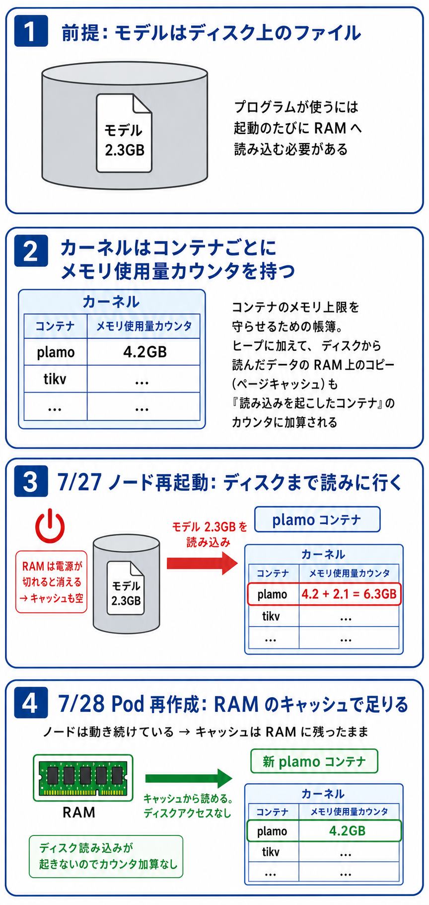

# plamo メモリ減少の原因調査 / restart カウンタ初期化 / restart 可視化 (2026-07-28)

- 起票日: 2026-07-28
- 関連: [ノード OS 更新](../2026-07-27-node-os-update/index.md), [jemalloc 対応](../2026-07-18-plamo-embedding-jemalloc/index.md)
- ステータス: 完了

「昨日のデプロイ以降 plamo のメモリがめっちゃ空くようになった」の原因を調査し、あわせて Pod restart カウンタの初期化と restart 時刻の可視化を行った。

## TL;DR

- メモリが空いた原因は **plamo のデプロイではなく 2026-07-27 のノード OS 更新再起動**。plamo の新イメージは実際にはデプロイされていない（ghcr `:latest` は python 3.12 ビルドのまま、実行中コンテナも Python 3.12.13）
- 解放の実体は長期稼働プロセスのリセットで、namespace 別では **tidb-cluster が -3.3GiB** (15.3→12.0GiB)。ノード別の used (MemTotal-MemAvailable) は node1 -3.6 / node2 -0.8 / node3 -1.8 GiB。TiKV のキャッシュ類はアクセスに応じて徐々に戻る想定
- plamo Pod の working_set は再起動後 **+2.1GiB** (4.27→6.37GiB) に見えたが、内訳は `active_file` 2.09GiB（再起動でモデルファイル約2.3GBをディスクから読み直したページキャッシュ）で、`anon` は 4.25GiB と再起動前と同一。回収可能メモリなので無害
- **jemalloc 対応 (2026-07-18) のデグレではない**。`container_memory_rss` (=anon) の推移は、jemalloc 導入前アイドル 5.2〜5.7GiB → 導入後 4.2GiB 台で安定 → 7/27 再起動をまたいでも 4.25GiB のまま不変 → 本日の Pod 再作成後 4.19GiB。heap は一貫して jemalloc 導入後の水準を維持している
- 本日の rollout restart 後は working_set も 4.21GiB に戻った。モデルファイルがホストのページキャッシュに残っており、新しい cgroup には課金されなかったため（7/27 はノード再起動でページキャッシュが空だったのでディスク読みが cgroup に課金された）
- 副産物として、Renovate #670 でマージ済みの `python:3.14-slim` 化は **torch 2.5.1 に cp314 wheel が存在せず次回ビルドが必ず失敗する**状態だった。`python:3.12-slim` に戻し、`renovate.json` に `<3.14` 制限を追加



## 調査コマンド

Prometheus (kube-prom-stack) に port-forward してメモリ推移を確認する。

```bash
kubectl -n monitoring port-forward svc/kube-prom-stack-kube-prome-prometheus 19090:9090 &

# plamo Pod の working_set 推移
curl -s "http://localhost:19090/api/v1/query_range" \
  --data-urlencode 'query=sum by (node) (container_memory_working_set_bytes{namespace="plamo-embedding", container="server"} * on(pod) group_left(node) kube_pod_info{namespace="plamo-embedding"})' \
  --data-urlencode "start=$(date -u -v-4d +%s)" --data-urlencode "end=$(date -u +%s)" --data-urlencode "step=7200" | jq

# ノード別 used / namespace 別 working_set も同様に
#   node_memory_MemTotal_bytes - node_memory_MemAvailable_bytes
#   topk(12, sum by (namespace) (container_memory_working_set_bytes{container!=""}))
```

Pod 内の cgroup で anon / file の内訳を確認する。

```bash
kubectl -n plamo-embedding exec <pod> -- \
  sh -c 'grep -E "^(anon|file|active_file|inactive_file) " /sys/fs/cgroup/memory.stat'
```

実行中コンテナと ghcr `:latest` の digest 一致確認（public イメージは匿名 token で取れる）。

```bash
kubectl -n plamo-embedding get pods -o jsonpath='{range .items[*]}{.status.containerStatuses[0].imageID}{"\n"}{end}'

TOKEN=$(curl -s "https://ghcr.io/token?scope=repository:shuntaka9576/plamo-embedding:pull" | jq -r .token)
curl -sI -H "Authorization: Bearer $TOKEN" \
  -H "Accept: application/vnd.oci.image.index.v1+json" \
  "https://ghcr.io/v2/shuntaka9576/plamo-embedding/manifests/latest" | grep -i docker-content-digest
```

## restart カウンタの初期化

restart カウンタは Pod を作り直さないとリセットできないため、rollout restart で再作成する。`imagePullPolicy: Always` + `:latest` のため、**実行前に registry の digest が実行中と一致していることを上記コマンドで確認する**（不一致だと意図しないイメージのデプロイになる）。

```bash
kubectl -n plamo-embedding rollout restart deployment/plamo-embedding
kubectl -n plamo-embedding rollout status deployment/plamo-embedding --timeout=20m
```

`maxSurge=0, maxUnavailable=1` なので 1 Pod ずつ入れ替わる。イメージと HF キャッシュがノードに残っているため今回は約1分で完了した。

## restart 時刻の可視化

Cluster Pods ダッシュボード (`cluster/manifests/monitoring/dashboards/cluster-pods.json`) を拡張した。

- 「Pod restart count (累積)」テーブルに `kube_pod_container_status_last_terminated_timestamp` による最終 restart 時刻と `..._last_terminated_reason` による理由の列を追加
- 「Pod restart events (10分窓の restart 増分)」timeseries パネルを新設。`increase(kube_pod_container_status_restarts_total[10m]) > 0` で、いつどの Pod が restart したかが時系列で見える（遡れるのは Prometheus の retention 分まで）

```bash
kubectl apply -k cluster/manifests/monitoring/dashboards/
```

アドホックに CLI で見る場合は lastState の終了時刻を出す（直近1回分のみ）。

```bash
kubectl get pods -A -o custom-columns='NS:.metadata.namespace,POD:.metadata.name,RESTARTS:.status.containerStatuses[0].restartCount,LAST_TERMINATED:.status.containerStatuses[0].lastState.terminated.finishedAt'
```

## python:3.14 地雷の解除

torch 2.5.1 の CPU wheel は cp310〜cp313 のみ（`https://download.pytorch.org/whl/cpu/torch/` で確認）。`python:3.14-slim` のままでは次回 `build-and-push.sh` の pip install が解決不能で失敗する。

- `cluster/manifests/plamo-embedding/Dockerfile` を `python:3.12-slim` に戻した
- `renovate.json` に packageRule を追加し、この Dockerfile の python を `<3.14` に制限（3.14 化は torch>=2.9 への更新とセットで行う）
