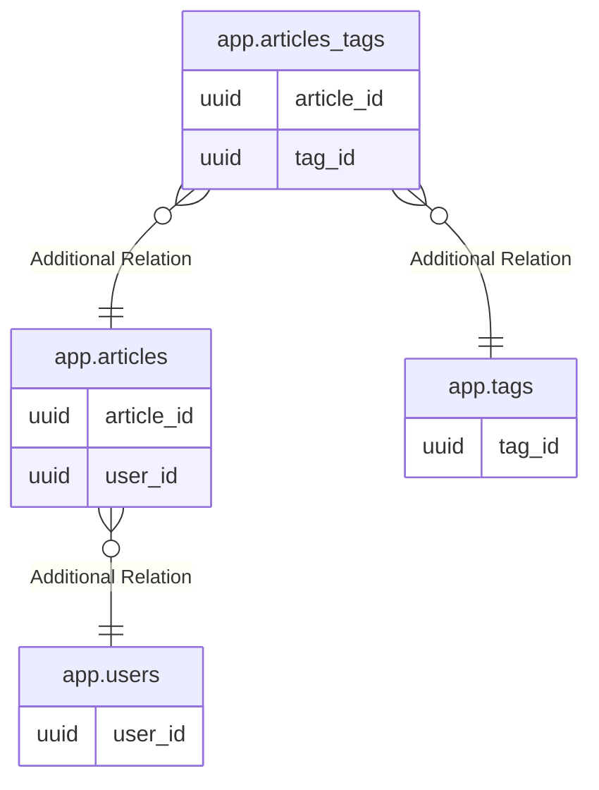

# postgres

## Tables

| Name                                      | Columns | Comment | Type       |
| ----------------------------------------- | ------- | ------- | ---------- |
| [app.users](app.users.md)                 | 6       |         | BASE TABLE |
| [app.tags](app.tags.md)                   | 2       |         | BASE TABLE |
| [app.articles](app.articles.md)           | 12      |         | BASE TABLE |
| [app.articles_tags](app.articles_tags.md) | 2       |         | BASE TABLE |

## Relations

---

> Generated by [tbls](https://github.com/k1LoW/tbls)
