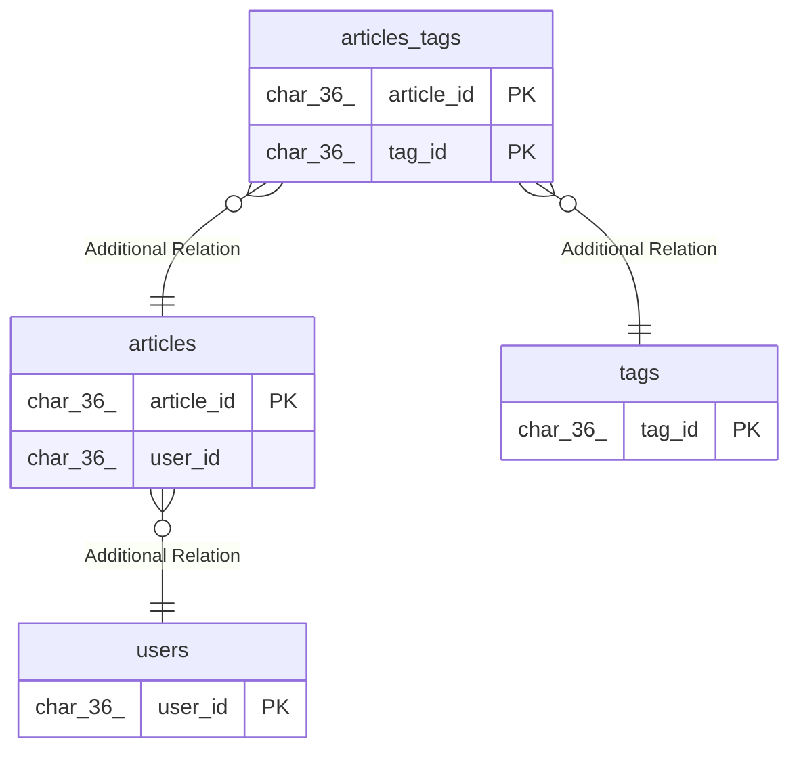

# blog_dev

## Tables

| Name                              | Columns | Comment | Type       |
| --------------------------------- | ------- | ------- | ---------- |
| [articles](articles.md)           | 13      |         | BASE TABLE |
| [articles_tags](articles_tags.md) | 2       |         | BASE TABLE |
| [users](users.md)                 | 6       |         | BASE TABLE |
| [tags](tags.md)                   | 2       |         | BASE TABLE |

## Relations

---

> Generated by [tbls](https://github.com/k1LoW/tbls)
