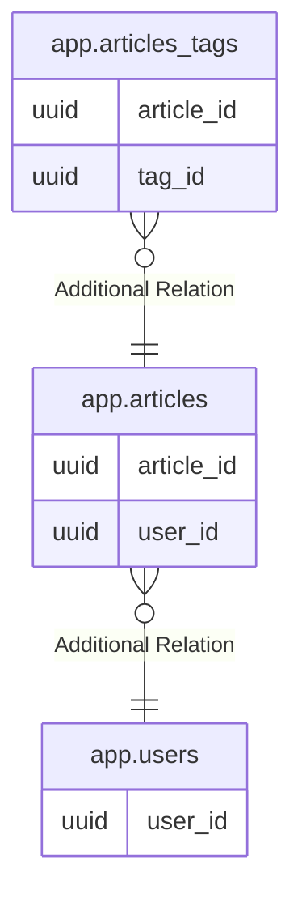

# app.articles

## Description

## Columns

| Name | Type | Default | Nullable | Children | Parents | Comment |
| ---- | ---- | ------- | -------- | -------- | ------- | ------- |
| article_id | uuid | gen_random_uuid() | false | [app.articles_tags](app.articles_tags.md) |  |  |
| title | text |  | false |  |  |  |
| slug | text |  | false |  |  |  |
| user_id | uuid |  | false |  | [app.users](app.users.md) |  |
| content | text |  | false |  |  |  |
| thumbnail | text |  | true |  |  |  |
| description | text |  | false |  |  |  |
| status | text | 'draft'::text | false |  |  | 記事のステータス: draft(下書き), review(レビュー待ち), scheduled(公開予約), published(公開済み), archived(アーカイブ済み) |
| type | text |  | true |  |  |  |
| published_at | timestamp with time zone |  | true |  |  |  |
| created_at | timestamp with time zone | CURRENT_TIMESTAMP | true |  |  |  |
| updated_at | timestamp with time zone | CURRENT_TIMESTAMP | true |  |  |  |

## Constraints

| Name | Type | Definition |
| ---- | ---- | ---------- |
| articles_status_check | CHECK | CHECK ((status = ANY (ARRAY['draft'::text, 'review'::text, 'scheduled'::text, 'published'::text, 'archived'::text]))) |
| articles_pkey | PRIMARY KEY | PRIMARY KEY (article_id) |
| articles_slug_key | UNIQUE | UNIQUE (slug) |

## Indexes

| Name | Definition |
| ---- | ---------- |
| articles_pkey | CREATE UNIQUE INDEX articles_pkey ON app.articles USING btree (article_id) |
| articles_slug_key | CREATE UNIQUE INDEX articles_slug_key ON app.articles USING btree (slug) |

## Relations

---

> Generated by [tbls](https://github.com/k1LoW/tbls)
