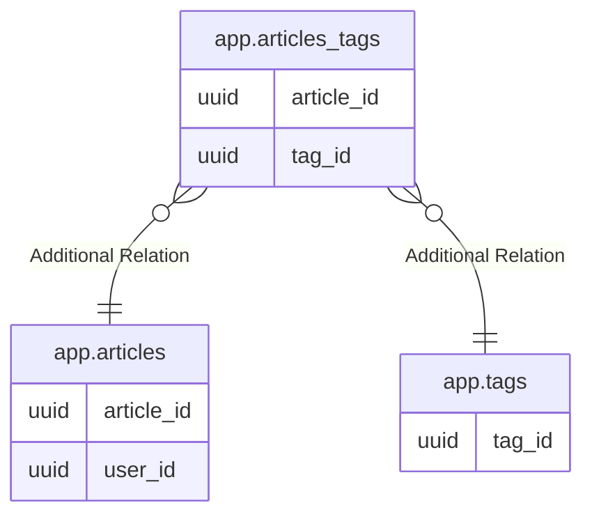

# app.articles_tags

## Description

## Columns

| Name | Type | Default | Nullable | Children | Parents | Comment |
| ---- | ---- | ------- | -------- | -------- | ------- | ------- |
| article_id | uuid |  | false |  | [app.articles](app.articles.md) |  |
| tag_id | uuid |  | false |  | [app.tags](app.tags.md) |  |

## Constraints

| Name | Type | Definition |
| ---- | ---- | ---------- |
| articles_tags_pkey | PRIMARY KEY | PRIMARY KEY (article_id, tag_id) |

## Indexes

| Name | Definition |
| ---- | ---------- |
| articles_tags_pkey | CREATE UNIQUE INDEX articles_tags_pkey ON app.articles_tags USING btree (article_id, tag_id) |

## Relations

---

> Generated by [tbls](https://github.com/k1LoW/tbls)
