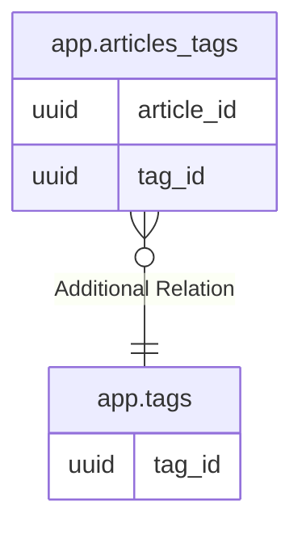

# app.tags

## Description

## Columns

| Name | Type | Default | Nullable | Children | Parents | Comment |
| ---- | ---- | ------- | -------- | -------- | ------- | ------- |
| tag_id | uuid | gen_random_uuid() | false | [app.articles_tags](app.articles_tags.md) |  |  |
| name | text |  | false |  |  |  |

## Constraints

| Name | Type | Definition |
| ---- | ---- | ---------- |
| tags_pkey | PRIMARY KEY | PRIMARY KEY (tag_id) |
| tags_name_key | UNIQUE | UNIQUE (name) |

## Indexes

| Name | Definition |
| ---- | ---------- |
| tags_pkey | CREATE UNIQUE INDEX tags_pkey ON app.tags USING btree (tag_id) |
| tags_name_key | CREATE UNIQUE INDEX tags_name_key ON app.tags USING btree (name) |

## Relations

---

> Generated by [tbls](https://github.com/k1LoW/tbls)
