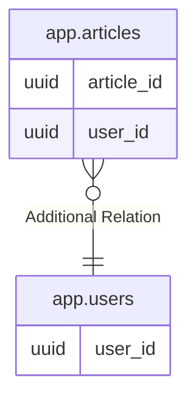

# app.users

## Description

## Columns

| Name                   | Type                     | Default           | Nullable | Children                        | Parents | Comment |
| ---------------------- | ------------------------ | ----------------- | -------- | ------------------------------- | ------- | ------- |
| user_id                | uuid                     | gen_random_uuid() | false    | [app.articles](app.articles.md) |         |         |
| name                   | text                     |                   | false    |                                 |         |         |
| email                  | text                     |                   | false    |                                 |         |         |
| github_installation_id | bigint                   |                   | true     |                                 |         |         |
| created_at             | timestamp with time zone | CURRENT_TIMESTAMP | true     |                                 |         |         |
| updated_at             | timestamp with time zone | CURRENT_TIMESTAMP | true     |                                 |         |         |

## Constraints

| Name                             | Type        | Definition                      |
| -------------------------------- | ----------- | ------------------------------- |
| users_pkey                       | PRIMARY KEY | PRIMARY KEY (user_id)           |
| users_name_key                   | UNIQUE      | UNIQUE (name)                   |
| users_email_key                  | UNIQUE      | UNIQUE (email)                  |
| users_github_installation_id_key | UNIQUE      | UNIQUE (github_installation_id) |

## Indexes

| Name                             | Definition                                                                                             |
| -------------------------------- | ------------------------------------------------------------------------------------------------------ |
| users_pkey                       | CREATE UNIQUE INDEX users_pkey ON app.users USING btree (user_id)                                      |
| users_name_key                   | CREATE UNIQUE INDEX users_name_key ON app.users USING btree (name)                                     |
| users_email_key                  | CREATE UNIQUE INDEX users_email_key ON app.users USING btree (email)                                   |
| users_github_installation_id_key | CREATE UNIQUE INDEX users_github_installation_id_key ON app.users USING btree (github_installation_id) |

## Relations

---

> Generated by [tbls](https://github.com/k1LoW/tbls)
