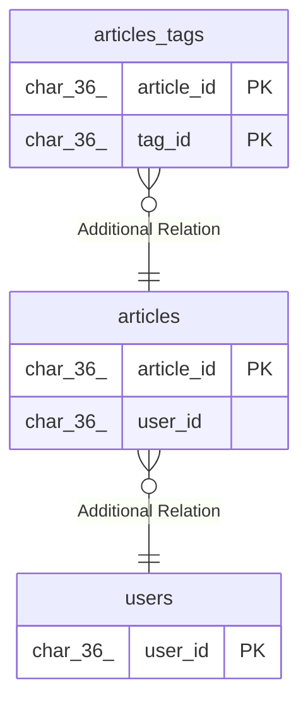

# articles

## Description

<details>
<summary><strong>Table Definition</strong></summary>

```sql
CREATE TABLE `articles` (
  `article_id` char(36) NOT NULL DEFAULT (uuid()),
  `title` varchar(500) NOT NULL,
  `slug` varchar(255) NOT NULL,
  `user_id` char(36) NOT NULL,
  `content` longtext NOT NULL,
  `content_html` longtext DEFAULT NULL,
  `thumbnail` text DEFAULT NULL,
  `description` text NOT NULL,
  `status` varchar(20) NOT NULL DEFAULT 'draft',
  `type` varchar(50) DEFAULT NULL,
  `published_at` datetime(6) DEFAULT NULL,
  `created_at` datetime(6) NOT NULL DEFAULT CURRENT_TIMESTAMP(6),
  `updated_at` datetime(6) NOT NULL DEFAULT CURRENT_TIMESTAMP(6),
  PRIMARY KEY (`article_id`) /*T![clustered_index] CLUSTERED */,
  UNIQUE KEY `uq_articles_slug` (`slug`),
  KEY `idx_articles_user_status_type_published_at_id` (`user_id`,`status`,`type`,`published_at`,`article_id`)
) ENGINE=InnoDB DEFAULT CHARSET=utf8mb4 COLLATE=utf8mb4_bin
```

</details>

## Columns

| Name | Type | Default | Nullable | Extra Definition | Children | Parents | Comment |
| ---- | ---- | ------- | -------- | ---------------- | -------- | ------- | ------- |
| article_id | char(36) | uuid() | false | DEFAULT_GENERATED | [articles_tags](articles_tags.md) |  |  |
| title | varchar(500) |  | false |  |  |  |  |
| slug | varchar(255) |  | false |  |  |  |  |
| user_id | char(36) |  | false |  |  | [users](users.md) |  |
| content | longtext |  | false |  |  |  |  |
| content_html | longtext |  | true |  |  |  |  |
| thumbnail | text |  | true |  |  |  |  |
| description | text |  | false |  |  |  |  |
| status | varchar(20) | draft | false |  |  |  | 記事のステータス: draft(下書き), review(レビュー待ち), scheduled(公開予約), published(公開済み), archived(アーカイブ済み) |
| type | varchar(50) |  | true |  |  |  |  |
| published_at | datetime(6) |  | true |  |  |  |  |
| created_at | datetime(6) | CURRENT_TIMESTAMP(6) | false |  |  |  |  |
| updated_at | datetime(6) | CURRENT_TIMESTAMP(6) | false |  |  |  |  |

## Constraints

| Name | Type | Definition |
| ---- | ---- | ---------- |
| PRIMARY | PRIMARY KEY | PRIMARY KEY (article_id) |
| uq_articles_slug | UNIQUE | UNIQUE KEY uq_articles_slug (slug) |

## Indexes

| Name | Definition |
| ---- | ---------- |
| idx_articles_user_status_type_published_at_id | KEY idx_articles_user_status_type_published_at_id (user_id, status, type, published_at, article_id) USING BTREE |
| PRIMARY | PRIMARY KEY (article_id) USING BTREE |
| uq_articles_slug | UNIQUE KEY uq_articles_slug (slug) USING BTREE |

## Relations



---

> Generated by [tbls](https://github.com/k1LoW/tbls)
