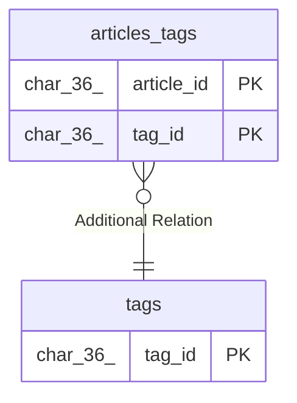

# tags

## Description

<details>
<summary><strong>Table Definition</strong></summary>

```sql
CREATE TABLE `tags` (
  `tag_id` char(36) NOT NULL DEFAULT (uuid()),
  `name` varchar(255) NOT NULL,
  PRIMARY KEY (`tag_id`) /*T![clustered_index] CLUSTERED */,
  UNIQUE KEY `uq_tags_name` (`name`)
) ENGINE=InnoDB DEFAULT CHARSET=utf8mb4 COLLATE=utf8mb4_bin
```

</details>

## Columns

| Name | Type | Default | Nullable | Extra Definition | Children | Parents | Comment |
| ---- | ---- | ------- | -------- | ---------------- | -------- | ------- | ------- |
| tag_id | char(36) | uuid() | false | DEFAULT_GENERATED | [articles_tags](articles_tags.md) |  |  |
| name | varchar(255) |  | false |  |  |  |  |

## Constraints

| Name | Type | Definition |
| ---- | ---- | ---------- |
| PRIMARY | PRIMARY KEY | PRIMARY KEY (tag_id) |
| uq_tags_name | UNIQUE | UNIQUE KEY uq_tags_name (name) |

## Indexes

| Name | Definition |
| ---- | ---------- |
| PRIMARY | PRIMARY KEY (tag_id) USING BTREE |
| uq_tags_name | UNIQUE KEY uq_tags_name (name) USING BTREE |

## Relations



---

> Generated by [tbls](https://github.com/k1LoW/tbls)
