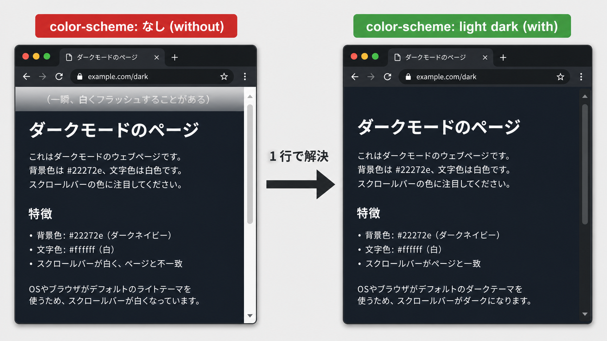
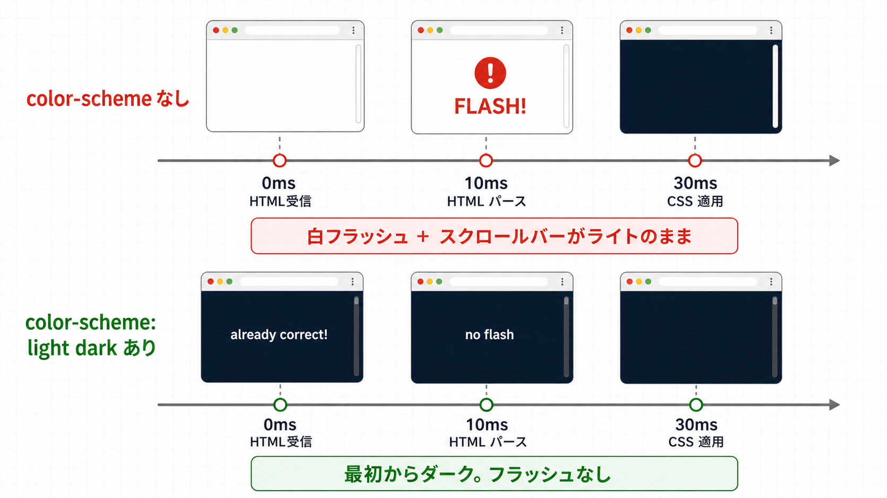
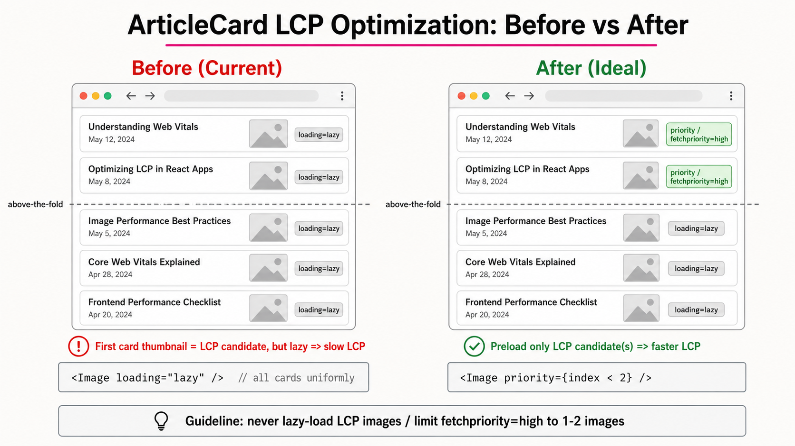

# apps/web モダンWeb準拠の改善 TODO

- 対象: `apps/web/`（Next.js 16 + React 19 + Tailwind CSS 4）
- 調査日: 2026-05-21
- 根拠: [`modern-web-guidance`](https://github.com/GoogleChrome/modern-web-guidance/tree/main/skills/modern-web-guidance/guides) の `dark-mode` / `cross-document-transitions` / `optimize-image-priority` / `optimize-preload-priority` / `visually-stable-font-fallbacks` ガイド（各項目に該当行リンクを掲載）
- 結論: FOUC・LCP・フォント周りに Baseline 対応の伸びしろがあるので段階的に手を入れる

## High priority

### 1. ダークモード FOUC 対策 — [x]

**該当ガイド**

- [dark-mode.md?plain=1#L9](https://github.com/GoogleChrome/modern-web-guidance/blob/main/skills/modern-web-guidance/guides/user-experience/dark-mode.md?plain=1#L9) — MANDATORY: `<meta name="color-scheme">` を `<head>` に置いて FOUC を回避
- [dark-mode.md?plain=1#L18-L26](https://github.com/GoogleChrome/modern-web-guidance/blob/main/skills/modern-web-guidance/guides/user-experience/dark-mode.md?plain=1#L18-L26) — MANDATORY: `:root { color-scheme: light dark; }` で viewport 全体のテーマを宣言
- [dark-mode.md?plain=1#L132-L144](https://github.com/GoogleChrome/modern-web-guidance/blob/main/skills/modern-web-guidance/guides/user-experience/dark-mode.md?plain=1#L132-L144) — ユーザーピン留めの色スキームを反映するため inline script で hydrate 前に確定

**現状の問題**
`ThemeProvider.tsx:22-33` で `colorMode` を `undefined` 初期化 → `useEffect` で確定、という流れ。`ToggleSwitch.tsx:13-15` が `colorMode === undefined` の間 `null` を返すため、初回ロードで一瞬トグルが消える。`layout.tsx:59` の `suppressHydrationWarning` で凌いでいるだけで、スクロールバー / canvas はネイティブテーマで一瞬ライトが出る。

**対応内容**

- [x] `app/globals.css` の `:root` に `color-scheme: light dark;` を追加、`[data-theme='light' | 'dark']` でピン留め
- [x] `layout.tsx` で `viewport` export の `colorScheme: 'light dark'` を宣言（Next.js 14 以降は `metadata.colorScheme` ではなく `viewport` が正）
- [x] `<html>` 内の明示的な `<head>` に `next/script` の `<Script id="color-scheme-boot" strategy="beforeInteractive">` で boot script を埋め込み、`localStorage.getItem('color-mode')` ＋ `matchMedia('(prefers-color-scheme: dark)')` を見て hydrate 前に `documentElement.dataset.theme` をセット
- [x] `ThemeProvider` を `useState(readInitialColorMode)` で初期化し `useEffect` の初期化処理を撤去（`colorMode` の型も `'light' | 'dark'` に narrowing）
- [x] `ToggleSwitch` の `colorMode === undefined` ガードを撤去、`aria-pressed` 追加。インライン style と SVG ノブ位置はそのまま残し、SSR/CSR 差分を黙らせるため button / toggle-label / dark-icon の 3 階層に `suppressHydrationWarning` を付与（CSS への完全移管は item 6 で実施）

#### 補足: なぜ `color-scheme` が必要か

CSS の `color-scheme: light dark` を宣言すると、**ブラウザがネイティブ UI（スクロールバー・フォーム部品・ページ初期背景）をテーマに追従させてくれる**ようになる。宣言しないと、ページ本体は暗くなってもスクロールバーは白いまま、初期描画では一瞬白背景がチラつく。



- **左 (`color-scheme: なし`)**: ページ本体は暗いのに、右側のスクロールバーが白いライト基調のまま。ページ上部にも一瞬白フラッシュが見える
- **右 (`color-scheme: light dark`)**: スクロールバーも暗くなり、フラッシュも消える

違いを生んでいるのは `globals.css` に追加したたった 1 行:

```css
:root {
  color-scheme: light dark;
}
```

##### ロード時系列で何が違うか

ブラウザがページを開くとき、内部的にはおおむね 3 段階ある。

| t    | 何が起きるか                                               |
| ---- | ---------------------------------------------------------- |
| 0ms  | HTML を受信開始。まだ何も描画していない                    |
| 10ms | HTML をパースして最初のフレームを描画                      |
| 30ms | CSS を解釈して `body { background: ... }` などが適用される |



**宣言なしのとき（上段）**: ブラウザは「このページがダーク対応か」分からないので、初期値として **白い canvas** + **ライトテーマのスクロールバー** で描画を始める。10ms 地点で白フラッシュ、30ms で `body` の暗い背景が当たってもスクロールバーは白いまま。

**`color-scheme: light dark` 宣言ありのとき（下段）**: ブラウザは「ダークも対応している」と知っているので、OS が dark なら**最初から暗い canvas** + **ダークなスクロールバー**で描画を始める。フラッシュなし。

##### canvas って何？

ここでの canvas は HTML の `<canvas>` 要素ではなく、**ブラウザが HTML/CSS を適用する前に塗りつぶす土台のサーフェス** のこと（W3C 用語）。具体的にはこういうもの。

| 場所                              | `color-scheme` なし | `color-scheme: light dark` あり |
| --------------------------------- | ------------------- | ------------------------------- |
| ページ初期背景 (canvas)           | 真っ白              | OS 設定に追従                   |
| スクロールバー                    | 常にライト          | OS に追従                       |
| `<input>` の枠線・autofill 黄背景 | ライト前提          | ダーク版                        |
| `<select>` のドロップダウン       | 白背景              | 黒背景                          |
| 空 iframe (`about:blank`)         | 白                  | OS に追従                       |

要するに「**自分の CSS が touch しない領域**」をブラウザに自動でテーマしてもらう機能。

##### `<meta name="color-scheme">` も入れた理由

CSS 内の `color-scheme` は **CSS が parse され終わってから**効く。一方、Next.js の `viewport.colorScheme` export 経由で出力される `<meta name="color-scheme">` は HTML の `<head>` を読んだ瞬間に効くので、**CSS のダウンロードが遅い回線でも canvas の白フラッシュが出ない**。両方入れることで早期と確実性の両方をカバーしている。

---

### 2. ArticleCard 先頭サムネを LCP 候補として優先読み込み — [x]

**該当ガイド**

- [optimize-image-priority.md?plain=1#L48-L53](https://github.com/GoogleChrome/modern-web-guidance/blob/main/skills/modern-web-guidance/guides/performance/optimize-image-priority.md?plain=1#L48-L53) — MANDATORY: LCP 画像に `fetchpriority="high"`、`fetchpriority="high"` は 1〜2 枚まで、`loading="lazy"` と `fetchpriority="high"` は同時に付けない

**現状の問題**
`ArticleCard.tsx:38` で全カード一律 `loading="lazy"`。リスト先頭のサムネは above-the-fold で LCP 候補だが、ガイドは「LCP 画像に lazy を付けるな／`fetchpriority="high"` を 1〜2 枚に絞れ」と明記。



- **左 (Before)**: 全カードのサムネに `loading="lazy"`。above-the-fold にある先頭サムネ＝LCP 候補も lazy なので、ブラウザは「これは後回しで良い」と解釈してダウンロード優先度を下げる → LCP が遅くなる
- **右 (After)**: 先頭 1〜2 枚だけ `priority`（内部的に `fetchpriority="high"` ＋非 lazy）にし、3 枚目以降は lazy のまま。LCP 候補だけが優先ダウンロードされる

**対応内容**

- [x] `ArticleCard` に `priority?: boolean` prop を追加（デフォルト `false`、true のとき `loading="lazy"` を外して `<Image priority />` に切替）
- [x] `page.tsx` / `type/note/page.tsx` で **サムネを持つ上位 2 件** を `priorityArticleIds` (`Set<string>`) に事前計算し、各 `ArticleCard` に `priority={priorityArticleIds.has(article.articleId)}` を渡す
- [x] `ArticleCard.stories.tsx` に `Priority` story を追加
- [x] `<Image>` に `style={{ width: 'auto', height: 'auto' }}` を追加（下記「Next.js Image の width/height 警告」参照）

#### 補足: Next.js dev server の LCP 警告

修正前は dev server から以下の警告が出ていた。

```
Image with src "...青梅2025..." was detected as the Largest Contentful Paint (LCP).
Please add the `loading="eager"` property if this image is above the fold.
```

**意味**: Next.js Image は実ブラウザの PerformanceObserver で LCP element を測定している。dev session 中、ビューポートに収まった画像のうち最も大きく最後に描画された **3 枚目 (`青梅2025`)** が LCP として検出され、「above the fold ならその画像に eager を付けろ」と促していた。

##### "above the fold" とは

元々は新聞用語で、二つ折りの新聞の **折り目より上**＝広げずに見える上半分のこと。Web に転用されて「**ブラウザを開いた瞬間、スクロールせずに見える領域**」を指す。

```
┌────────────────────────┐
│  ヘッダー              │
│  カード 1 (LCP 候補)   │  ← above the fold（見える）
│  カード 2              │
│  カード 3              │
│ ─ ─ ─ viewport 下端 ─ ─│  ← fold
│  カード 4              │  ← below the fold（スクロールしないと見えない）
│  カード 5              │
└────────────────────────┘
```

警告で言っていたのは「その画像が最初の表示領域に映っているなら lazy じゃなくて eager にしろ」という条件付き提案。lazy のままだと、ユーザーが見ているのにダウンロード優先度が下がってしまうため。逆に below the fold の画像は lazy のままで OK。`<Image priority />` を **viewport 内に入る 1〜2 枚に絞る** のがガイドの主旨。

サムネはすべて 150x100 で同サイズなので、LCP は単純に「**上から数えて何枚目までが viewport に入るか × どれが最後に paint されたか**」で決まる。当時は全カードが `loading="lazy"` だったので、ビューポート内の最後のサムネ（3 枚目）が paint 完了 = LCP になりやすい状況だった。

**対応後**: 上位 2 枚に `priority`（= preload + eager + fetchpriority=high）が付いたことで、それらが優先的にダウンロード・描画される。LCP は通常 1〜2 枚目のどちらかになるはずで、警告も消える。

ただし、もし viewport によって 3 枚目が LCP に残り続ける場合（例: 大きめウィンドウで 3 枚以上が above the fold に入る）は、`slice(0, 2)` を `slice(0, 3)` に拡張するか、上部レイアウト（ヘッダー高さ等）を見直して LCP 候補を確実に 1〜2 枚目に収める。`fetchpriority="high"` は guide 上「1〜2 枚まで」が推奨なので 3 枚以上には無闇に増やさない。

#### 補足: なぜ `index < 2` ではダメだったか

最初は `priority={index < 2}` で実装したが、prod ビルド出力を見ると **先頭 2 件のうち 1 件にしか** priority が効いていなかった。

理由は `articles` 配列の上位にサムネを持たない記事が混じることがあるため。たとえば:

| index | article            | thumbnail | `priority={index<2}` | サムネ表示 |
| ----- | ------------------ | --------- | -------------------- | ---------- |
| 0     | 2025年の振り返り   | あり      | true                 | ⬆ 1 枚目   |
| 1     | （サムネ無し記事） | なし      | true                 | ―          |
| 2     | VimConf 2025 Small | あり      | false                | ⬇ 2 枚目   |
| 3     | 青梅2025           | あり      | false                | ⬇ 3 枚目   |

ユーザーに見える「サムネ 2 枚目」（VimConf 2025）は articles[] 上では index=2 にいるため、`index < 2` だと priority が付かない。

修正後は articles をフィルタしてから上位 2 件の `articleId` を抽出する形に変更:

```tsx
const priorityArticleIds = new Set(
  articles
    .filter((a) => a.thumbnail)
    .slice(0, 2)
    .map((a) => a.articleId),
);
```

これで「実際に表示されるサムネの上位 2 枚」にだけ確実に priority が付く。

#### 補足: Next.js Image の width/height 警告

dev server を立ち上げると Next.js が以下の警告を出していた。

```
Image with src "..." has either width or height modified, but not the other.
If you use CSS to change the size of your image, also include the styles
'width: "auto"' or 'height: "auto"' to maintain the aspect ratio.
```

**原因**: Tailwind v4 の preflight に `img, video { max-width: 100%; height: auto; }` が含まれている。そのため `<Image width={150} height={100}>` で HTML 属性として渡した `height` が CSS で `auto` に上書きされ、Next.js は「片方の dimension を変えるとアスペクト比が崩れる可能性がある」と判定して警告を出す。

**対応**: Next.js の公式ガイダンス通り `style={{ width: 'auto', height: 'auto' }}` を `<Image>` に追加。これで以下が成立する。

- Tailwind の `height: auto` が引き続き効く（preflight に乗っかる形）
- 明示的に `width: auto` も足すことで Next.js の警告条件（「片方だけ auto」）を回避
- `width=150 / height=100` の HTML 属性は残るので intrinsic size として CLS 防止に効く
- 実描画サイズは親要素（150x100 の親 div）と `object-cover` で 150x100 に収束

`DESIGN.md` の「インライン `style={{ color: '#…' }}` 禁止」ルールは色トークンを直書きさせないためのもの。`width: 'auto'` は Next.js 側が公式に提示する書き方で、color トークン直書きとは性質が違うため許容範囲と判断。

---

### 3. Web フォント読み込みを 5 リクエスト → 2 に削減 — [ ]

**該当ガイド**

- [optimize-preload-priority.md?plain=1#L27-L33](https://github.com/GoogleChrome/modern-web-guidance/blob/main/skills/modern-web-guidance/guides/performance/optimize-preload-priority.md?plain=1#L27-L33) — preload は 1 ページあたり画像 2 本＋必須フォント 2〜3 本まで。フォント preload は `crossorigin` 必須
- [visually-stable-font-fallbacks.md?plain=1#L13-L26](https://github.com/GoogleChrome/modern-web-guidance/blob/main/skills/modern-web-guidance/guides/user-experience/visually-stable-font-fallbacks.md?plain=1#L13-L26) — MANDATORY: `font-size-adjust: from-font;` でフォールバック時の CLS を抑える

**現状の問題**
`layout.tsx:62-66` で 300/400/500/600/700 の CSS を 5 本ロード。`DESIGN.md:161` には「400 / 700 の 2 本」と書いてあり仕様と実装が食い違っている。`optimize-preload-priority` ガイドはフォント preload を 2〜3 本までに抑えることを推奨。フォールバック時の CLS 対策も入っていない。

**対応内容**

- [ ] `DESIGN.md` と実装のどちらが正かを決定（推奨: 400 / 700 のみに削減）
- [ ] `layout.tsx` のフォント `<link>` を必要 weight だけに削る
- [ ] `globals.css` の `body` に `font-size-adjust: from-font;` を追加（`visually-stable-font-fallbacks` 準拠、Baseline Newly available なので fallback 不要）
- [ ] (任意) 400 weight の woff2 を `<link rel="preload" as="font" type="font/woff2" fetchpriority="high" crossorigin>` で明示 preload
- [ ] (検討) `next/font/local` で self-host し jsDelivr 依存を切る

---

## Medium priority

### 4. Cross-document View Transitions でナビ周りを簡素化 — [ ]

**該当ガイド**

- [cross-document-transitions.md?plain=1#L9-L18](https://github.com/GoogleChrome/modern-web-guidance/blob/main/skills/modern-web-guidance/guides/user-experience/cross-document-transitions.md?plain=1#L9-L18) — `@media (prefers-reduced-motion: no-preference) { @view-transition { navigation: auto; } }` で opt-in（source/destination の両方で必要）

**現状の問題**
`NavigationProgressProvider` / `ProgressLink` / `PageReady` + `ArticleContent.tsx:51-57` の `requestAnimationFrame` 2 段ネストで合計 150 行強のコード。Next.js 16 + React 19.2 ならクロスドキュメント View Transition で大半が消える。

**対応内容**

- [ ] `globals.css` に `@media (prefers-reduced-motion: no-preference) { @view-transition { navigation: auto; } }` を追加
- [ ] NProgress を残す場合は `startProgress` を 200ms 遅延起動にして、速い遷移ではバーを出さない UX にする
- [ ] `PageReady` / `ArticleContent` の rAF×2 完了通知を撤去できるか検証
- [ ] Firefox 未対応は progressive enhancement として許容することをチームで確認

---

### 5. ArticleContent のハッシュスクロールをポーリングから脱却 — [ ]

**該当ガイド**

- [scroll-target-on-load.md?plain=1#L42-L56](https://github.com/GoogleChrome/modern-web-guidance/blob/main/skills/modern-web-guidance/guides/user-experience/scroll-target-on-load.md?plain=1#L42-L56) — `DOMContentLoaded` + `scrollIntoView({ behavior: 'instant' })` パターン。`scroll-initial-target` が普及するまでの fallback として参考になる

**現状の問題**
`ArticleContent.tsx:124-154` で最大 10 回 × 100ms のポーリングで要素を探している。`dangerouslySetInnerHTML` は同期で DOM に入るので、本来ポーリングは不要。

**対応内容**

- [ ] ポーリングを 1 回の `requestAnimationFrame` + `scrollIntoView` に置換
- [ ] CSS で `.prose :is(h1,h2,h3,h4,h5,h6)[id] { scroll-margin-top: calc(var(--layout-header-h) + var(--layout-nav-h) + var(--space-5)); }` を追加し、`:target` 経由でブラウザ任せのオフセット計算を効かせる
- [ ] `prefers-reduced-motion: reduce` のときは `behavior: 'instant'` に切り替える

---

### 6. ToggleSwitch のインライン style を CSS 側に移す — [ ]

**該当ガイド**

- [individual-transform-properties.md?plain=1#L17-L35](https://github.com/GoogleChrome/modern-web-guidance/blob/main/skills/modern-web-guidance/guides/user-experience/individual-transform-properties.md?plain=1#L17-L35) — MANDATORY: `transform`/`translate` を遷移で使う要素にはベース値で identity transformation を入れ、stacking context のズレを防ぐ。ノブの位置は `left` ではなく `translate` で GPU 合成

**現状の問題**
`DESIGN.md:115` ハードルール「インライン `style={{ color: '#…' }}` 禁止」に違反。`ToggleSwitch.tsx:25, 29-36, 38` で `cursor` / `backgroundColor` / `borderColor` / `left` をインライン指定している。

**対応内容**

- [ ] `button[aria-pressed="true"]` または `[data-mode='dark']` でスタイルを分岐する CSS を `globals.css` に追加
- [ ] ノブの `left` 値を `transform: translateX(var(--toggle-x))` に変えて GPU 合成に乗せる（INP 改善）
- [ ] `style={{ cursor: 'pointer' }}` は CSS の `.toggle-switch { cursor: pointer; }` に移管

---

### 7. TableOfContents の tocbot 依存を外す — [ ]

**該当ガイド**

- [identify-heavy-scripts.md?plain=1#L1-L7](https://github.com/GoogleChrome/modern-web-guidance/blob/main/skills/modern-web-guidance/guides/performance/identify-heavy-scripts.md?plain=1#L1-L7) — third-party / 「忘れがちなライブラリ」が長時間 JS の主因になる前提を示す。tocbot は IntersectionObserver の薄いラッパで代替可能

**現状の問題**
`TableOfContents.tsx:39-41` で `setTimeout(300)` → 動的 import → tocbot init、という race condition 含みの初期化。tocbot は約 10KB あり、機能の大半（IntersectionObserver による active 状態管理）は自前実装で代替可能。

**対応内容**

- [ ] 記事 HTML から見出しを API（Rust comrak アダプター）側で抽出して JSON で返す
- [ ] TOC 本体は Server Component で SSR
- [ ] active ハイライトだけ IntersectionObserver の小さな Client Component に切り出す（30 行程度の想定）
- [ ] `tocbot` を `package.json` の dependencies から削除

---

## Low priority

### 8. ArticleContent の copy ボタン DOM 注入を API 側に寄せる — [ ]

**現状の問題**
`ArticleContent.tsx:60-83` で `useEffect` から `pre` に `<button class="copy-btn">` を `appendChild` している。React 管理外の imperative な DOM 操作で、SSR とのズレも発生しうる。

**対応内容**

- [ ] Rust 側 comrak アダプターで `<pre>` の直後に `<button class="copy-btn" data-code="...">` を出力するよう変更
- [ ] `ArticleContent` 側の `useEffect`（コピーボタン注入）を削除
- [ ] click ハンドラは delegated listener 1 本だけ残す（`ArticleContent.tsx:86-120` 相当）

---

### 9. `next.config.ts` の `X-XSS-Protection` を撤去 — [ ]

**該当ガイド**

- [security.md?plain=1#L194-L210](https://github.com/GoogleChrome/modern-web-guidance/blob/main/skills/modern-web-guidance/guides/security/security.md?plain=1#L194-L210) — 3.2 Transitioning to CSP Enforcement。XSS 対策の中核は `script-src` + nonce/hash + `base-uri 'none'`。`X-XSS-Protection` は同ガイドにそもそも登場しない（CSP に置き換える前提）

**現状の問題**
`next.config.ts:30-32` の `X-XSS-Protection: 1; mode=block` は廃止仕様。モダンブラウザは無視するか、過去には逆効果になるバグもあった。

**対応内容**

- [ ] `X-XSS-Protection` ヘッダー設定を削除
- [ ] 代替として最小限の CSP を段階的に導入（`default-src 'self'; img-src 'self' data: https://res.cloudinary.com https://pbs.twimg.com; script-src 'self' https://www.googletagmanager.com; ...`）
- [ ] react-tweet / GTM の許可ドメインを精査してから本番投入

---

### 10. globals.css のダークモード定義二重化を `light-dark()` に統合 — [ ]

**該当ガイド**

- [dark-mode.md?plain=1#L28-L48](https://github.com/GoogleChrome/modern-web-guidance/blob/main/skills/modern-web-guidance/guides/user-experience/dark-mode.md?plain=1#L28-L48) — `--xxx-light` / `--xxx-dark` の生値を分けて持ち、`light-dark(var(--xxx-light), var(--xxx-dark))` でトークン化する推奨パターン

**現状の問題**
`globals.css:130-200` で `[data-theme='dark']` ブロックと `@media (prefers-color-scheme: dark) :root:not([data-theme='light'])` ブロックに同じトークンをコピペしており、片方だけ更新する事故が起きうる。

**対応内容**

- [ ] 各トークンを `--color-xxx-light` / `--color-xxx-dark` の raw 値に分解
- [ ] `--color-xxx: light-dark(var(--color-xxx-light), var(--color-xxx-dark));` に置換
- [ ] `[data-theme='dark']` では `color-scheme: dark;` を、`[data-theme='light']` では `color-scheme: light;` を切り替えるだけにする
- [ ] 重複していた `@media (prefers-color-scheme: dark)` ブロックを削除（`light-dark()` が自動で解決）

---

## 着手順の推奨

1（FOUC）→ 2（LCP）→ 3（フォント）→ 4（View Transitions で大量削除）→ 5〜7 → 8〜10。1〜3 は Core Web Vitals に直結、4 は LOC が一番削れる。
