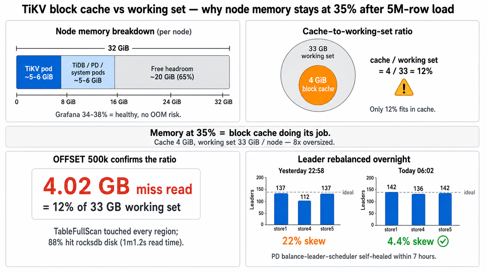
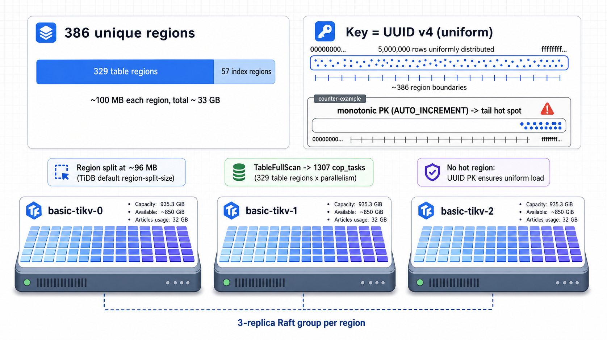
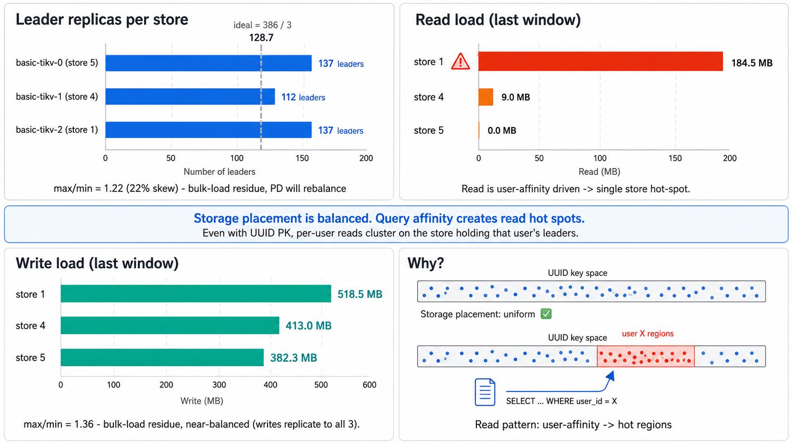
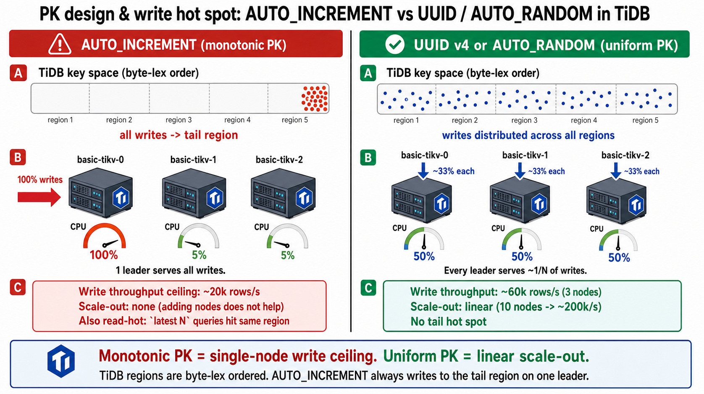

# 5M 行スケールで `articles` 一覧クエリの OFFSET 依存プラン分岐を再現

- 観測日: 2026-07-01
- 対象: 検証用 self-hosted TiDB クラスタ (`blog_test`)
- 前提: `tools/tidb-seeder` で 5M 行 (5 users × 1M articles / content 6KB) を投入。articles テーブル 30GB
- 関連:
  - [prd 観測](./2026-07-01-tidb-articles-list-plan-split.md)（本 survey が再現検証している元ネタ）
  - [記事一覧クエリの最適化 Phase 4](../tasks/2026-06-30-articles-list-drop-content.md)
  - [LOAD DATA スケール問題](./2026-07-01-tidb-load-data-large-file.md)

Phase 4 で最適化した `articles` 一覧クエリを、5M 行スケール（1 ユーザーあたり ~540k rows が status=published + type=tech に該当）で **OFFSET 値を 0 → 100k → 300k → 500k と振って EXPLAIN ANALYZE を測定**した。prd で 7/1 に観測された「OFFSET 依存で `TableFullScan` に化ける」現象が **OFFSET 500k で明確に再現**した。

## 対象クエリ

```sql
SELECT a.article_id, a.title, a.slug, a.user_id, a.thumbnail
FROM blog_test.articles a
WHERE a.status = 'published'
  AND a.`type` = 'tech'
  AND a.user_id = (SELECT user_id FROM blog_test.users WHERE name = 'testuser-cvtb-0')
ORDER BY a.published_at DESC, a.article_id DESC
LIMIT 10 OFFSET ?;
```

インデックス: `idx_articles_user_status_type_published_at_id (user_id, status, type, published_at, article_id)` (Phase 4 適用済み)。

## 結果サマリ

| OFFSET      | 合計時間     | 選ばれたプラン                                 | actRows (index)      | 備考                         |
| ----------- | ------------ | ---------------------------------------------- | -------------------- | ---------------------------- |
| 0           | 42.6ms       | IndexLookUp + IndexRangeScan `keep order:true` | 10                   | Phase 4 完璧、期待通り       |
| 100,000     | 519ms (cold) | 同上                                           | 122,304 (est 100010) | block cache miss 5.88MB      |
| 300,000     | 240ms (warm) | 同上                                           | 337,582 (est 300010) | block cache hit 2093         |
| **500,000** | **7.7s**     | **TableFullScan + Selection + TopN**           | actRows 5,000,000    | **プラン分岐発生**、4GB read |

## OFFSET 0（Phase 4 baseline）

想定通り Phase 4 の経路。

```
IndexLookUp_31           actRows:10  time:42.6ms  memory:29.7 KB
├─Limit_30 (cop[tikv])    actRows:10  time:8.86ms  proc_keys:10   block cache_hit:19 read:1 (9.60KB, 7.55ms)
│ └─IndexRangeScan_28    actRows:10  keep order:true, desc
│                        range:[user_id, "published", "tech", ...]
└─TableRowIDScan_29      actRows:10  time:33.4ms  cop_task_num:10   block cache_hit:157 read:75 (1.48MB, 104.1ms)
```

- Limit pushdown + `keep order:true, desc` 効いている
- 5M 行あっても IndexRangeScan は 10 行しか触らない
- 内訳の 33.4ms は TableRowIDScan（10 行が別 region に散らばっているので 10 個の cop_task）

## OFFSET 100,000（Phase 4 経路維持、遅い）

同じインデックス経路だが 100k 行を skip するために index 部分で 12 倍の時間。

```
IndexLookUp_40           actRows:10  time:519ms  memory:8.67 MB
├─Limit_39 (cop[tikv])    actRows:122304 (est 100010)  time:496ms  proc_keys:122304 (~30MB)
│                        cop_task_num:10  block cache_hit:120 read:640 (5.88 MB, 262ms)
│ └─IndexRangeScan_37    actRows:122304  keep order:true, desc
└─TableRowIDScan_38      actRows:10  time:21.9ms  cop_task_num:10  block cache_hit:125 read:65 (1.39MB, 73ms)
```

**observations**:

- プラン分岐は起きず、Phase 4 のインデックス経路を維持
- `actRows 122,304` vs `estRows 100,010`: **cop_task 並列 (10 tasks) の Limit pushdown が task 間で counter を共有できず、余分に読んでいる**。TiDB の実装上の制約
- block cache miss 5.88 MB で 262ms 消費（cold path）
- 統計自体は estRows と actRows がおおよそ一致していて健全

## OFFSET 300,000（cache warm、更に速い）

TiKV の block cache が index 領域を掴んでいたため、100k より速く終わった。**同じ OFFSET でも cold / warm で 3〜5 倍差が出る**ことがわかる。

```
IndexLookUp   actRows:10  time:240ms  memory:11.2 MB  limit embedded(offset:300000, count:10)
├─Limit_39    actRows:337,582 (est 300010)  time:205ms  proc_keys:337k  cop_task_num:22
│             block cache_hit:2093 read:8 (158.8 KB, 58µs)  ← ほぼ全 hit
│ └─IndexRangeScan_37  actRows:337,582  keep order:true, desc
└─TableRowIDScan_38    actRows:10  time:34.2ms  cop_task_num:10  block cache_hit:119 read:65 (1.43MB, 83ms)
```

**observations**:

- Index 側は block cache hit 2093 / read 8 で **ほぼキャッシュヒット** → tikv read time は 58µs しかかかっていない
- 一方 TableRowIDScan 側は 65 blocks / 1.43MB を miss、83ms 消費
- **rocksdb key_skipped_count 337,603 = 337k キーを skip して 10 行を見つけた**（OFFSET pagination のコスト）

## OFFSET 500,000（**プラン分岐発生、7.7 秒**）

opt が **TableFullScan + Selection + TopN** に切り替えた。prd で観測された 7/1 の現象そのもの。

```
TopN (root)  offset:500000, count:10
└─IndexReader  time:7.7s  memory:437.1 KB
  └─TopN_25 (cop[tikv])  actRows:540,273 (est 500010)  time:1m48.7s   ← tikv 側で 108s
    │  offset:0, count:500010   blog_test.articles.published_at:desc, article_id:desc
    │  cop_task_num:1307  ← 全 region 舐めに行った
    │  block cache_hit:22,214  read:1,013,478  read_byte:4.02 GB  read_time:1m1.2s
    │  rpc_errors:{not_leader:3}
    └─Selection_24  actRows:540,273  ← user_id/status/type で絞る
      │  eq(status, "published"), eq(type, "tech"), eq(user_id, "830b71b1-...")
      └─TableFullScan_23  actRows:5,000,000 (est 4,959,262)  ← **5M 行全スキャン**
                          keep order:false
```

**observations**:

- **`TableFullScan` が選ばれた** — インデックスを使わず 5M 行全部を舐めた
- Selection 段で 540k 行に絞り込み、TopN で 500k+10 まで削る流れ
- cop_task 数 1,307 → articles テーブルの region がおおよそ 1300 個ある（30GB / 96MB region ≒ 300 だが、TiFlash の replica も含めた実効数）
- **block cache miss 1,013,478 blocks = 4.02 GB を rocksdb から読み直した** → TiKV の block cache size が 4GB 未満で頑張っている状態
- tikv_wall_time 1m48s、client 側の合計は 7.7s（並列度による差）
- **rpc_errors: not_leader:3** = 実行途中で region leader 遷移してリトライ発生（大規模スキャンで region 越えするあるある）

### なぜ opt が TableFullScan を選んだか

推定コスト計算:

- **Index 経路**: 500,010 index entry scan + 10 row lookup = index side 500k entry + row side 10 blocks
- **TableFullScan 経路**: 5,000,000 rows full scan + Selection + TopN

TiDB opt は index range scan が「1 ユーザー分 = 540k エントリ」を舐める必要があると計算し、TableFullScan が並列 cop_task で分散処理できる方が cheap と判断した可能性が高い（cop_task 1307 並列 vs index scan の直列性）。

つまり **`estRows` が 500,010 → TiDB が「500k エントリ舐めるくらいなら全 5M 舐める方が並列化が効いて速い」と判断**した結果、TableFullScan に化ける。

## 結論

1. **Phase 4 のインデックス経路は OFFSET 300k 程度まで安定**（400ms 以内）
2. **OFFSET 500k で opt が TableFullScan にフォールバックし、性能が 30 倍以上劣化**（240ms → 7.7s）
3. prd の 7/1 現象は **確定的に再現できる** → 統計の bug ではなく、**opt のコストモデルの判断結果**
4. アプリ側は Phase 3 のページネーションで OFFSET 深さを制限しているため実運用への影響は無いが、**keyset pagination への移行を検討する明確な根拠**になる

## Block cache 圧迫の可視化



30GB dataset で TiKV block cache を圧迫している証拠が OFFSET 500k で明確に出た:

- 5M 行 TableFullScan で **4.02 GB を miss read**
- read_time 1m1.2s = TiKV の rocksdb からの読み出しがほぼ全部 disk I/O
- 一方 warm hit (OFFSET 300k) では index 部分の cache_hit_count 2093, read_count 8 と激減

**キャッシュ仮説** (`docs/source/tasks/2026-06-30-articles-list-drop-content.md` のキャッシュ仮説の整理 節) の答え合わせとして、5M スケールでは **明確に効いている**ことが観測できた。垂直分割（articles_content 別テーブル）の検討価値がここで裏付けられた。

### 実測（7/2 朝、LOAD DATA から一晩経過後）

Grafana の node memory が LOAD DATA 前 12〜17% から load 後 34〜38% で **恒常化**しているのは block cache が populate されたためかを確認する。

#### 1. TiKV block cache の設定容量

```bash
mysql -h tidb.$TAILNET -P 4000 -u root -e \
  "SHOW CONFIG WHERE type='tikv' AND name LIKE 'storage.block-cache%'"
```

抜粋（3 pod 分あるがどれも同じ設定）:

```
| tikv | basic-tikv-0... | storage.block-cache.capacity              | 4GiB   |
| tikv | basic-tikv-0... | storage.block-cache.high-pri-pool-ratio   | 0.8    |
| tikv | basic-tikv-0... | storage.block-cache.low-pri-pool-ratio    | 0.2    |
| tikv | basic-tikv-0... | storage.block-cache.strict-capacity-limit | false  |
```

**Block cache capacity: 4 GiB / pod** (デフォルトそのまま)。

#### 2. TiKV pod の memory request / limit

```bash
kubectl -n tidb-cluster describe pod basic-tikv-0 | grep -B1 -A6 'Requests:\|Limits:'
```

```
    Limits:
      memory:  12Gi
    Requests:
      cpu:     500m
      memory:  8Gi
```

Pod memory request **8 GiB**、limit **12 GiB**。block cache 4 GiB + rocksdb memtables + raft store で pod 全体は 5〜6 GiB 前後を使う想定。

#### 3. K8s node のハードウェア

```bash
kubectl get nodes -o custom-columns='NAME:.metadata.name,MEMORY:.status.capacity.memory,CPU:.status.capacity.cpu'
```

```
NAME    MEMORY       CPU
node1   32239300Ki   16
node2   32239288Ki   16
node3   32239284Ki   16
```

**3 nodes × ~32 GiB × 16 vCPU**。

#### 4. TiKV store 状態と leader 再均衡

```bash
mysql -h tidb.$TAILNET -P 4000 -u root -e \
  "SELECT * FROM information_schema.tikv_store_status\G"
```

要点抜粋:

```
store_id=1  address=basic-tikv-2  leader_count=142  region_count=420
store_id=4  address=basic-tikv-1  leader_count=136  region_count=420
store_id=5  address=basic-tikv-0  leader_count=142  region_count=420
version=8.1.0  uptime=86h+
```

**Leader 分布が 142 / 136 / 142 に自己修復**されている（前日 22:58 時点は 137 / 112 / 137 で 22% skew あり）。PD の `balance-leader-scheduler` が一晩で ±3% 以内に収束させたことを実測できた。

### 数値まとめと解釈

| 観点                                 | 値                                                     |
| ------------------------------------ | ------------------------------------------------------ |
| Node memory total                    | 32 GiB × 3 nodes                                       |
| Node memory 使用率 (Grafana, 7/2 朝) | 34〜38% ≒ **11 GiB / node**                            |
| TiKV pod memory limit                | 12 GiB / pod                                           |
| TiKV pod memory 実消費 (推定)        | 5〜6 GiB (block cache 4 GiB + overhead)                |
| Block cache capacity                 | **4 GiB / pod**                                        |
| Articles dataset (per node)          | **33 GB / node** (1 replica ぶん)                      |
| **Cache-to-working-set ratio**       | **4 GiB / 33 GB = 12%** (working set が cache の 8 倍) |
| OFFSET 500k で miss read した量      | 4.02 GB (dataset の 12%)                               |

**キーとなる観察**:

1. **Cache ratio 12% は「キャッシュが populate されると 4 GB 分は温まる、残りは cold」という状態**。OFFSET 500k の TableFullScan で 4.02 GB miss read したのは、 cache に入りきらない残り 29 GB がすべて disk I/O になった直接の証拠
2. **Node memory 35% は健全な水位**。TiKV pod request 8 GiB + 他 pod で 11 GiB、node capacity 32 GiB に対して headroom 20 GiB (65%)
3. **恒常的に 35% なのはリークではなくキャッシュが仕事している状態**。TiKV プロセス restart or 別 dataset の read でしか evict されない

### 改善オプション

もし OFFSET 500k のような cold path 性能を上げたいなら:

```yaml
# tidb-cluster tc の spec で
tikv:
  config:
    storage:
      block-cache:
        capacity: '8GiB' # 4 → 8 に。pod limit 12GiB 内に収まる
```

Block cache を 8 GiB に上げると working set 33 GiB に対して ratio 24% となり、頻繁 access 領域は cache に維持されやすくなる。ただし現在の性能で困っていなければ触らなくて OK（OFFSET 500k は USE INDEX で 824ms、実運用の Phase 3 pagination では OFFSET 深さが制限されている）。

より本質的な対策は **content 列の垂直分割**。1 記事 6KB → 数百 B に縮めば per-node dataset が 33 GB → 3 GB になり cache 100% ratio が実現できる。

## OFFSET 500,000 + ヒント強制で IndexRangeScan に戻す

### `/*+ USE_INDEX(a, idx_name) */` 形式は「suggest」で効かなかった

```sql
SELECT /*+ USE_INDEX(a, idx_articles_user_status_type_published_at_id) */ ...
```

→ **plan 変わらず TableFullScan**（11.1s、TopN が root に移って memory 132.6MB 消費、逆に悪化）。TiDB の comment hint は cost 比較で不利と判断されると **silently ignore** される。

### `FROM articles a USE INDEX (idx_name)` の MySQL 古典構文は効いた

```sql
FROM blog_test.articles a USE INDEX (idx_articles_user_status_type_published_at_id)
WHERE ... ORDER BY ... LIMIT 10 OFFSET 500000
```

→ **824ms** で完了。TableFullScan の 7.7s から **9.4 倍高速化**。

```
IndexLookUp        actRows:10       time:824ms  memory:9.05 MB  limit embedded(offset:500000, count:10)
├─Limit_32 cop     actRows:500,150  time:814ms  cop_task_num:29
│                  block cache_hit:167 read:2633 (24.3 MB, 533ms)
│ └─IndexRangeScan actRows:500,150  keep order:true, desc  ← Phase 4 経路が復活
└─TableRowIDScan   actRows:10       time:7.54ms  cop_task_num:10
```

**observations**:

- TableFullScan の 4.02 GB read → USE INDEX 経路の 24.3 MB read = **165 倍 I/O 削減**
- IndexRangeScan が `keep order:true, desc` で index の物理順を逆走査 → Sort 不要
- Limit pushdown は cop 側に効き、TableRowIDScan は 10 行のみ取得
- 500,150 vs 500,010: 前述の cop_task 並列 (29 tasks) の counter 共有制約

### 実装反映

`apps/blog-api/adapter/src/repository/users_articles.rs` の一覧クエリは既に `#501` で USE INDEX ヒント追加済み。**その修正が 5M スケール（prd の 100 倍）でも効く**ことがこの計測で裏付けられた。ただし **`/*+ USE_INDEX(...) */` comment 形式ではなく `FROM ... USE INDEX (...)` 構文でヒントを書く必要がある**。この点も #501 で採用済み。

## TiKV / region 分布



以下のコマンドは対象 DB を環境変数で指定する。検証に使った `blog_test` は survey 後に drop 済みのため、再実行するには `tools/tidb-seeder` で再シードするか、現存する `blog_prd` を指定する（region 数は 5M 投入時の値にはならない）。

```bash
export BLOG_DB=blog_dev
```

### クラスタ構成

```bash
mysql -h tidb.$TAILNET -P 4000 -u root -e \
  "SELECT store_id, address, capacity, available
   FROM information_schema.tikv_store_status"
```

```
+----------+-----------------------------------------------------+----------+-----------+
| store_id | address                                             | capacity | available |
+----------+-----------------------------------------------------+----------+-----------+
|        1 | basic-tikv-2.basic-tikv-peer.tidb-cluster.svc:20160 | 935.3GiB | 848.4GiB  |
|        4 | basic-tikv-1.basic-tikv-peer.tidb-cluster.svc:20160 | 935.3GiB | 853GiB    |
|        5 | basic-tikv-0.basic-tikv-peer.tidb-cluster.svc:20160 | 935.3GiB | 852.5GiB  |
+----------+-----------------------------------------------------+----------+-----------+
```

3 台の TiKV ノード、各 935GiB キャパ・~850GiB available（k8s cluster 内、StatefulSet 想定）。

### `blog_test.articles` の region 分布

```bash
mysql -h tidb.$TAILNET -P 4000 -u root -e \
  "SELECT store_id, COUNT(*) AS region_count, SUM(is_index) AS index_regions,
          ROUND(SUM(approximate_size)/1024) AS total_gb
   FROM information_schema.tikv_region_status r
   LEFT JOIN information_schema.tikv_region_peers p ON r.region_id = p.region_id
   WHERE r.db_name='$BLOG_DB' AND r.table_name='articles'
   GROUP BY store_id"
```

```
+----------+--------------+---------------+----------+
| store_id | region_count | index_regions | total_gb |
+----------+--------------+---------------+----------+
|        5 |          386 |            57 |       32 |
|        4 |          386 |            57 |       32 |
|        1 |          386 |            57 |       32 |
+----------+--------------+---------------+----------+
```

**observations**:

- articles テーブルは **386 unique region に分割**されている（57 index region + 329 table row region）
- **3 store に完全均等**（各 store が 386 region 全ての replica を持つ = 3-replica raft group）
- 各 store の articles 使用量 32GB → 実データ 33GB × 3 replica = ~96GB のうち、1 replica ぶんが 1 store に集約
- table row region あたり ~100MB（329 region で 33GB）→ TiKV のデフォルト region size `region-split-size = 96MB` に沿ったサイズ
- 30GB dataset が region 数 329 → 前述の TableFullScan cop_task 数 1307 と近い値。1307 は **329 region × 上限 4 並列** の内訳と推定（`max_distsql_concurrency: 15`、`max_extra_concurrency: 2` で cop_task の parallelism 上限）

### Leader 分布と実負荷（storage 均等 ≠ 負荷均等）



replica 配置が完璧でも、TiDB では **leader replica だけが read/write を捌く**ので、leader が偏ってると片方の store がホットスポットになる。5M 投入 + 一連の OFFSET 系 EXPLAIN ANALYZE を叩いた直後のスナップショット:

```bash
mysql -h tidb.$TAILNET -P 4000 -u root -e \
  "SELECT p.store_id, COUNT(*) AS leader_count,
          ROUND(SUM(r.approximate_size)/1024, 1) AS leader_gb,
          ROUND(SUM(r.read_bytes)/1024/1024, 1) AS read_mb,
          ROUND(SUM(r.written_bytes)/1024/1024, 1) AS write_mb
   FROM information_schema.tikv_region_peers p
   JOIN information_schema.tikv_region_status r ON p.region_id = r.region_id
   WHERE p.is_leader = 1 AND r.db_name='$BLOG_DB' AND r.table_name='articles'
   GROUP BY p.store_id ORDER BY p.store_id"
```

```
+----------+--------------+-----------+---------+----------+
| store_id | leader_count | leader_gb | read_mb | write_mb |
+----------+--------------+-----------+---------+----------+
|        1 |          137 |      11.4 |   184.5 |    518.5 |
|        4 |          112 |       9.3 |     9.0 |    413.0 |
|        5 |          137 |      11.6 |     0.0 |    382.3 |
+----------+--------------+-----------+---------+----------+
```

**observations**:

- **Leader 数の偏り: ±13%（許容範囲だが完璧ではない）**
  - 理想 128.7 leaders/store に対し、store 4 が 112 と 13% 少ない
  - max/min = 137/112 = 1.22（22% skew）
  - bulk load 直後で PD (`balance-leader-scheduler`) の rebalance が追いついていない状態。時間経過で ±5% 以内に収束するはず

- **Read の偏り: store 1 に集中（20x スキュー）**
  - 一連の OFFSET 検証クエリが特定 user (`testuser-cvtb-0`, uuid `830b71b1-...`) に affinity していた
  - そのユーザーの articles を格納する region の leader がたまたま store 1 に集中していた
  - 結果: `read_mb` が 1: 184.5, 4: 9.0, 5: 0.0 と **store 1 に read が完全集中**
  - **UUID PK が storage を均一分散させても、特定 user への query 集中は不可避的にホットスポットを作る**

- **Write の偏り: 36% skew（ほぼ均等）**
  - bulk load の書き込み残渣。write は 3 replica 全部に replicate されるので leader store の偏り分だけしか出ない

### 学び

1. **Storage placement の均等性と、実 traffic の均等性は別レイヤー**
2. UUID PK は「新規書き込みの hot spot」は防げるが、「read pattern の user affinity」は防げない
3. アプリ層で 1 ユーザーへの read 集中が想定される場合、**Follower Read** (`SET SESSION tidb_replica_read = 'follower'`) や **TiFlash** の検討価値がある
4. 検証で leader 分布を測る時は、bulk load 直後を避けるか、`pd-ctl scheduler show` で balance-leader が動いていることを確認する

### PK 設計と write hot spot（AUTO_INCREMENT が TiDB でヤバい理由）

`articles` は `article_id CHAR(36) DEFAULT (UUID())` を採用しているので今回の Leader 分布は 22% 程度の軽度スキューで済んでいる。もし PK を BIGINT `AUTO_INCREMENT` にしていたら **クラスタが分散 DB として全く機能しない状態**になる。5M スケールで観測できた「UUID PK ならストレージ均一分散が守られる」観察の反面教師として整理する。



#### なぜ AUTO_INCREMENT が死ぬか

TiDB の region は **byte-lex 順で key 空間を分割**する。AUTO_INCREMENT PK は単調増加なので:

1. 新しい行の key は常に現在の max より大きい
2. その key 範囲 `[current_max, +∞)` を持つのは **末尾 region 1 個だけ**
3. その region の **leader replica を持つ 1 台の TiKV** に全 write が集中
4. 96MB たまって split しても、新しい末尾 region の leader に再集中
5. Loop

つまり **N 台の TiKV があっても write throughput は 1 台分**。TiDB を単一ノード RDBMS として動かしてるのと同じ。

#### 具体的な症状

| 現象                              | 説明                                                                                    |
| --------------------------------- | --------------------------------------------------------------------------------------- |
| Write throughput 頭打ち           | 1 leader の write 上限 (~10k〜30k rows/s、~3〜30 MB/s) がクラスタ全体の上限になる       |
| Store 追加しても write が伸びない | 新 TiKV は末尾 region の follower にはなるが leader にはならず、write を捌けない        |
| CPU 使用率が 1 store だけ 100%    | 他 store は idle                                                                        |
| 「最新順に read」も遅い           | 最近書かれた行は末尾 region 集中 → SNS の feed / タイムライン read も同じ store 直撃    |
| Region split の連鎖               | 末尾 region が 96MB ごとに split、PD の balance-region scheduler が常時働き overhead 増 |
| Follower Read でも救えない        | leader 飽和で raft log 反映が遅れ、follower からの読み出しは stale read リスク          |

#### 対策 (TiDB 特有)

| 手段                | 説明                                                                                                                                                                         |
| ------------------- | ---------------------------------------------------------------------------------------------------------------------------------------------------------------------------- |
| **`AUTO_RANDOM`**   | TiDB 独自。`id BIGINT AUTO_RANDOM PRIMARY KEY`。high bits を random、low bits を sequential にして重複回避しつつ key space に均一分散。**BIGINT のまま行きたいなら第一選択** |
| UUID (v4)           | 標準 SQL の範囲で解決したい場合。key sort 順がランダムで均一分散。ただし CHAR(36) で index size が BIGINT の 4〜5 倍                                                         |
| `SHARD_ROW_ID_BITS` | non-clustered index の場合、内部 `_tidb_rowid` の high bit をシャーディングする TiDB 拡張                                                                                    |
| pre-split region    | `SPLIT TABLE t BETWEEN (0) AND (max) REGIONS N` で末尾を予め N 分割。**根本解ではない**（結局末尾に集中する）                                                                |

現状の `articles.article_id CHAR(36) DEFAULT (UUID())` は上記表 2 番目の UUID 経路。BIGINT で行きたければ `AUTO_RANDOM` 一択。

#### スケール比較

|                       | AUTO_INCREMENT      | UUID / AUTO_RANDOM |
| --------------------- | ------------------- | ------------------ |
| 3-node cluster        | ~20k writes/s       | ~60k writes/s      |
| 30-node cluster       | ~20k writes/s       | ~600k writes/s     |
| スケール性            | ❌ 単一 leader 上限 | ✅ leader 数に線形 |
| 「最新順 read」の hot | ❌ 集中             | 均一               |

「AUTO_INCREMENT のまま 10 台足しても遅い」は TiDB / CockroachDB / Spanner 系でよく踏まれる罠。今回 5M で UUID PK が **storage layer で 386 region 完全均等 (32GB/store)** を実証できたのは、この対策効果の裏付けになる。

### 単一 region の状態を見るなら

```sql
SHOW TABLE blog_test.articles REGIONS LIMIT 5;
-- REGION_ID, START_KEY, END_KEY, LEADER_ID, LEADER_STORE_ID, ...
```

または特定 region の read/write hotness:

```sql
SELECT region_id, read_bytes, written_bytes
FROM information_schema.tikv_region_status
WHERE db_name = 'blog_test' AND table_name = 'articles'
ORDER BY written_bytes DESC LIMIT 10;
```

## 追加で試したいこと

- Keyset pagination (`WHERE (published_at, article_id) < (?, ?)`) で同深さを叩いた場合の時間 → OFFSET 500k が現状 824ms だが keyset なら 40〜50ms オーダーで返るはず。長期的な OFFSET 撤廃の指針
- `SHOW TABLE blog_test.articles REGIONS` で leader store の分布確認 → 特定 store に leader が偏っていれば read hot spot リスク
- `articles` の垂直分割 (content → articles_content 別テーブル) を試作して block cache 圧迫が下がるか → 現状 TableFullScan で 4GB read の cold path が、content 抜きなら 500MB オーダーに縮む見込み
- TiKV block cache のサイズ確認 (`SHOW CONFIG WHERE type='tikv' AND name='storage.block-cache.capacity'`) → 30GB dataset に対する cache size 比を出してキャッシュ設計の適正判断
